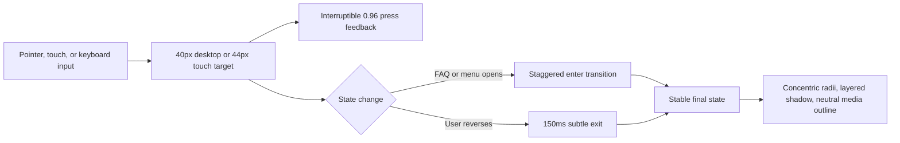

# Bulma Better-UI Polish Plan

> **Implemented status (verified 2026-07-19):** Implemented and ready to archive from documents/todo. Evidence: `demo/test/better-ui-contracts.test.mjs` plus five focused UI contract suites (14 passing tests), `demo/src/components/elements/button.tsx`, `demo/src/components/sections/faqs-two-column-accordion.tsx`, `demo/src/components/sections/navbar-with-links-actions-and-centered-logo.tsx`, `demo/src/app/globals.css`, and `documents/guides/_animations.md`.

<critical_warning>
> **CRITICAL WARNING:** The project forbids `prefers-reduced-motion`, `@media (prefers-reduced-motion: reduce)`, and equivalent animation gates. The current stylesheet contains four such branches. Remove those branches while preserving the intended animation timing and interaction model. Do not replace them with timing short-circuits or `requestAnimationFrame` wrappers.
</critical_warning>

<important_note>
> **IMPORTANT NOTE:** This plan applies the `better-ui` principles to the runnable `demo/` app. Typography, copy, font selection, brand colours, contact-form fields, and new decorative effects are out of scope. The site already has extensive motion; this pass makes the existing system more precise, tactile, and consistent instead of adding more effects.
</important_note>

## 1. Goal

Raise the Bulma marketing site's interaction and surface quality to the standard set by its hero. The current interface is visually cohesive and responsive, but it falls short in four repeatable ways:

- High-use controls have 22-36px hit areas where the target is 40px on desktop and 44px on touch/mobile.
- Nested surfaces, media edges, and card separation use inconsistent radius and outline rules.
- Interactive state changes mix transitions with open-only keyframes, so rapid reversal and exit states are less polished than entrance states.
- `transition-all`, persistent `will-change`, and duplicated page-load motion weaken performance discipline.

The work is complete when the affected controls meet the target sizes, nested radii are concentric, media uses neutral 10% outlines, state changes animate in both directions, broad transitions are removed, and the required light/dark browser matrix passes without overflow, clipping, or console errors.

---

## 2. Current State Analysis

### 2.1 Current implementation overview

The runnable Next.js app is in `demo/`. Shared UI primitives live under `demo/src/components/elements/`, page sections live under `demo/src/components/sections/`, and the animation system is split between those components, hooks, and `demo/src/app/globals.css`.

The existing UI already provides:

- A strong hero with aurora, cursor spotlight, blur-transition text, parallax, screenshot tilt, and staggered entrance motion.
- Equal-height feature and pricing grids with responsive one-column mobile layouts.
- Light and dark colour schemes with no observed horizontal overflow at `1440x900` or `390x900`.
- Rich pricing, FAQ, mobile-menu, testimonial, contact-form, and supported-lender interactions.
- Clean sampled runtime behaviour with no browser console or page errors on the homepage.

### 2.2 Evidence from the audit

| Area | Current evidence | Why it falls short |
| --- | --- | --- |
| Transition scope | `rg` finds 39 `transition-all` occurrences across 18 files. The live homepage has 60 rendered elements with a non-zero `transition-property: all`; `/pricing` has 113. | Browsers watch unrelated properties, and later layout or colour edits can start animating unexpectedly. |
| Buttons | `button.tsx` uses `active:scale-[0.98]`; medium buttons render 36px high. | The press response is weaker than the required `0.96`, and the target is below both desktop and mobile minimums. |
| Navbar controls | Mobile open and close buttons render `36x36`; the mobile `Get started` action renders 99x36. Desktop navigation links render 28px high. | Primary navigation is visually clear but has undersized pointer and touch targets. |
| Pricing toggle | Monthly and Yearly tabs render 36px high on both homepage and `/pricing`. | This is a high-frequency control below the 44px mobile target. |
| Supported lenders | Lender buttons render 22px high on mobile and 24px high on desktop. | The interactive ledger is readable but difficult to tap and keyboard-focus without precise input. |
| Feature-card radii | `Feature` uses an 8px outer radius, 8px padding, and a 2px inner media radius. | `8 != 2 + 8`; the corners are not concentric, which makes the image frame feel slightly pinched. |
| Media outlines | Hero/product screenshots and the about hero photo have no computed outline. Team and testimonial media use black/white at 5%. | Media edges are inconsistent and softer than the `better-ui` neutral 10% rule. |
| Pricing hierarchy | Hovering one card sets sibling cards to `opacity: 0.7` and `saturate(0.7)`. The effect is especially strong in dark mode. | Alternative plans look disabled while the visitor is trying to compare them. |
| Testimonial depth | Light-mode cards use a white 50% ring on a white surface plus a broad glow. | The edge nearly disappears while the ambient shadow reads as haze rather than controlled elevation. |
| FAQ state change | Content uses the open-only `faq-spring-open` keyframe; plus/minus icons use `transition-all`, rotation, and opacity. | Closing has no equivalent exit choreography, and rapid toggles cannot retarget smoothly. |
| Mobile menu state change | The panel and links use open-only keyframes, then `dialog.close()` removes the menu immediately. | Entry is polished, but exit snaps and mid-animation reversal is not interruptible. |
| Page-load motion | `Main` applies `page-transition-enter` on every mount while `TransitionLink` also uses the View Transitions API and the hero has its own entrance sequence. | A full refresh stacks page and hero motion instead of reserving route motion for navigation. |
| Compositing hints | `Screenshot` applies `will-change-transform` whenever tilt is enabled. | The compositor layer persists while idle instead of existing only during interaction. |
| Project animation policy | `globals.css` contains four `prefers-reduced-motion` branches. | This directly conflicts with the nearest `AGENTS.md` animation standard. |

### 2.3 Core problem

The design system has more effects than it has interaction primitives. Buttons, tabs, FAQ icons, mobile navigation, cards, and images each solve polish locally, so exact values and behaviours drift. The next pass should consolidate those details at the shared primitive and CSS-token level, then update the page-specific components that bypass those primitives.

### 2.4 Technical constraints

- Preserve the current brand palette, fonts, content, route structure, and contact form field contract.
- Preserve the homepage `#lenders` FAQ deep link and verify both direct loads and same-page clicks.
- Keep homepage and `/pricing` pricing modules visually and verbally aligned, with `/pricing` as the source of truth.
- Keep `items-stretch` on pricing grids and `h-full` on plan cards and their animation wrappers.
- Do not add `motion`, `framer-motion`, or another animation dependency. The current app has no motion library.
- Do not remove or rewrite an existing marketing animation unless the step explicitly targets that exact animation.
- Keep animation wrappers layout-neutral and clean up every observer, timer, listener, and animation frame.

### 2.5 Existing infrastructure to reuse

- `Button`, `ButtonLink`, `SoftButton`, `SoftButtonLink`, `PlainButton`, and `PlainButtonLink` in `demo/src/components/elements/button.tsx`.
- Existing light/dark tokens and component classes in `demo/src/app/globals.css`.
- `useScrollAnimation` for one-shot section entrances.
- Existing two-icon FAQ DOM structure, which can support a dependency-free CSS cross-fade.
- Existing `TransitionLink` and View Transitions API integration for route navigation.
- Existing `CardSpotlight`, pricing grid parity, and `h-full` layout rules.

---

## 3. Desired State

### 3.1 Desired-state requirements

- **REQ-1 (MUST):** Touch/mobile interactive elements use a minimum 44x44px hit area; desktop-only interactive elements use at least 40x40px.
- **REQ-2 (MUST):** Shared buttons press to `scale(0.96)` through an interruptible transform transition and expose a `static` prop for intentional opt-out.
- **REQ-3 (MUST):** Close nested surfaces use `outer radius = inner radius + padding` when padding is 24px or less.
- **REQ-4 (MUST):** Product, team, testimonial, and about-page images use an inset 1px pure-black 10% outline in light mode and pure-white 10% outline in dark mode.
- **REQ-5 (MUST):** Interactive open/close and toggle states use interruptible CSS transitions with a visible but softer exit state.
- **REQ-6 (MUST):** Contextual plus/minus icons cross-fade with `scale(0.25)` to `scale(1)`, opacity `0` to `1`, and blur `4px` to `0px` using `cubic-bezier(0.2, 0, 0, 1)`.
- **REQ-7 (MUST):** `transition-all` and `transition: all` are absent from `demo/src` after the pass; each component names only the properties it changes.
- **REQ-8 (MUST):** `will-change` is limited to `transform`, `opacity`, or `filter` and is applied only during active interaction or measured stutter.
- **REQ-9 (MUST):** The four forbidden reduced-motion branches are removed without changing the default animation design.
- **REQ-10 (MUST NOT):** Pricing hover must not make non-hovered plans look disabled or reduce their text below the resting contrast.
- **REQ-11 (MUST NOT):** Initial page load must not apply both the global `Main` entrance and the intentional hero entrance.
- **REQ-12 (SHOULD):** Section dividers must read as separators, not as broken card borders.

### 3.2 Before and after recommendations

#### Minimum hit areas and press feedback

| Priority | Location | Before | After |
| --- | --- | --- | --- |
| P0 | `demo/src/components/elements/button.tsx` | Shared buttons use `transition-all`, press to `0.98`, and medium controls render 36px high. | Use `transition-[transform,background-color,box-shadow,color]`, press to exactly `0.96`, add `static?: boolean`, and enforce `min-h-10` desktop plus `min-h-11` on touch/mobile. |
| P0 | `demo/src/components/sections/navbar-with-links-actions-and-centered-logo.tsx` | Mobile menu controls are `36x36`; desktop nav links are 28px high. | Make menu controls `size-11`; give desktop nav links a 40px-high box without changing their visible text position; keep adjacent hit areas non-overlapping. |
| P0 | `demo/src/components/sections/pricing-multi-tier.tsx` and `pricing-hero-multi-tier.tsx` | Monthly/Yearly tabs are 36px high. | Make both toggle implementations 44px high and keep the sliding/selected pill concentric within the 4px outer padding. |
| P0 | `demo/src/components/elements/supported-lenders-field.tsx` and `globals.css` | Lender buttons are 22-24px high and packed into visually dense rows. | Give each button a 44px mobile and 40px desktop hit box, then reflow the list so targets never overlap; preserve the active underline, pointer proximity, keyboard focus, and static HTML names. |
| P1 | Shared trailing-icon CTA usages in `page.tsx`, `about/page.tsx`, and CTA sections | Icon alignment is adjusted locally with negative margins and equal button-side padding. | Centralise a trailing-icon button treatment with icon-side padding 2px smaller than the text side; retain local SVG correction only where the icon remains optically off-centre. |

#### Concentric radii and surface depth

| Priority | Location | Before | After |
| --- | --- | --- | --- |
| P0 | `demo/src/components/sections/features-two-column-with-demos.tsx` | Feature card uses outer 8px radius, 8px padding, and inner 2px radius. | Use outer 16px and inner 8px radii with the existing 8px padding, satisfying `16 = 8 + 8`. |
| P1 | `demo/src/components/sections/pricing-multi-tier.tsx` and `pricing-hero-multi-tier.tsx` | Resting cards rely mostly on a 2.5% tinted background; focus isolation dims siblings to 70% opacity and saturation. | Add a neutral layered shadow ring for resting separation; keep all plans at full opacity; express focus with the hovered card's shadow and `translateY(-4px)` only. |
| P1 | `demo/src/components/sections/testimonials-glassmorphism.tsx` | Light cards use `ring-white/50` against white and a broad ambient shadow. | Use a pure-black 6% shadow ring plus two low-opacity depth layers in light mode; use a pure-white 8% ring in dark mode; transition only transform and box-shadow. |
| P1 | `demo/src/components/sections/features-two-column-with-demos.tsx` and `.section-horizon` in `globals.css` | Horizon lines sit at `top: 0` on the same wrapper as the card grid, visually touching the first card row. | Move the horizon line into the section header-to-grid gap or add at least 24px clearance so it reads as a section separator on desktop and mobile. |

#### Image and media outlines

| Priority | Location | Before | After |
| --- | --- | --- | --- |
| P0 | `demo/src/components/elements/screenshot.tsx` and feature media wrappers | Product images use a ring or no light-mode edge; the computed image outline is `none`. | Apply an inset 1px `oklch(0 0 0 / 0.1)` outline in light mode and `oklch(1 0 0 / 0.1)` in dark mode without changing layout. |
| P0 | `demo/src/app/about/page.tsx`, `team-four-column-grid.tsx`, and testimonial photo wrappers | About hero has no outline; team/testimonial photos use black/white 5%. | Standardise every photographic edge to pure black/10 and pure white/10, including circular avatars, while retaining the current crop and radius. |

#### Interruptible animations, exits, and icon swaps

| Priority | Location | Before | After |
| --- | --- | --- | --- |
| P0 | `faqs-two-column-accordion.tsx`, `faqs-accordion.tsx`, and FAQ CSS | FAQ content uses an open-only spring keyframe and disappears immediately on close. | Keep content mounted during state change; transition opacity and a fixed `translateY` distance; use the existing 400ms enter and a softer 150ms exit that can reverse mid-flight. |
| P0 | FAQ plus/minus icons | Icons rotate and fade through `transition-all`; no blur or scale treatment is used. | Keep both icons in the DOM and cross-fade `scale(0.25) -> 1`, `opacity: 0 -> 1`, `blur(4px) -> 0` over 300ms with `cubic-bezier(0.2, 0, 0, 1)`. |
| P0 | Mobile menu component and CSS | Panel, links, and close icon use one-shot open keyframes; `dialog.close()` snaps the menu away. | Use state-driven CSS transitions with the current 60ms link stagger; add a 150ms opacity and `translateY(-12px)` exit, then close the native dialog after `transitionend`; permit rapid open/close reversal. |
| P1 | `demo/src/components/elements/main.tsx` and page-transition CSS | Every full load runs `page-transition-enter`, while navigation also uses View Transitions and the hero runs its own entrance. | Remove the mount-time `Main` animation; keep hero entrance on first load and View Transitions for subsequent internal navigation only. |

#### Transition and compositing discipline

| Priority | Location | Before | After |
| --- | --- | --- | --- |
| P0 | 18 files currently containing `transition-all` | 39 source occurrences animate every changed property. | Replace each occurrence with an explicit list such as `transition-[transform,opacity]`, `transition-[opacity,filter,scale]`, `transition-colors`, or `transition-[box-shadow]` based on the actual state delta. |
| P0 | `demo/src/app/globals.css` | Four `prefers-reduced-motion` branches alter grain, reveal, parallax, and route-transition behaviour. | Remove all four branches and retain one consistent animation path in accordance with project policy. |
| P1 | `demo/src/components/elements/screenshot.tsx` | `will-change-transform` is present whenever tilt is enabled, including idle time. | Apply `will-change: transform` on pointer enter or active tilt only, then remove it after the 400ms reset completes. |
| P1 | `demo/src/components/elements/magnetic-wrapper.tsx` | The ripple restarts by removing a class, forcing layout through `offsetWidth`, and adding the class again. | Preserve the magnetic transform transition; trigger the one-shot ripple by replacing or re-keying the ripple element so no forced reflow is required. |

### 3.3 Defaults and fallbacks

- Shared button press feedback defaults to enabled. `static` disables only the scale effect, not focus or colour feedback.
- Touch targets increase through the element box itself, not overlapping pseudo-elements, where controls are tightly packed.
- Media outlines are always neutral and never use a mist, slate, zinc, or brand-accent tint.
- One-shot section entrances may continue using keyframes or visibility transitions because they do not reverse through user input.
- Interactive open/close, tab, hover, focus, and press states use transitions so they can retarget.
- Unsupported View Transitions API browsers continue using normal navigation without adding a separate mount animation.

### 3.4 Verification checklist

**Controls:**
- [ ] Every visible `button` and actionable link is at least 40px high on desktop and 44px high at `390x900`, excluding inline text links inside prose.
- [ ] Shared buttons compute to `scale(0.96)` while pressed and return without snapping.
- [ ] Supported-lender targets do not overlap and the field has no horizontal overflow.

**Surfaces and media:**
- [ ] Feature cards compute to 16px outer and 8px inner radii with 8px padding.
- [ ] Target images compute to a 1px black/10 light outline and white/10 dark outline.
- [ ] Pricing cards remain fully readable while another card is hovered.

**Motion:**
- [ ] FAQ and mobile-menu entrance animations reverse cleanly when toggled before completion.
- [ ] FAQ exit lasts 150ms and moves no more than 12px.
- [ ] Initial page load runs the hero entrance without a second global page wrapper entrance.
- [ ] Internal route navigation still uses the View Transitions API where supported.

**Code discipline:**
- [ ] `rg -n "transition-all|transition:\\s*all" demo/src` returns no matches.
- [ ] `rg -n "prefers-reduced-motion" demo/src` returns no matches.
- [ ] `will-change` appears only on transform, opacity, or filter and is not permanently applied to idle screenshot elements.

---

## 4. Additional Context

### 4.1 User-provided context

- The requested standard is the local `better-ui` skill, with explicit before-and-after recommendations and a clear account of where the current interface falls short.
- Project policy takes precedence over reusable skill guidance, including the rule that animations must not be gated by reduced-motion preferences.
- The result is an implementation outline only. No production UI code is changed by this planning task.

### 4.2 Scope decisions

- Do not add new ambient effects. The current site already has aurora, spotlight, parallax, hue shifts, graph pulses, gradient borders, magnetic CTAs, and multiple entrance systems.
- Do not revisit typography in this pass. The `better-ui` skill explicitly delegates typography to a separate skill, and the browser audit did not find clipping or horizontal overflow.
- Keep form input borders because they communicate focus and field boundaries. The shadow-over-border recommendation applies to cards and elevated containers, not accessible form controls or table dividers.
- Keep existing divider borders in FAQ and comparison-table layouts because they provide structural separation rather than elevation.

---

## 5. Implementation Plan

### Step 1: Consolidate button, tab, and navigation ergonomics

**Objective:** Establish one tactile press rule and compliant target sizing across shared controls.

#### High-level approach

- Update `demo/src/components/elements/button.tsx` with property-specific transitions, `active:scale-[0.96]`, a `static` prop, and minimum heights.
- Update the active navbar's desktop links, mobile CTA, menu button, and close button.
- Update both pricing toggle implementations so homepage and `/pricing` remain aligned.
- Reflow supported-lender buttons to provide non-overlapping 40/44px targets while preserving the existing interactive field contract.

**Success Criteria:**

- `Button`, `ButtonLink`, `SoftButton`, `SoftButtonLink`, `PlainButton`, and `PlainButtonLink` press to exactly `0.96` unless `static` is set.
- Mobile navbar open, close, CTA, pricing tabs, and lender buttons have computed heights of at least 44px at `390x900`.
- Desktop navigation, CTA, pricing tabs, and lender buttons have computed heights of at least 40px at `1440x900`.
- No target boxes overlap and neither `/` nor `/pricing` gains horizontal overflow.

### Step 2: Standardise card surfaces, radii, and media edges

**Objective:** Make nested cards and image edges feel deliberate in both colour schemes.

#### High-level approach

- Apply the 16px outer, 8px inner, 8px padding geometry to two-column feature cards.
- Add reusable light/dark shadow-border variables in `globals.css` for feature, pricing, and testimonial surfaces.
- Remove pricing sibling opacity/saturation dimming and retain focus through hovered-card lift and shadow.
- Apply the mandated neutral image outline to product screenshots, the about hero, team photos, testimonial photos, and avatars.
- Reposition the feature horizon divider so it has 24px clearance from the grid.

**Success Criteria:**

- Feature cards compute to 16px outer and 8px inner radii at desktop and mobile viewports.
- Product and photographic media compute to an inset 1px black 10% outline in light mode and white 10% outline in dark mode.
- Hovering a pricing card leaves every sibling at `opacity: 1` and `filter: none` or an equivalent full-readability state.
- Testimonial and pricing card resting edges remain visible against their section background in both colour schemes without adding solid depth borders.
- The horizon divider never touches or overlays a feature card at `1440x900` or `390x900`.

### Step 3: Make interactive motion reversible

**Objective:** Give FAQ, mobile menu, icon swaps, and route changes complete enter and exit behaviour.

#### High-level approach

- Replace FAQ content open-only keyframes with state-driven opacity and fixed-translate transitions while preserving `#lenders` auto-open behaviour.
- Convert FAQ plus/minus icons to the exact dependency-free contextual icon cross-fade values from `better-ui`.
- Add a closing state to the mobile dialog; close it after its 150ms exit transition completes.
- Remove the global `Main` mount entrance and keep View Transitions for route navigation.
- Preserve section entrance staggers because they are one-shot, non-interactive sequences.

**Success Criteria:**

- Rapidly toggling an FAQ five times never snaps content, leaves stale inline styles, or desynchronises `aria-expanded` from visibility.
- Plus/minus icons compute to the required scale, opacity, blur, 300ms duration, and cubic-bezier values in both states.
- Rapidly opening then closing the mobile menu reverses the current transition; the exit completes in 150ms before the dialog closes.
- Direct `/#lenders` loads and same-page `#lenders` clicks open and reveal the correct FAQ answer.
- Full page refresh shows the intentional hero entrance but not `page-transition-enter`; internal navbar navigation still animates through View Transitions where available.

### Step 4: Remove broad transitions and idle compositor hints

**Objective:** Make every animation declare only the properties it changes and keep compositor hints temporary.

#### High-level approach

- Replace all 39 `transition-all` occurrences in `demo/src` with explicit transition utilities.
- Remove the four forbidden reduced-motion branches from `globals.css` without altering the default motion implementation.
- Toggle screenshot `will-change` only during pointer interaction and reset completion.
- Remove the magnetic-ripple forced reflow while preserving the same visual ripple timing.
- Update comments that still describe `transition-all` or reduced-motion behaviour.

**Success Criteria:**

- Repository searches for `transition-all`, `transition: all`, and `prefers-reduced-motion` return no matches under `demo/src`.
- Screenshot tilt adds `will-change: transform` during interaction and removes it no later than 450ms after pointer leave.
- Magnetic CTA entry does not read `offsetWidth` to restart its ripple.
- Hero tilt, cursor spotlight, magnetic movement, scroll reveals, pricing changes, and navbar states have no console errors and retain their documented default timing.

### Step 5: Preserve parity and synchronise animation documentation

**Objective:** Verify every affected route and keep the architecture guide aligned with the implementation.

#### High-level approach

- Apply pricing changes to both homepage and `/pricing` modules, treating `/pricing` as the source of truth.
- Review `documents/guides/_animations.md` after implementation and update sections covering buttons, FAQ, mobile menu, pricing focus, route transitions, screenshot tilt, `transition-all`, and reduced-motion branches.
- Run the project validation commands and the complete browser matrix in Section 6.

**Success Criteria:**

- Homepage and `/pricing` use the exact annual callout `Get 2 months free on a yearly plan.` and remain visually aligned in Monthly and Yearly states.
- Pricing grids retain `items-stretch`; plan cards and animation wrappers retain `h-full`; all cards in the same row have equal computed heights.
- `documents/guides/_animations.md` contains no statement that the implementation uses `transition-all` or `prefers-reduced-motion` after those patterns are removed.
- `npm run lint`, `npm run test`, and `npm run build` pass from `demo/`.

---

## 6. Testing Plan

### 6.1 Source-of-truth regression artefacts

No user-provided regression screenshot exists. The audit generated temporary local baselines that document the current state:

- `/Users/sacino/.dev-browser/tmp/bulma-ui-audit-home-features-desktop-light.png` shows the feature-card corner geometry and horizon line.
- `/Users/sacino/.dev-browser/tmp/bulma-ui-audit-home-testimonials-desktop-light.png` shows the light testimonial surface separation.
- `/Users/sacino/.dev-browser/tmp/bulma-ui-audit-home-pricing-desktop-light.png` shows homepage plan-card hierarchy and Yearly state.
- `/Users/sacino/.dev-browser/tmp/bulma-ui-audit-pricing-desktop-dark.png` shows the dark pricing focus-isolation dimming.
- `/Users/sacino/.dev-browser/tmp/bulma-ui-audit-home-mobile-light-menu.png` shows the mobile menu and 36px close control.
- `/Users/sacino/.dev-browser/tmp/bulma-ui-audit-home-mobile-light-pricing.png` shows the 36px pricing toggle at `390x900`.
- `/Users/sacino/.dev-browser/tmp/bulma-ui-audit-about-mobile-light.png` shows the about hero photo without a neutral outline.

These files are temporary dev-browser output, not committed fixtures. If they are unavailable when implementation begins, recapture the same route, viewport, colour scheme, and state before editing. Use them for visual comparison, not pixel-perfect regression thresholds.

### 6.2 Automated checks

| Check | Location or command | Expected result |
| --- | --- | --- |
| Existing Node tests | `cd demo && npm run test` | All configured `node:test` suites pass. |
| ESLint | `cd demo && npm run lint` | Zero ESLint errors. |
| Static export build | `cd demo && npm run build` | Next.js static export and sitemap generation complete without errors. |
| Broad transition search | `rg -n "transition-all|transition:\\s*all" demo/src` | No matches. |
| Forbidden animation gate search | `rg -n "prefers-reduced-motion" demo/src` | No matches. |

### 6.3 Browser verification

Use the project `dev-browser` workflow. Reuse `http://localhost:3001` when it is already serving the Bulma demo; otherwise start `cd demo && npm run dev -- -p 3001` and stop only the server started for the task.

| Scenario | Viewports and schemes | Pass condition |
| --- | --- | --- |
| Shared chrome | `1440x900` and `390x900`, light and dark, on `/`, `/pricing`, `/about`, `/contact`, `/privacy-policy`, and `/404` | Navbar and footer render without overflow; all changed controls meet target sizes; console and page errors are empty. |
| Button feedback | Desktop pointer plus mobile emulation | Press scale computes to `0.96`; `static` control does not scale; focus rings remain visible. |
| Mobile menu | `390x900`, light and dark | Open, close, rapid reverse, Escape, link navigation, and repeated cycles preserve dialog state and show the 150ms exit. |
| Pricing parity | `/` and `/pricing`, both viewports and schemes, Monthly and Yearly | Copy, price states, callout, card heights, target sizes, focus, hover, and no-overflow behaviour match. |
| Pricing focus | `1440x900`, light and dark | Hover each plan; non-hovered plans remain full-opacity and readable; hovered plan receives lift and layered shadow. |
| FAQ | `/` and `/pricing`, both viewports and schemes | Rapid open/close reverses smoothly; icon cross-fade uses exact values; content exit is 150ms; keyboard activation works. |
| FAQ hash | Direct `/#lenders` and same-page `#lenders` click | The `Which lenders does Bulma cover?` disclosure opens and is visible. |
| Supported lenders | Homepage and pricing footer, both viewports and schemes | Pointer, click persistence, keyboard focus, touch selection, target size, and pointer-leave reset work without overlapping targets. |
| Media edges | Homepage, `/about`, and `/pricing` where product or photographic media is visible | Light images show black/10 inset outline; dark images show white/10 inset outline; no size or crop changes occur. |
| Feature cards | Homepage at both viewports and schemes | Outer/inner radius values are 16px/8px; divider has at least 24px clearance; paired desktop cards remain equal height. |
| Animation lifecycle | Homepage scroll and route navigation at both viewports | Scroll entrances start and finish; hover/focus states reverse; observers, timers, listeners, and animation frames leave no duplicate work after repeated navigation. |

---

## 7. UI/UX Changes

### 7.1 User interface flow

### 7.2 Affected components

| Component | Location | Purpose of change | Interaction |
| --- | --- | --- | --- |
| Shared button family | `demo/src/components/elements/button.tsx` | Standardise hit area, press scale, opt-out, and transition properties. | Hover, focus, press. |
| Active navbar | `demo/src/components/sections/navbar-with-links-actions-and-centered-logo.tsx` | Expand targets and add reversible menu exit. | Navigation, menu open/close. |
| Supported lenders field | `demo/src/components/elements/supported-lenders-field.tsx` and `globals.css` | Make every lender target usable without overlap. | Pointer proximity, focus, click, touch. |
| Feature cards | `demo/src/components/sections/features-two-column-with-demos.tsx` | Correct nested radius geometry, media edge, and divider placement. | Scroll entrance and CTA interaction. |
| Pricing cards and toggles | `pricing-multi-tier.tsx`, `pricing-hero-multi-tier.tsx`, and `globals.css` | Expand tabs, preserve comparison readability, and refine depth. | Toggle, hover, focus, press. |
| FAQ accordions | `faqs-two-column-accordion.tsx`, `faqs-accordion.tsx`, and `globals.css` | Make content and icons animate in both directions. | Toggle, keyboard, hash navigation. |
| Testimonials and media | Testimonial sections, team grid, about page, and `screenshot.tsx` | Standardise depth, image outline, and transition properties. | Hover and scroll entrance. |
| Route wrapper | `demo/src/components/elements/main.tsx` and transition CSS | Remove duplicate first-load motion. | Initial load and internal navigation. |
| Animation guide | `documents/guides/_animations.md` | Document the resulting runtime behaviour and constraints. | Developer reference. |
