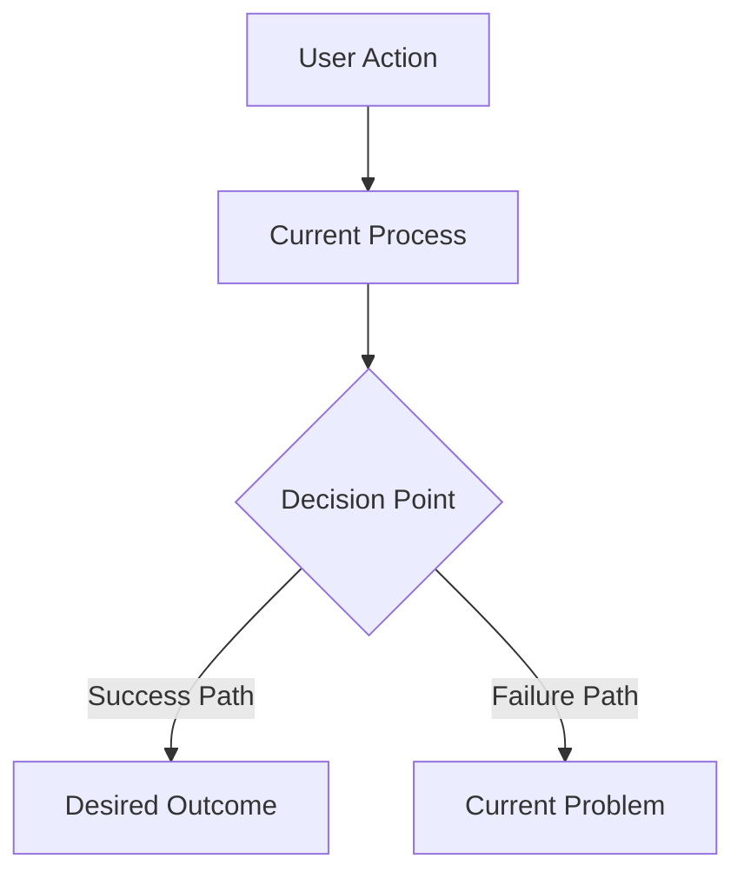
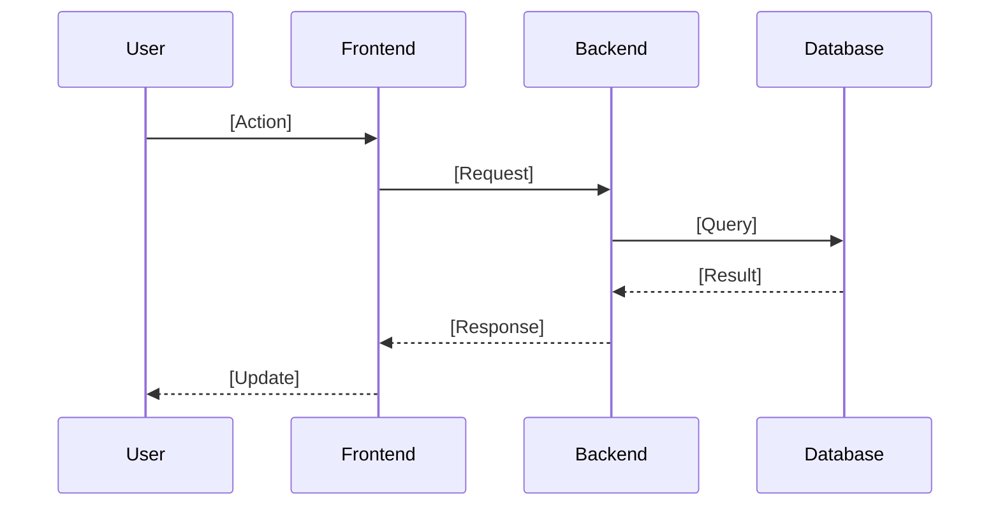

# [Feature Name] Plan

<critical_warning>
> **CRITICAL WARNING:** [Plan-specific breaking change, risk, or coordination requirement.]
</critical_warning>

<important_note>
> **IMPORTANT NOTE:** [Plan-specific constraint, dependency, or non-obvious requirement.]
</important_note>

## 1. Goal
[Describe the primary objective, user pain points, desired outcome, and success criteria.]

---

## 2. Current State Analysis

### 2.1 Current Implementation Overview
[Describe how the system currently works, key components, and normal vs failure modes.]

### 2.2 Current Flow

### 2.3 The Core Problem
[Describe root cause, impact, and workarounds.]

### 2.4 Affected User Scenarios
[Provide a table or list of scenarios and impacts.]

### 2.5 Technical Constraints
[Describe constraints that affect the solution.]

### 2.6 Existing Infrastructure That Can Be Reused
[List reusable components, patterns, or files.]

---

## 3. Desired State

### 3.1 Desired State Requirements
- **REQ-1 (MUST)**: [Requirement]
- **REQ-2 (MUST)**: [Requirement]
- **REQ-3 (MUST)**: [Requirement]
- **REQ-4 (MUST NOT)**: [Regression to avoid]
- **REQ-5 (SHOULD)**: [Requirement]

### 3.2 Defaults and Fallbacks
- **Defaults**: [Default rules]
- **Fallback order**: [Order]
- **Compatibility**: [Compatibility notes]

### 3.3 Verification Checklist

**Functional:**
- [ ] [Requirement verified]

**Defaults/Fallbacks:**
- [ ] [Default and fallback behavior verified]

**Compatibility:**
- [ ] [Legacy behavior verified]

**Ops/Docs:**
- [ ] [Documentation or alerts verified]

---

## 4. Implementation Plan

### Step 1: [Component or Module Name]
**Objective:** [What this step achieves and why]

#### 1.1 High-Level Approach
- [Key change]
- [Key files to touch]
- [Important decisions or trade-offs]

### Step 2: [Next Component]
**Objective:** [What this step achieves and why]

#### 2.1 High-Level Approach
- [Key change]
- [Key files to touch]
- [Important decisions or trade-offs]

---

## 5. Testing Plan

### 5.1 Unit Tests
| Test Case | Component | Expected Result |
| --- | --- | --- |
| [Test] | [Area] | [Outcome] |

### 5.2 Integration Tests
1. [Scenario]
   - Action: [Action]
   - Expected: [Expected]
   - Verify: [Verification method]

---

## 6. API Changes

| Endpoint | Method | Parameters | Response | Breaking Change |
| --- | --- | --- | --- | --- |
| [Endpoint] | [Method] | [Params] | [Response] | [Yes/No] |

---

## 7. Database Changes

### 7.1 Schema Modifications
[Describe schema changes and migration needs.]

<critical_warning>
> **CRITICAL WARNING:** All database changes must use Flask-Migrate. Do not run manual ALTER statements.
</critical_warning>

### 7.2 Data Migration
[Describe data migration or backfill plan.]

---

## 8. UI/UX Changes

### 8.1 User Interface Flow

### 8.2 Visual Components

| Component | Location | Purpose | Interaction |
| --- | --- | --- | --- |
| [Component] | [Location] | [Purpose] | [Interaction] |
