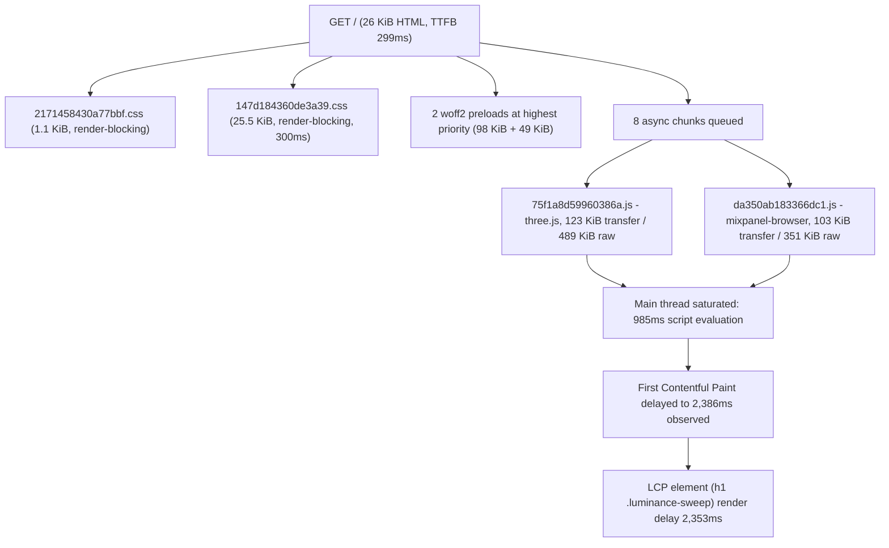

# Agent Readiness and Page Speed Plan 🧪 **PENDING TESTING**

<critical_warning>
> **CRITICAL WARNING:** `demo/AGENTS.md` (`<animation_standards>`) forbids removing, simplifying, or rewriting marketing-site animations "unless the user explicitly asks for that exact animation change". The user **has explicitly authorised** Step 1 of this plan: deferring the Three.js Dot Pool hero background's *chunk load* until after first paint, while keeping its visual design, timing curve, and interaction model byte-for-byte identical. Do not treat Step 1 as a policy violation, and do not extend that authorisation to any other animation. Every other animation in `documents/guides/_animations.md` must render exactly as it does today.
</critical_warning>

<important_note>
> **IMPORTANT NOTE:** The user explicitly decided to **stay on GitHub Pages**. GitHub Pages hard-codes `Cache-Control: max-age=600` on every response and supports no custom response headers. Therefore the Lighthouse `cache-insight` failure (626 KiB, est. 2,750 ms LCP saving) is **not fixable in this plan** and must be reported as a host limitation, not as a defect or a pass. Do not add inert middleware, a `_headers` file, a `vercel.json`, a `<meta http-equiv>` substitute for a transport header, or any other configuration that implies header control this host does not have. Do not propose a hosting migration or a DNS change; both were considered and declined.
</important_note>

## 1. Goal

Raise the Bulma marketing site's **agent readiness** and **mobile page speed** to the level defined by the reusable static-site readiness contract (`/Users/sacino/.agents/skills/build-astro-websites/references/`: `agent-readiness.md`, `accessibility-for-agents.md`, `llms-txt.md`, `agent-readable-http.md`, `performance-and-caching.md`, `fonts.md`, `images.md`, `metadata.md`, `structured-data-and-trust.md`), applying only its **host-neutral** rules to this Next.js 16 static export.

This site is **not** an Astro site and **must not** become one. Those references describe an Astro implementation; this plan carries across their *principles and required outcomes* and re-expresses every one of them in Next.js App Router terms. No Astro package, config, file layout, or convention may be introduced.

### Pain points this fixes

1. An AI agent fetching `https://bulma.com.au/` with JavaScript disabled gets **no structured identity at all**. The JSON-LD graph exists only inside the React Server Component flight payload (`self.__next_f.push(...)`), because it is emitted through `next/script`, which injects client-side. A crawler that does not execute JavaScript cannot parse `Organization`, `WebSite`, `SoftwareApplication`, or `FAQPage`.
2. **No page on the site emits a canonical link.** `curl https://bulma.com.au/ | grep -c 'rel="canonical"'` returns `0`.
3. **`https://bulma.com.au/llms.txt` returns 404.** There is no agent entry point.
4. Lighthouse's **Agentic Browsing** category scores **1/2**: the `agent-accessibility-tree` audit fails because 113 of 114 icon components render `role="image"` with no accessible name.
5. The same defect fails the **Accessibility** category's `svg-img-alt` audit, and the footer fineprint fails `color-contrast` at 3.90:1.
6. **Mobile Performance is 72** (user's PageSpeed Insights run) / **0.75** (local Lighthouse 13.4.1). First Contentful Paint is 2.6–2.9 s and Speed Index 4.7–5.4 s because two JavaScript chunks saturate the main thread before the hero text can paint.

### High-level success criteria

Measured with Lighthouse 13.x, `--form-factor=mobile --screenEmulation.mobile --throttling-method=simulate`, against the deployed `https://bulma.com.au/`:

| Metric | Baseline (measured) | Target |
| --- | --- | --- |
| Performance category | 0.75 | ≥ 0.90 |
| First Contentful Paint | 2,935 ms | ≤ 1,500 ms |
| Speed Index | 4,703 ms | ≤ 2,000 ms |
| Largest Contentful Paint | 4,633 ms | ≤ 3,300 ms |
| Total Blocking Time | 116 ms | ≤ 50 ms |
| Cumulative Layout Shift | 0 | 0 (no regression) |
| Accessibility category | 0.96 | 1.00 |
| Agentic Browsing applicable audits passing | 1 of 2 | 3 of 3 |
| Best Practices category | 1.00 | 1.00 (no regression) |
| SEO category | 1.00 | 1.00 (no regression) |

Plus these binary outcomes:

- Every indexable route emits exactly one self-referencing `<link rel="canonical">` in the **static HTML**.
- Every indexable route emits a parseable `<script type="application/ld+json">` in the **static HTML** (verifiable with JavaScript disabled).
- `https://bulma.com.au/llms.txt` returns HTTP 200 with `Content-Type: text/plain; charset=utf-8` and conforms to the llms.txt v2 format.
- `grep -rn 'role="image"' demo/src` returns zero matches.

---

## 2. Current State Analysis

### 2.1 Current Implementation Overview

The repository root is `/Users/sacino/bulma-root`. All paths below are relative to it.

- The only runnable application is `demo/`: Next.js 16.1.5 App Router, React 19.2.4, Tailwind CSS v4, `output: 'export'`, `trailingSlash: true`, `images.unoptimized: true`. There is no `package.json` at the repository root.
- Deployment is `.github/workflows/deploy.yml`: on push to `main`, `npm ci` then `npm run build` in `demo/`, upload `demo/out` via `actions/upload-pages-artifact@v3`, deploy via `actions/deploy-pages@v4`. The custom domain comes from `demo/public/CNAME`.
- `npm run build` = `next build && node src/scripts/generate-sitemap.js`. The sitemap generator writes `demo/public/sitemap.xml` from the route list in `demo/src/lib/sitemap.js`.
- Routes: `/`, `/about/`, `/pricing/`, `/contact/`, `/privacy-policy/`, plus `demo/src/app/404/page.tsx` and `demo/src/app/not-found.tsx`.
- Site metadata lives in `demo/src/lib/metadata.ts` (`siteMetadata` + `pageMetadata`). `demo/src/app/layout.tsx` owns the sitewide `Metadata` object, fonts, navbar, footer, and analytics.
- Structured data lives in `demo/src/schemas/organization-schema.ts` (`organizationSchema`, `websiteSchema`, `softwareApplicationSchema`, `buildFaqPageSchema`).
- The site is **dark-only**: `demo/src/app/globals.css` declares `@custom-variant dark (&:where(.dark, .dark *))` and `layout.tsx` puts a permanent `dark` class on `<html>` with `viewport.colorScheme = 'dark'`.
- Tests: `demo/package.json` has `"test": "node --test test/*.test.mjs"` and `demo/test/` contains 7 `.test.mjs` files. **`AGENTS.md` currently states this project "has no `npm test` script", which is stale and must be corrected (Step 12).**

### 2.2 Current Critical Path



### 2.3 The Core Problem

#### 2.3.1 Performance: two JavaScript chunks gate first paint

The Largest Contentful Paint element is the hero headline:

```html
<h1 class="font-display ... hero-animate hero-delay-1 ...">
  <div class="luminance-sweep" data-text="Your AI assistant for policy questions." ...>
```

Its LCP breakdown is **299 ms time-to-first-byte + 2,353 ms element render delay**. The render delay is *not* caused by the hero entrance CSS animation and *not* caused by font loading. It is main-thread contention from two chunks, proven by blocking them at the network layer and re-running Lighthouse:

| Scenario | Perf | FCP (sim) | LCP (sim) | Speed Index | TBT | Observed FCP | Observed LCP |
| --- | --- | --- | --- | --- | --- | --- | --- |
| Baseline (production) | 0.75 | 2,935 ms | 4,633 ms | 4,703 ms | 116 ms | 2,386 ms | 2,652 ms |
| `75f1a8d59960386a.js` blocked (three.js) | 0.85 | 1,201 ms | 4,276 ms | 1,751 ms | 78 ms | 124 ms | 349 ms |
| `da350ab183366dc1.js` blocked (mixpanel) | 0.86 | 1,200 ms | 4,198 ms | 1,689 ms | 42 ms | 122 ms | 189 ms |
| **Both blocked** | **0.94** | **1,202 ms** | **3,077 ms** | **1,202 ms** | **15 ms** | **120 ms** | **195 ms** |

Blocking *either* chunk alone recovers FCP; only blocking *both* recovers LCP and TBT. Both must therefore be moved off the critical window.

- **three.js** is loaded by `demo/src/components/elements/dot-pool-background.tsx`, which is `next/dynamic(..., { ssr: false })`-imported by `demo/src/components/sections/hero-dot-pool.tsx`. The imports are already named (`BufferAttribute`, `BufferGeometry`, `Color`, `PerspectiveCamera`, `Plane`, `Points`, `Raycaster`, `Scene`, `ShaderMaterial`, `Vector2`, `Vector3`, `WebGLRenderer`), so the bundle is already tree-shaken; 489 KiB raw is the irreducible `WebGLRenderer` core. The chunk currently begins downloading and executing as soon as React hydrates, which is exactly when the hero needs to paint.
- **mixpanel-browser** is loaded by `demo/src/components/MixpanelProvider.jsx`, which already defers via `requestIdleCallback(callback, { timeout: 3000 })` with a 1,200 ms `setTimeout` fallback. On a throttled mobile CPU `requestIdleCallback` still fires *before* LCP, so the deferral is not deferring far enough. The Mixpanel payload is inflated by session replay and heatmaps configured in `demo/src/lib/mixpanelClient.js` (`record_sessions_percent: 20`, `record_heatmap_data: true`, `record_collect_fonts: true`).

#### 2.3.2 Performance: font preloads compete with render-blocking CSS

`demo/src/app/layout.tsx` configures both families through `next/font/google` with `display: 'swap'`:

```ts
const monaSans = Mona_Sans({ subsets: ['latin'], variable: '--font-mona-sans', display: 'swap', axes: ['wdth'] })
const inter = Inter({ subsets: ['latin'], variable: '--font-inter', display: 'swap' })
```

`next/font` preloads by default, so the served HTML contains two highest-priority font preloads totalling **147 KiB** (`c89730c3ffa99552-s.p.7cba12cc.woff2` 98 KiB, `83afe278b6a6bb3c-s.p.3a6ba036.woff2` 49 KiB), issued **above** the two render-blocking stylesheets in the head. With `font-display: swap` the text paints immediately in the metric-matched fallback and *that* paint is the recorded LCP, so a font preload cannot improve LCP — it can only delay first paint by competing for bandwidth with the HTML and the CSS.

#### 2.3.3 Performance: hero image over-delivered on mobile

`demo/src/components/elements/responsive-screenshot.tsx` renders:

```html
<source media="(max-width: 639px)"
        srcset="...-mobile.webp 390w, ...-mobile@2x.webp 780w, ...-mobile@3x.webp 1170w"
        sizes="82vw" type="image/webp" width="390" height="330">
```

On the Moto G Power emulation (412 CSS px, DPR 1.75) the browser downloads `bulma-policy-advisor-workspace-mobile@2x.webp` (**105,008 bytes on disk**) while the element renders at **291 × 246 CSS px**. Lighthouse attributes 90,371 bytes to over-sized delivery and a further 19,208 bytes to compression, 93,048 bytes total, est. **450 ms LCP saving**.

Two contributing causes:
- `sizes="82vw"` overstates the rendered width. The measured element runs from x=60 to x=352 on a 412 px viewport (292 px ≈ 71vw), because `Screenshot` (`demo/src/components/elements/screenshot.tsx`) adds wallpaper-frame padding inside the hero's `px-6` container.
- The srcset jumps 390w → 780w with nothing between, so a 1.75 DPR device needing ~510 px is forced up to 780w.

#### 2.3.4 Performance: repeat-visit caching cannot be fixed on this host

`curl -sI https://bulma.com.au/_next/static/chunks/75f1a8d59960386a.js` returns `cache-control: max-age=600`. Every asset, including content-hashed `/_next/static/*` chunks that are safe to cache forever, expires in 10 minutes. `cache-insight` reports 626 KiB and est. 2,750 ms LCP saving. GitHub Pages provides no mechanism to change this. **Out of scope by explicit user decision.**

#### 2.3.5 Agent readiness: structured data is invisible without JavaScript

`demo/src/app/page.tsx:172` and `demo/src/app/pricing/page.tsx:80` render the JSON-LD through `next/script`:

```tsx
<Script id="structured-data" type="application/ld+json" dangerouslySetInnerHTML={{ __html: ... }} />
```

`next/script` defaults to `strategy="afterInteractive"`, so the tag is *not* in the static HTML — it appears only as an escaped string inside the RSC flight payload. Verified: `curl -s https://bulma.com.au/ | grep -c '<script type="application/ld+json">'` returns `0`. `/about/`, `/contact/`, and `/privacy-policy/` have no JSON-LD at all.

This fails readiness factor **CORE-02** (JSON-LD structured identity: "Parse one truthful linked graph from the rendered page") and weakens **CORE-06**, **CORE-10**, and **CORE-11**.

#### 2.3.6 Agent readiness: no canonical on any route

`demo/src/app/layout.tsx` sets `metadataBase` but never sets `alternates.canonical`, and no page sets it either. `curl -s https://bulma.com.au/ | grep -c 'rel="canonical"'` returns `0`. This fails readiness factor **CORE-07** (canonical, language, social image and type — the other three are present and correct: `<html lang="en">`, `og:image` absolute with `og:image:alt`, `og:type="website"`).

#### 2.3.7 Agent readiness: no `llms.txt`

`curl -s -o /dev/null -w '%{http_code}' https://bulma.com.au/llms.txt` returns `404`. Lighthouse's `llms-txt` audit is currently `notApplicable`, so it neither passes nor fails. This fails optional factors **OPT-01** (agent when-to-use guidance), **OPT-02** (existence), **OPT-03** (v2 format) and **OPT-08** (link resolution).

#### 2.3.8 Accessibility and Agentic Browsing: `role="image"` on 113 icon components

`grep -rl 'role="image"' demo/src/components/icons | wc -l` returns **113** of 114 icon files. Each renders, for example (`demo/src/components/icons/sparkles-icon.tsx`):

```tsx
<svg width={13} height={13} viewBox="0 0 13 13" fill="none" stroke="currentColor"
     strokeWidth={1} role="image" className={clsx('inline-block', className)} {...props}>
```

An SVG carrying an image role must have an accessible name. None do. This produces:
- **Accessibility → `svg-img-alt` = 0** (weight 1). Failing nodes on the homepage include two `div.icon-path-motion > div.flex > svg.inline-block` feature icons and the `faq-context-icon--plus` / `faq-context-icon--minus` pair inside every `button#faq-N-question`.
- **Agentic Browsing → `agent-accessibility-tree` = 0** (weight 1, the only failing audit in that category), reported as `<svg> elements with an img or image role must have alternative text`.

Every one of these icons is decorative: it sits beside visible text or inside a control that already has a text label. The correct fix is to remove the role and hide them from the accessibility tree, not to invent alt text.

#### 2.3.9 Accessibility: footer contrast 3.90:1

`demo/src/components/sections/footer-with-newsletter-form-categories-and-social-icons.tsx:145` renders the fineprint as `text-mist-600 dark:text-mist-500`. On the dark-only site the effective pair is `#67787c` on `#151718` = **3.90:1**, below the 4.5:1 AA minimum for 14 px normal weight. `color-contrast` carries weight 7 — the largest single accessibility deduction.

Computed contrast against the footer surface `#151718`:

| Token | sRGB | Contrast |
| --- | --- | --- |
| `--color-mist-400` `oklch(72.3% 0.014 214.4)` | `#9ca8ab` | 7.37:1 |
| `--color-mist-500` `oklch(56% 0.021 213.5)` | `#67787c` | 3.90:1 |
| `--color-mist-600` `oklch(45% 0.017 213.2)` | `#4b585b` | 2.44:1 |

The same 3.90:1 pair is used for the billing-period suffix in `demo/src/components/sections/pricing-multi-tier.tsx:207` and `demo/src/components/sections/pricing-hero-multi-tier.tsx:296` (`text-mist-500 dark:text-mist-500`), and for fineprint in the two unused footer variants `footer-with-link-categories.tsx:41` and `footer-with-links-and-social-icons.tsx:60`. Lighthouse only surfaced the homepage footer because it only audited `/`.

#### 2.3.10 Accessibility: no skip link

`curl -s https://bulma.com.au/ | grep -ci skip` returns `0`. The navbar's repeated navigation precedes `<main>` on every route with no bypass mechanism. Required by readiness factor **CORE-18**.

#### 2.3.11 Sitemap accuracy

`demo/src/scripts/generate-sitemap.js` sets `lastmod` for **every** URL to `new Date().toISOString()` at build time, and emits the homepage as `https://bulma.com.au` with no trailing slash while `next.config.ts` sets `trailingSlash: true`. Readiness factor **CORE-12** requires `lastmod` to come only from authoritative content changes; the sitemap reference states plainly: "Do not set every entry to the build time or current time." `changefreq` and `priority` are ignored by Google and add unmaintainable noise.

### 2.4 Affected User Scenarios

| Scenario | Current impact |
| --- | --- |
| AI agent (ChatGPT-User, Claude-User, Perplexity-User) fetches `/` without executing JS | Reads the page text, but finds no canonical, no JSON-LD identity, and no `llms.txt` entry point. Cannot confirm who operates the site, where the app lives, or which pages answer which questions. |
| Agentic browser drives the interface | Encounters 113 unnamed `role="image"` SVGs. Lighthouse rates the accessibility tree malformed; agents can misread FAQ disclosure controls and feature icons as unlabelled images. |
| Broker on a mid-range Android over slow 4G, first visit | Sees a blank dark canvas for ~2.4 s before any text; Speed Index 4.7 s. |
| Screen-reader or low-vision user reading the footer | `© 2026 Bulma Pty Ltd` renders at 3.90:1, below AA. |
| Keyboard-only user on any route | Must tab through the full navbar and mobile-menu markup before reaching page content. |
| Repeat visitor within a day | Re-downloads 626 KiB because GitHub Pages expires every asset after 10 minutes. **Not fixable on this host.** |

### 2.5 Technical Constraints

- **Host:** GitHub Pages. Fixed `Cache-Control: max-age=600`. No custom response headers. No request-time execution. Therefore: no `Vary: Accept`, no same-URL Markdown negotiation, no header-based CSP, HSTS, or `X-Robots-Tag`. The site sits on the **file-only readiness profile** defined in `agent-readable-http.md`.
- **Confirmed working host behaviour that must not regress:** `https://bulma.com.au/robots.txt` returns `text/plain; charset=utf-8`; a random unknown path returns a real **HTTP 404** with the custom 404 page (`<meta name="robots" content="noindex">`, navbar links back to `/` satisfy the CORE-17 named-recovery requirement).
- **Dark-only rendering.** Do not introduce any `prefers-color-scheme` branch in CSS, `<source media>`, or `matchMedia`. Verify with the browser emulating `prefers-color-scheme: light`.
- **No `prefers-reduced-motion`.** `AGENTS.md` forbids gating, disabling, pausing, or skipping animation setup on reduced-motion preferences anywhere in this repository.
- **Static export only.** `output: 'export'` means no middleware, no route handlers at request time, no `next/image` optimisation (`images.unoptimized: true`).
- **No Astro.** The source references are Astro documents; only their outcomes transfer.
- **Node 22.23.1** per `demo/package.json` `engines` and the CI workflow.

### 2.6 Existing Infrastructure That Can Be Reused

| Asset | Path | Reuse for |
| --- | --- | --- |
| Build-time generator pattern | `demo/src/scripts/generate-sitemap.js` + `demo/src/lib/sitemap.js` | Model the `llms.txt` generator on this exact split (typed config module + script wired into `npm run build`). |
| Typed site facts | `demo/src/lib/metadata.ts` (`siteMetadata`, `pageMetadata`) | Single source for site name, description, canonical origin, locale used by canonicals and `llms.txt`. |
| Structured-data graph | `demo/src/schemas/organization-schema.ts` | Already correct content; only the *render path* changes. |
| Existing test suite | `demo/test/*.test.mjs`, `npm test` (`node --test`) | Add build-output assertions here. Do **not** add Playwright — explicitly out of scope. |
| Icon prop spreading | All 114 icon components already accept `ComponentProps<'svg'>` and spread `{...props}` | Lets the default become `aria-hidden` while any future informative use can override per call site. |
| Dot Pool client boundary | `demo/src/components/sections/hero-dot-pool.tsx` already uses `next/dynamic` with `ssr: false` | Add the load gate here without restructuring the component. |
| Analytics idle helper | `requestAnalyticsIdle()` in `demo/src/components/MixpanelProvider.jsx` | Extend rather than replace. |

---

## 3. Desired State

### 3.1 Desired State Requirements

- **REQ-1 (MUST):** The three.js chunk `dot-pool-background` must not begin downloading until after the document `load` event **and** a subsequent idle callback. The Dot Pool's rendered appearance, tunables in `DOT_POOL_CONFIG`, rise entrance, ripples, calm/sink/fade scroll response, and pointer interaction must be unchanged.
- **REQ-2 (MUST):** The Mixpanel chunk must not begin downloading until after the document `load` event. Event payloads, the Mixpanel token, session-replay settings, and the `bulma:mixpanel-ready` / `bulma:mixpanel-disabled` events must be unchanged.
- **REQ-3 (MUST):** No `<link rel="preload" as="font">` appears in the built HTML. Both families still load from their emitted `@font-face` rules and keep `display: 'swap'`. Mona Sans keeps `axes: ['wdth']`.
- **REQ-4 (MUST):** `grep -rn 'role="image"' demo/src` returns zero matches. Every icon SVG is `aria-hidden="true"` and `focusable="false"` by default, and callers can still override via spread props.
- **REQ-5 (MUST):** Every text/background pair rendered on the dark canvas reaches at least 4.5:1. Specifically the footer fineprint and the pricing billing-period suffix.
- **REQ-6 (MUST):** Every indexable route (`/`, `/about/`, `/pricing/`, `/contact/`, `/privacy-policy/`) emits exactly one `<link rel="canonical">` in the static HTML, self-referencing, absolute, on `https://bulma.com.au`, with the trailing slash that `trailingSlash: true` produces.
- **REQ-7 (MUST):** Every indexable route emits at least one `<script type="application/ld+json">` in the static HTML containing a linked `WebSite` + `WebPage` + `Organization` graph. `/` additionally keeps `SoftwareApplication` and `FAQPage`; `/pricing/` keeps its existing nodes. The serialiser must escape `<`, `</script`, U+2028 and U+2029.
- **REQ-8 (MUST):** A keyboard skip link is the first focusable element in the document on every route, is visually hidden until focused, is visible with the site's focus ring when focused, and moves focus to `<main>`.
- **REQ-9 (MUST):** `https://bulma.com.au/llms.txt` returns HTTP 200, `Content-Type: text/plain; charset=utf-8`, valid UTF-8, and conforms to llms.txt v2: one H1, one blockquote summary, non-heading detail paragraphs carrying `When to use` / `When not to use` / `How to use`, then H2 file-list sections, with `## Optional` last if present. Every listed URL is absolute, canonical, unique, and returns 200.
- **REQ-10 (MUST):** `<link rel="describedby" href="https://bulma.com.au/llms.txt">` appears in the head of every route covered by that file.
- **REQ-11 (MUST):** The hero screenshot on a 412 px / DPR 1.75 mobile viewport downloads no more than 60 KiB for the mobile `<source>` candidate, and `sizes` matches the element's real rendered width.
- **REQ-12 (MUST):** `demo/public/sitemap.xml` lists the homepage as `https://bulma.com.au/` with a trailing slash and carries no fabricated `lastmod`, `changefreq`, or `priority`.
- **REQ-13 (MUST NOT):** No animation listed in `documents/guides/_animations.md` other than the Dot Pool's *load timing* changes in appearance, duration, easing, trigger, or interaction model.
- **REQ-14 (MUST NOT):** No `prefers-color-scheme` or `prefers-reduced-motion` conditional is introduced anywhere.
- **REQ-15 (MUST NOT):** No response-header file, middleware, adapter, `Vary` declaration, per-page `.md` route, or Markdown alternate relation is added. GitHub Pages is the file-only profile.
- **REQ-16 (MUST NOT):** No new runtime dependency is added to `demo/package.json`. Build-time devDependencies are permitted only if Step 9 requires an image encoder; prefer a system tool or a pre-generated committed asset.
- **REQ-17 (SHOULD):** `demo/test/*.test.mjs` gains assertions over the built `demo/out` output for canonical presence, JSON-LD presence and parseability, `llms.txt` format, and absence of `role="image"`.

### 3.2 Defaults and Fallbacks

- **Icon default:** decorative. `aria-hidden="true" focusable="false"`, no `role`. An informative icon must be made informative deliberately at the call site by passing `aria-hidden={false}` plus `role="img"` and an `aria-label`. No such call site exists today; do not create one speculatively.
- **Deferred-load fallback order:** if `document.readyState === 'complete'`, schedule immediately; otherwise wait for the `load` event once. Then `requestIdleCallback(fn, { timeout: 2000 })` when available, else `setTimeout(fn, 200)`. Both paths must be cancelled on unmount.
- **Dot Pool absence:** while deferred, the hero must look exactly as it does today before the pool mounts — the existing `aria-hidden="true"` sticky container stays in the tree and reserves the same space, so CLS stays at 0.
- **Canonical derivation:** `alternates.canonical: './'` in Next.js App Router metadata resolves relative to the current route against `metadataBase`. Set it once in `demo/src/app/layout.tsx` so every route inherits, then confirm each built route resolves to its own URL rather than the origin.
- **`llms.txt` ownership:** exactly one owner. Generated into `demo/public/llms.txt` by a build script. Do not also hand-maintain a second copy, and do not add a `src/app/llms.txt/route.ts` — route handlers do not run under `output: 'export'`.

### 3.3 Verification Checklist

**Functional:**
- [ ] `cd demo && npm run lint` exits 0 with zero errors.
- [ ] `cd demo && npm run build` completes without errors and regenerates `demo/public/sitemap.xml` and `demo/public/llms.txt`.
- [ ] `cd demo && npm test` passes, including new assertions.
- [ ] `grep -rn 'role="image"' demo/src` returns no matches.
- [ ] `grep -rn 'prefers-color-scheme\|prefers-reduced-motion' demo/src` returns no matches.
- [ ] Every file under `demo/out` matching `*/index.html` contains exactly one `rel="canonical"` and at least one `<script type="application/ld+json">`.
- [ ] `demo/out/llms.txt` exists, decodes as strict UTF-8, and its first non-blank line is `# Bulma`.
- [ ] Built HTML contains no `rel="preload"` with `as="font"`.

**Performance:**
- [ ] Lighthouse 13.x mobile run against the deployed site meets every target in §1.
- [ ] `agent-accessibility-tree` scores 1.
- [ ] `svg-img-alt` scores 1.
- [ ] `color-contrast` scores 1.
- [ ] `llms-txt` scores 1 (it changes from `notApplicable` once the file exists).
- [ ] `cumulative-layout-shift` remains 0.

**Compatibility:**
- [ ] The Dot Pool renders, animates, ripples on pointer move, calms and sinks on scroll, and fades before the supported-lenders field, exactly as documented in `documents/guides/_animations.md` §55.
- [ ] Mixpanel still initialises in production and still emits `Page View`.
- [ ] The `#lenders` FAQ deep link still opens the `Which lenders does Bulma cover?` disclosure on both direct load and same-page click.
- [ ] Contact form fields remain exactly `form_source`, `name`, `email`, `message`.
- [ ] Homepage and `/pricing/` pricing modules stay verbally and visually aligned, including the exact string `Get 2 months free on a yearly plan.`

**Ops/Docs:**
- [ ] `AGENTS.md` `<validation_commands>` corrected to record the existing `npm test` script.
- [ ] `AGENTS.md` gains a short host-limits note recording the GitHub Pages file-only profile.
- [ ] `documents/guides/_animations.md` §55 records the Dot Pool deferred-load gate.
- [ ] `DESIGN.md` records the skip link, the footer/pricing contrast tokens, and the icon accessibility default.

---

## 4. Additional Context

### 4.1 User-Provided Context

- The user asked to "integrate all of the agents accessibility, llms.txt, and speed improvements on this website that we've outlined in `$agents-md-creator`". `$agents-md-creator` is the AGENTS.md-authoring skill and contains none of that material. The material the user meant is the `build-astro-websites` skill at `/Users/sacino/.agents/skills/build-astro-websites/`, whose `references/` directory contains exactly those three subjects. The user's own note — "we KNOW this is not an astra site, and we don't want to turn it into one" — confirms the Astro skill is the intended source.
- The user's instruction, verbatim: *"We just want to use these principles as instructive to help us optimise the agent readiness + speed of the website."* Principles transfer; Astro implementation does not.
- The user supplied a PageSpeed Insights mobile report (`https://pagespeed.web.dev/analysis/https-bulma-com-au/vqxr3pmzu1?form_factor=mobile`, captured on a Moto G Power with slow-4G throttling, Lighthouse 13.4.1) showing **Performance 72, Accessibility 91, Best Practices 100, SEO 100, Agentic Browsing 1/2**, with FCP 2.6 s, LCP 5.2 s, TBT 90 ms, CLS 0, Speed Index 5.4 s. The insight cards named: efficient cache lifetimes (635 KiB), image delivery (91 KiB), legacy JavaScript (23 KiB), forced reflow, LCP breakdown (element render delay 2,920 ms), network dependency tree (613 ms critical path), unused JavaScript (155 KiB), main-thread work (3.0 s), 5 long tasks, 40 non-composited animations. The user asked that page-speed optimisations be included.
- Four decisions the user made explicitly when asked:
  1. **Hosting/cache:** *Stay on GitHub Pages, document limit.* No DNS change, no migration.
  2. **Dot Pool:** *Defer load, keep animation.* Identical visual and timing; the three.js chunk loads after first paint.
  3. **Fonts:** *Drop preloads, keep both fonts.* `preload: false` on both families; keep Mona Sans's `wdth` axis and therefore no `DESIGN.md` typography change.
  4. **Agent scope:** *Core set only.*

### 4.2 Background and Decisions

**Rejected alternatives, and why.**

| Alternative | Why rejected |
| --- | --- |
| Front `bulma.com.au` with proxied Cloudflare to set `max-age=31536000, immutable` on `/_next/static/*` | Offered with its est. 2,750 ms repeat-visit LCP saving; user chose to stay on GitHub Pages. Do not reopen. |
| Migrate hosting to Cloudflare Workers/Pages or Vercel | Offered; declined for the same reason. |
| Rewrite the Dot Pool in raw WebGL2 to delete the 123 KiB `three` dependency permanently | Offered; user chose deferral instead, which preserves visual parity with no rewrite risk. |
| Drop Mona Sans's `axes: ['wdth']` to halve the display font | Offered; declined because it would change rendered display-heading width and require a `DESIGN.md` typography revision. |
| Add explicit AI-crawler groups (`ChatGPT-User`, `Claude-User`, `Perplexity-User`) to `robots.txt` | Offered as a separate scope item; not selected. `demo/public/robots.txt` keeps its current `User-agent: * / Allow: /` plus sitemap directive. Under RFC 9309 that already allows those agents, so readiness factors CORE-01 and CORE-05 resolve to "allowed at `/`" today. |
| Add WebMCP declarative annotations to the contact form | Offered; not selected. Experimental Chrome API. The Lighthouse `webmcp-*` audits stay `notApplicable`, which does not reduce the Agentic Browsing score. |
| Add a Playwright + `@axe-core/playwright` 33-rule regression suite | Offered; not selected. `AGENTS.md` also records that this project has no configured Playwright suite. Use the existing `node --test` suite instead. |
| Generate per-page `.md` representations or `llms-full.txt` | Prohibited by `agent-readable-http.md` for file-only hosts: a separate public `.md` URL does not satisfy `Accept: text/markdown`, cache-safe `Vary`, or Markdown 404 recovery, and adds build, parity, and test cost with no protocol consumer. |
| Reduce `record_sessions_percent` or disable Mixpanel heatmaps to shrink the analytics chunk | Not proposed. That is a product analytics decision, not a rendering one. Deferring the load past `load` achieves the measured performance goal without changing what is collected. |

**Two additions beyond the four items the user selected, and why they are in this plan.** Both are small, are direct prerequisites of the selected outcomes, and can be cut without affecting the rest:

1. **Step 9 (hero image delivery).** The user explicitly asked for page-speed optimisations from the PSI report, and `image-delivery-insight` is one of its named failures with a 450 ms LCP saving. It touches no design decision.
2. **Step 10 (sitemap accuracy).** Readiness factor **CORE-12** requires accurate `lastmod`; the current generator stamps build time on every URL, which the sitemap reference names as a specific failure. The homepage `<loc>` also disagrees with the site's own trailing-slash policy. These undermine the same discovery contract the selected core set is meant to establish.

**Domain background.** Bulma is an AI assistant for Australian mortgage brokers covering scenario planning, credit assessment preparation, policy matching, and lender selection. The marketing site at `bulma.com.au` exists to earn trust and convert visitors to `https://app.bulma.com.au/register`. The `llms.txt` copy in Step 7 must reflect that and must not promise transaction, advice, or data-access capabilities the marketing site does not have.

**Why `role="image"` and not `role="img"` matters little here.** `image` is an ARIA 1.3 synonym for `img`, and axe-core matches both. Changing the spelling would not fix the audit; only removing the role or supplying an accessible name does. All 113 are decorative, so removal is correct.

**Measurement method used to produce §2.3.1.** Lighthouse 13.4.1 run locally against production with `--form-factor=mobile --screenEmulation.mobile --throttling-method=simulate`, repeated with `--blocked-url-patterns` for each chunk in isolation and together. Reproduce with the same flags to compare against the recorded baseline.

---

## 5. Implementation Plan

### Step 1: Defer the Three.js Dot Pool chunk past first paint 🧪 **PENDING TESTING**

**Objective:** Remove three.js from the window in which the hero headline must paint, without altering the Dot Pool's appearance or behaviour.

#### 1.1 High-Level Approach

- Edit `demo/src/components/sections/hero-dot-pool.tsx` only. Leave `demo/src/components/elements/dot-pool-background.tsx` and `DOT_POOL_CONFIG` untouched.
- Keep the existing `next/dynamic(..., { ssr: false })` import. Add a `poolReady` state, initialised `false`, and render `{poolReady && <DotPoolBackground sectionRef={sectionRef} />}` inside the existing sticky `aria-hidden="true"` container. The container itself must keep rendering so layout is identical from the first frame.
- Set `poolReady` from a `useEffect` that waits for the document `load` event (or runs immediately when `document.readyState === 'complete'`), then schedules `requestIdleCallback(fn, { timeout: 2000 })`, falling back to `setTimeout(fn, 200)` where `requestIdleCallback` is unavailable.
- Clean up in the effect's return: remove the `load` listener, and cancel the pending idle callback or timeout.
- Comment the effect in the imperative mood explaining that the gate exists to keep the 123 KiB three.js chunk off the LCP critical path, and that the Dot Pool's own animation is unchanged.
- Do not add any `prefers-reduced-motion` or `prefers-color-scheme` condition to this gate.

**Success Criteria:**
- `demo/src/components/sections/hero-dot-pool.tsx` renders `DotPoolBackground` only when `poolReady === true`.
- The sticky container `<div class="sticky top-0 z-0 -mb-[100svh] h-[100svh]" aria-hidden="true">` is present in the built HTML for `/` both before and after the change.
- In a throttled browser profile (4× CPU slowdown), the network request for the chunk containing `WebGLRenderer` starts **after** the `load` event fires; confirm by comparing the request's start time to `performance.timing.loadEventEnd` (or `performance.getEntriesByType('navigation')[0].loadEventEnd`).
- Lighthouse mobile `observedFirstContentfulPaint` for `/` is ≤ 400 ms (baseline 2,386 ms).
- Lighthouse `cumulative-layout-shift` for `/` remains exactly 0.
- The Dot Pool still renders: the hero shows the mist-coloured disc field, discs ripple under pointer movement, the field calms and sinks on scroll, and fades before the supported-lenders field. Verified in the browser at `1440x900`.
- `DOT_POOL_CONFIG` in `demo/src/components/elements/dot-pool-background.tsx` is byte-identical to its pre-change state.

### Step 2: Defer the Mixpanel chunk past the load event ✅ **COMPLETED**

**Objective:** Move the 103 KiB analytics chunk out of the LCP window while collecting the same events.

#### 2.1 High-Level Approach

- Edit `demo/src/components/MixpanelProvider.jsx` only. Do not change `demo/src/lib/mixpanelClient.js`, the token, or any `mixpanel.init` option.
- Extend `requestAnalyticsIdle` so it first waits for the document `load` event when `document.readyState !== 'complete'`, and only then requests the idle callback. Keep the existing `{ timeout: 3000 }` idle option and the 1,200 ms `setTimeout` fallback.
- Ensure the returned cancel function removes the `load` listener as well as cancelling the idle callback or timeout, so both `useEffect` cleanups stay leak-free.
- Both existing effects (init, and page-view on `pathname` change) must keep using the same helper.

**Success Criteria:**
- `requestAnalyticsIdle` does not call `requestIdleCallback` or `setTimeout` until the document `load` event has fired.
- Its returned cancel function removes every listener, idle callback, and timeout it created; calling it twice does not throw.
- In a production build served from `demo/out`, the network request for the chunk containing `mixpanel` starts after `loadEventEnd`.
- `window.mixpanelLoaded === true` and `window.mixpanel` is defined within 5 s of load in a production build.
- A `Page View` event with `url` and `page` equal to the current pathname is still emitted once per route entry, and not more than once.
- Lighthouse mobile `totalBlockingTime` for `/` is ≤ 50 ms (baseline 116 ms).

### Step 3: Remove the font preloads ✅ **COMPLETED**

**Objective:** Free 147 KiB of highest-priority bandwidth that competes with the render-blocking CSS and cannot improve LCP under `font-display: swap`.

#### 3.1 High-Level Approach

- In `demo/src/app/layout.tsx`, add `preload: false` to both the `Mona_Sans(...)` and `Inter(...)` configurations.
- Keep `subsets: ['latin']`, `display: 'swap'`, both `variable` names, and `axes: ['wdth']` on Mona Sans exactly as they are.
- Add a comment at each call recording why preload is off: with `font-display: swap`, text paints in the metric-matched fallback and that paint is the LCP, so a preload can only delay first paint.

**Success Criteria:**
- `grep -c 'rel="preload"' demo/out/index.html` counts zero occurrences where `as="font"`.
- `demo/out/index.html` still contains `@font-face` references for both families via the emitted CSS, and the `--font-mona-sans` and `--font-inter` variable class names still appear on `<html>`.
- Rendered display headings still use the widened Mona Sans axis; compare a `1440x900` screenshot of the homepage hero before and after and confirm identical glyph widths once fonts have loaded.
- No visible layout shift on font swap: Lighthouse `cumulative-layout-shift` for `/` remains 0.

### Step 4: Make every icon decorative and remove `role="image"` 🧪 **PENDING TESTING**

**Objective:** Fix the only failing Agentic Browsing audit and the `svg-img-alt` accessibility failure.

#### 4.1 High-Level Approach

- Across all 113 files under `demo/src/components/icons/` (including `social/`) that contain `role="image"`, replace that attribute with `aria-hidden="true"` and `focusable="false"`.
- Keep every other attribute (`width`, `height`, `viewBox`, `fill`, `stroke`, `strokeWidth`, `className` via `clsx`) unchanged, and keep `{...props}` spread **after** the new attributes so a call site can still override them.
- Confirm no icon is the sole content of an interactive control without an existing text label. The known icon-only controls already carry their own names and must keep them: `SocialLink` in `demo/src/components/sections/footer-with-newsletter-form-categories-and-social-icons.tsx:64` uses `aria-label={name}`, the newsletter controls use `aria-label="Email"` and `aria-label="Subscribe"`, and the mobile menu close button uses `aria-label="Close menu"`.
- Do not add `<title>` elements, `aria-label`s, or alt text to any icon. They are decorative and sit beside visible text.
- Keep the edits mechanical and reviewable — one attribute swap per file, no reformatting, no repo-wide search-and-replace across unrelated file types.

**Success Criteria:**
- `grep -rn 'role="image"' demo/src` returns no matches.
- `grep -rln 'aria-hidden="true"' demo/src/components/icons | wc -l` returns 113.
- Every icon component still spreads `{...props}` after its hard-coded attributes, so `<SparklesIcon aria-hidden={false} role="img" aria-label="X" />` would override the default.
- Lighthouse `svg-img-alt` scores 1 on `/`, `/pricing/`, `/about/`, `/contact/`, and `/privacy-policy/`.
- Lighthouse `agent-accessibility-tree` scores 1 on `/`.
- Lighthouse Accessibility category for `/` reaches 1.00.
- The FAQ disclosure plus/minus icons still animate between states on click, and the `icon-path-motion` feature icons still play their entry motion, verified in the browser at `1440x900` and `390x900`.

### Step 5: Raise fineprint and pricing-period contrast to AA 🧪 **PENDING TESTING**

**Objective:** Clear the `color-contrast` failure, which carries the largest single accessibility weight.

#### 5.1 High-Level Approach

- Change the dark-mode token from `mist-500` to `mist-400` (`#9ca8ab`, 7.37:1 on `#151718`) at these exact locations:
  - `demo/src/components/sections/footer-with-newsletter-form-categories-and-social-icons.tsx:145` — the live footer's fineprint.
  - `demo/src/components/sections/pricing-multi-tier.tsx:207` — the billing-period suffix.
  - `demo/src/components/sections/pricing-hero-multi-tier.tsx:296` — the billing-period suffix.
  - `demo/src/components/sections/footer-with-link-categories.tsx:41` and `demo/src/components/sections/footer-with-links-and-social-icons.tsx:60` — unused footer variants, updated for consistency so the defect cannot return by swapping footers.
- Leave the unprefixed light-mode class in each pair as-is; it is inert on this dark-only site and `AGENTS.md` says to keep such pairs readable.
- Because the homepage and `/pricing/` pricing modules are governed by the parity rule in `AGENTS.md`, make the two pricing edits together and verify both modules.

**Success Criteria:**
- `grep -rn 'dark:text-mist-500' demo/src` returns no matches.
- Lighthouse `color-contrast` scores 1 on `/` and `/pricing/`.
- The computed footer fineprint colour is `#9ca8ab` against `#151718`, a ratio of 7.37:1, confirmed by reading the computed style in the browser.
- Homepage and `/pricing/` pricing cards remain equal-height with `items-stretch` + `h-full`, show the same billing-period wording in Monthly and Yearly states, and produce no horizontal overflow at `1440x900` or `390x900`.

### Step 6: Emit canonicals, server-rendered JSON-LD, and the skip link ✅ **COMPLETED**

**Objective:** Give every indexable route a canonical URL and a machine-parseable identity graph in the static HTML, and let keyboard users bypass the navbar.

#### 6.1 Canonical URLs

- In `demo/src/app/layout.tsx`, add `alternates: { canonical: './' }` to the exported `metadata` object. `metadataBase` is already `new URL(siteMetadata.siteUrl)`.
- Build and inspect each route's emitted `index.html`. If any route resolves to the origin rather than its own path, set an explicit `alternates.canonical` on that route's own `metadata` export instead of relying on inheritance.

**Success Criteria:**
- Each of `demo/out/index.html`, `demo/out/about/index.html`, `demo/out/pricing/index.html`, `demo/out/contact/index.html`, `demo/out/privacy-policy/index.html` contains exactly one `<link rel="canonical">`.
- Their `href` values are exactly `https://bulma.com.au/`, `https://bulma.com.au/about/`, `https://bulma.com.au/pricing/`, `https://bulma.com.au/contact/`, `https://bulma.com.au/privacy-policy/`.
- No canonical contains a query string, fragment, `localhost`, or preview origin.
- `demo/out/404.html` does **not** gain a canonical (it keeps `<meta name="robots" content="noindex">`).

#### 6.2 Server-rendered JSON-LD

- Create a server component, `demo/src/components/elements/structured-data.tsx`, exporting a `StructuredData` component that takes a graph array and renders a plain `<script type="application/ld+json" dangerouslySetInnerHTML={{ __html: serialise(graph) }} />`. It must not be a client component and must not use `next/script`.
- The `serialise` helper must call `JSON.stringify` on the graph and then, in the resulting string, replace every `<` with the six-character JSON escape `\u003c`, every `>` with `\u003e`, every `&` with `\u0026`, every U+2028 with `\u2028`, and every U+2029 with `\u2029`. These are JSON-level escapes, so the emitted text still parses with `JSON.parse` while containing no literal `</script` sequence and no raw line or paragraph separator that could terminate or alter the script element.
- Replace the `<Script id="structured-data" type="application/ld+json" ...>` usages in `demo/src/app/page.tsx:172` and `demo/src/app/pricing/page.tsx:80` with `<StructuredData>`, passing the same graphs they pass today. Remove the now-unused `next/script` imports if nothing else on those pages uses them.
- Add `<StructuredData>` to `demo/src/app/about/page.tsx`, `demo/src/app/contact/page.tsx`, and `demo/src/app/privacy-policy/page.tsx`, each emitting `websiteSchema`, `organizationSchema`, and a route-specific `WebPage` node whose `@id` is the route canonical, whose `name` is the route's document title, whose `description` is the route's `pageMetadata` description, and which links `isPartOf` to the `WebSite` `@id` and `publisher`/`about` to the `Organization` `@id`. Add the `WebPage` builder to `demo/src/schemas/organization-schema.ts` beside the existing builders.
- Do not invent facts. Use only values already present in `demo/src/lib/metadata.ts` and `demo/src/schemas/organization-schema.ts`.

**Success Criteria:**
- `curl -s file://.../demo/out/index.html` (or `grep`) finds `<script type="application/ld+json">` in all five indexable route HTML files.
- Each block parses with `JSON.parse` without error.
- On `/`, the parsed graphs include `@type` values `Organization`, `WebSite`, `SoftwareApplication`, and `FAQPage`.
- On every indexable route, the parsed graph contains a `WebPage` node whose `url` equals that route's canonical and whose `isPartOf.@id` equals `https://bulma.com.au/#website`.
- No `application/ld+json` content appears only inside `self.__next_f.push(...)`.
- Loading `/` with JavaScript disabled and running an extraction over the DOM yields the full graph.
- Google's Rich Results structured-data parsing of the built `/` HTML reports no errors for `Organization`, `SoftwareApplication`, or `FAQPage`. If that tool cannot be reached, record it as unavailable and rely on local `JSON.parse` plus schema-field assertions.

#### 6.3 Skip link

- In `demo/src/app/layout.tsx`, render an anchor as the first child of `<body>`, before `NavbarWithLinksActionsAndCenteredLogo`, with `href="#main-content"` and the text `Skip to main content`.
- Give `demo/src/components/elements/main.tsx` the `id="main-content"` and `tabIndex={-1}` so focus can land on it.
- Style the link with the project's existing Tailwind utilities: visually hidden by default (`sr-only`), and revealed on focus (`focus:not-sr-only`) as a positioned element with the site's existing focus ring classes, the mist-950 surface, and white text. Do not introduce a new colour token.

**Success Criteria:**
- The skip link is the first focusable element in the DOM on every route.
- It is not visible until focused; pressing Tab once from a fresh page load reveals it.
- Activating it moves focus to the `<main id="main-content">` element (`document.activeElement` is that element).
- Its computed contrast against its own background is at least 4.5:1.
- It appears in `demo/out/index.html` before the `<header>`/navbar markup.
- Verified in the browser at `1440x900` and `390x900`.

### Step 7: Publish `/llms.txt` 🧪 **PENDING TESTING**

**Objective:** Give agents one curated, truthful entry point in llms.txt v2 format.

#### 7.1 High-Level Approach

- Create `demo/src/lib/llms.js`, modelled on `demo/src/lib/sitemap.js`: a CommonJS module exporting the site name, summary, the three guidance fields, and the ordered sections with `{ label, href, description }` entries.
- Create `demo/src/scripts/generate-llms-txt.js`, modelled on `demo/src/scripts/generate-sitemap.js`, which renders the document deterministically and writes `demo/public/llms.txt` as UTF-8. It must throw and fail the build when the name or summary is empty, when a section has no links, when a URL is not an absolute `https://bulma.com.au` URL, or when a URL is duplicated.
- Extend the build script in `demo/package.json` to `next build && node src/scripts/generate-sitemap.js && node src/scripts/generate-llms-txt.js`.
- Commit the generated `demo/public/llms.txt` alongside `demo/public/sitemap.xml`, matching the existing convention.
- Add `<link rel="describedby" href="https://bulma.com.au/llms.txt" />` to the `<head>` block in `demo/src/app/layout.tsx`, beside the existing `dns-prefetch` hints.
- The document content must be exactly this shape, with these verified facts and no others:

```
# Bulma

> Bulma is an AI assistant for Australian mortgage brokers that answers lender policy questions with source attribution, and supports scenario planning, credit assessment preparation, policy matching, and lender selection.

**When to use:** Use these pages to answer questions about what Bulma does for Australian mortgage brokers, which lenders it covers, how its answers are sourced from lender policy documents, what it costs, and how to contact or sign up.

**When not to use:** Do not use them for lender policy answers themselves, for credit advice, for a specific borrower's scenario, or for anything about an individual customer's account or data. Those live inside the product at https://app.bulma.com.au/ and require an account.

**How to use:** Read the most relevant page below, then link a person to https://app.bulma.com.au/register to start a free trial or to https://bulma.com.au/contact/ to reach the team.

## Primary

- [Overview](https://bulma.com.au/): What Bulma does for Australian mortgage brokers, the supported lenders, and answers to common questions.
- [Pricing](https://bulma.com.au/pricing/): Current plans, what each includes, and monthly versus yearly billing.
- [About](https://bulma.com.au/about/): Who operates Bulma and why it exists.

## Contact

- [Contact](https://bulma.com.au/contact/): How to reach the Bulma team about questions, feedback, or partnerships.

## Policies

- [Privacy Policy](https://bulma.com.au/privacy-policy/): How Bulma collects, uses, and protects personal information.
```

- Before writing this content, open `/about/`, `/pricing/`, `/contact/`, and `/privacy-policy/` and confirm each description matches what the page actually says. Correct any description that does not; do not publish a claim the page does not support.

**Success Criteria:**
- `demo/public/llms.txt` and `demo/out/llms.txt` both exist after `npm run build`.
- `file demo/out/llms.txt` reports UTF-8 text, and `python3 -c "open('demo/out/llms.txt',encoding='utf-8',errors='strict').read()"` succeeds.
- The first non-blank line is `# Bulma`; there is exactly one `#`-level heading; the next non-blank line begins with `> `.
- No line between the blockquote and the first `## ` heading begins with `#`.
- Every resource line matches `- [label](https://bulma.com.au/...): description`.
- Every URL is unique, absolute, on `https://bulma.com.au`, ends with `/`, and returns HTTP 200 after deployment.
- The file contains no YAML frontmatter, no `example.com`, no placeholder token, no crawler directive, and no `Optional` section unless a genuinely secondary resource is added.
- After deployment, `curl -sI https://bulma.com.au/llms.txt` returns `HTTP/2 200` and `content-type: text/plain; charset=utf-8`.
- `demo/out/index.html` contains `<link rel="describedby" href="https://bulma.com.au/llms.txt"`.
- Lighthouse's `llms-txt` audit changes from `notApplicable` to score 1.
- The built output contains **zero** per-page `.md` files and **zero** `rel="alternate" type="text/markdown"` relations.

### Step 8: Record the GitHub Pages host limits ✅ **COMPLETED**

**Objective:** Make the unfixable items explicit so a future reader does not mistake them for defects or try to "fix" them with inert configuration.

#### 8.1 High-Level Approach

- Add a short `<host_limits>` block to `AGENTS.md` inside `<container_information>` stating: GitHub Pages fixes `Cache-Control: max-age=600` on all responses and supports no custom response headers; therefore long-lived immutable asset caching, header-based CSP/HSTS/`X-Robots-Tag`, `Vary: Accept`, and same-URL Markdown negotiation are unavailable; the site runs the file-only agent-readability profile; do not add `_headers`, `vercel.json`, middleware, or a `Vary` declaration, because they would be inert and misleading.
- Keep it to a few lines. Do not restate the whole readiness contract.

**Success Criteria:**
- `AGENTS.md` contains a `<host_limits>` section naming `Cache-Control: max-age=600`, the absence of custom headers, and the file-only profile.
- It explicitly forbids adding `_headers`, `vercel.json`, or middleware to this repository.
- No such file exists anywhere in the repository after this plan is complete.

### Step 9: Reduce hero screenshot delivery on mobile ✅ **COMPLETED**

**Objective:** Stop a 412 px mobile viewport downloading a 105 KiB image to render a 291 px element.

#### 9.1 High-Level Approach

- Measure first. In the browser at `390x900`, read the hero ``'s `getBoundingClientRect().width` and the container's computed padding, and compute the true `sizes` value as a percentage of the viewport. Use the measured value; do not guess.
- Generate one intermediate mobile variant of `bulma-policy-advisor-workspace-mobile` at roughly 585 px wide (1.5× the 390 px base) as WebP, and commit it to `demo/public/img/screenshots/`. Match the existing naming so it reads as part of the same set.
- Re-encode the existing `bulma-policy-advisor-workspace-mobile@2x.webp` at a higher compression factor. Lighthouse attributes 19,208 bytes to compression alone. Compare the re-encoded file against the original at `390x900` and reject any visible loss of readability in the screenshot's UI text — the file is a product capture whose legibility is the point.
- Update `demo/src/components/elements/responsive-screenshot.tsx` so `VerifiedAppScreenshot` accepts the intermediate source and emits it in the mobile `<source srcSet>` between the 1× and 2× entries, and so `sizes` uses the measured value instead of the hard-coded `82vw`.
- Apply the same `sizes` correction to `FeatureScreenshotLeft` and `FeatureScreenshotRight` only if their measured rendered widths also disagree with `82vw`; otherwise leave them alone.
- Do not switch to `next/image`; `images.unoptimized: true` is required by `output: 'export'` and the component deliberately serves verified captures from `public/`.

**Success Criteria:**
- `demo/public/img/screenshots/bulma-policy-advisor-workspace-mobile@2x.webp` is at most 86,000 bytes (baseline 105,008).
- A new intermediate variant exists at roughly 585 px wide and is at most 60,000 bytes.
- On a 412 px viewport at DPR 1.75, the resource the browser selects for the hero `<source>` transfers at most 60 KiB; confirm the selected URL in the network panel.
- `sizes` on the mobile `<source>` is within 3 percentage points of the measured rendered width as a fraction of viewport width.
- Lighthouse `image-delivery-insight` reports at most 20 KiB of estimated savings for `/` (baseline 91 KiB).
- The hero screenshot at `390x900` shows the Policy Advisor UI text as legibly as the current production image; compare screenshots side by side.
- The hero `` keeps `loading="eager"` and `fetchPriority="high"`; below-fold screenshots keep `loading="lazy"`.
- `cumulative-layout-shift` remains 0.

### Step 10: Correct the sitemap ✅ **COMPLETED**

**Objective:** Stop publishing a fabricated `lastmod` on every URL and align the homepage `<loc>` with the site's trailing-slash policy.

#### 10.1 High-Level Approach

- Edit `demo/src/scripts/generate-sitemap.js` and `demo/src/lib/sitemap.js`.
- Emit the homepage as `https://bulma.com.au/` with the trailing slash, matching `trailingSlash: true` and the Step 6.1 canonical.
- Remove the `lastmod` element entirely rather than stamping build time. There is no authoritative per-page content-change date in this repository, and the sitemap reference forbids using build time. If a future content model supplies real dates, `lastmod` can return then.
- Remove `changefreq` and `priority`; Google ignores both and they cannot be maintained accurately here.
- Keep `demo/public/robots.txt` pointing at `https://bulma.com.au/sitemap.xml` unchanged.

**Success Criteria:**
- `demo/out/sitemap.xml` is well-formed XML; `xmllint --noout demo/out/sitemap.xml` exits 0.
- It contains exactly five `<url>` entries: `https://bulma.com.au/`, `https://bulma.com.au/about/`, `https://bulma.com.au/pricing/`, `https://bulma.com.au/contact/`, `https://bulma.com.au/privacy-policy/`.
- Every `<loc>` ends with `/` and matches the corresponding route's canonical exactly.
- The file contains no `<lastmod>`, `<changefreq>`, or `<priority>` element.
- `/404/` does not appear.
- `curl -s https://bulma.com.au/robots.txt` still returns the `Sitemap: https://bulma.com.au/sitemap.xml` directive and `text/plain; charset=utf-8`.

### Step 11: Add build-output regression assertions ✅ **COMPLETED**

**Objective:** Stop these specific defects returning silently, using the test stack the project already has.

#### 11.1 High-Level Approach

- Add `demo/test/agent-readiness.test.mjs` using `node --test`, matching the style of the existing seven test files.
- The test must run against the built `demo/out` directory. Document in a comment that it requires `npm run build` first, and make the test fail with a clear message if `demo/out` is missing rather than passing vacuously.
- Assert the outcomes below by reading files from disk. Do not start a browser and do not add Playwright.

**Success Criteria:**
- The test file asserts, and the assertions fail when the corresponding fix is reverted:
  - Each of the five indexable `index.html` files contains exactly one `rel="canonical"` with its expected absolute URL.
  - Each contains at least one `<script type="application/ld+json">` whose contents `JSON.parse` successfully.
  - The `/` graph contains `Organization`, `WebSite`, `SoftwareApplication`, and `FAQPage` `@type` values.
  - Each contains `rel="describedby"` pointing at `https://bulma.com.au/llms.txt`.
  - No indexable `index.html` contains `rel="preload"` with `as="font"`.
  - `demo/out/llms.txt` exists, its first non-blank line is `# Bulma`, its second non-blank line starts with `> `, and every list item URL is unique and absolute on `https://bulma.com.au`.
  - `demo/out/sitemap.xml` has no `<lastmod>`, `<changefreq>`, or `<priority>`, and its homepage `<loc>` ends with `/`.
  - No file under `demo/src` contains the string `role="image"`.
  - No file under `demo/src` contains `prefers-color-scheme` or `prefers-reduced-motion`.
- `cd demo && npm test` passes with the new file included and all seven existing files still passing.

### Step 12: Synchronise project documentation ✅ **COMPLETED**

**Objective:** Keep the repository's own guides accurate, as `AGENTS.md` `<documentation_synchronisation>` requires.

#### 12.1 High-Level Approach

- `AGENTS.md` `<validation_commands>`: correct the stale claim that "This project currently has no `npm test` script". Record the real command `cd demo && npm test` (`node --test test/*.test.mjs`) and that it requires a prior `npm run build` for the new build-output assertions. Keep the existing statement that there is no configured Playwright suite, which remains true.
- `documents/guides/_animations.md` §55 (Dot Pool Hero Background (Three.js) and the "Take the stage" screenshot): add a short subsection recording the deferred-load gate — that `DotPoolBackground` now mounts only after the document `load` event plus an idle callback, why (the 123 KiB three.js chunk was delaying FCP by ~1.7 s), and that the pool's own animation, tunables, and interaction model are unchanged.
- `DESIGN.md`: record the skip-link component and its focus treatment under Layout/navigation; record `mist-400` as the minimum dark-surface secondary text token for fineprint and pricing-period text with its 7.37:1 ratio; record that icon components are decorative by default (`aria-hidden="true"`, `focusable="false"`) and that an informative icon must opt in at the call site.
- Do not restate the same fact in more than one document; link to the owner instead.

**Success Criteria:**
- `AGENTS.md` no longer contains the string "has no `npm test` script".
- `AGENTS.md` `<validation_commands>` names `cd demo && npm test` and its build prerequisite.
- `documents/guides/_animations.md` §55 describes the load gate, its trigger conditions, and its cleanup.
- `DESIGN.md` contains entries for the skip link, the `mist-400` contrast floor, and the icon accessibility default.
- No document claims a capability GitHub Pages does not provide.

---

## 6. Testing Plan

### 6.1 Source-of-Truth Regression Artefacts

These are the artefacts that revealed each defect. They are the primary regression inputs and must be used directly.

| Artefact | Why it matters | Expected post-fix behaviour | Scope |
| --- | --- | --- | --- |
| `https://pagespeed.web.dev/analysis/https-bulma-com-au/vqxr3pmzu1?form_factor=mobile` — the user's PSI mobile report (Lighthouse 13.4.1, Moto G Power, slow-4G) | The originating report: Performance 72, Accessibility 91, Agentic Browsing 1/2, FCP 2.6 s, LCP 5.2 s, SI 5.4 s | A fresh PSI mobile run reports Performance ≥ 90, Accessibility 100, Agentic Browsing 2/2 or better, SEO 100, Best Practices 100 | Full report, except `cache-insight`, which must still fail and be reported as a GitHub Pages host limit |
| Local Lighthouse baseline: `lighthouse https://bulma.com.au/ --form-factor=mobile --screenEmulation.mobile --throttling-method=simulate` | The measured baseline in §2.3.1 (Perf 0.75, FCP 2,935 ms, LCP 4,633 ms, SI 4,703 ms, TBT 116 ms) | Re-run after deployment with identical flags and meet every §1 target | Full report |
| Chunk-isolation runs with `--blocked-url-patterns="*75f1a8d59960386a.js*"` and `"*da350ab183366dc1.js*"` | Proved the two chunks cause the FCP/LCP delay; the "both blocked" run (Perf 0.94, FCP 1,202 ms) is the ceiling the deferral should approach | After Steps 1 and 2, the **unblocked** production run should land near the "both blocked" figures | Comparison only; chunk hashes will change after rebuild, so re-derive them from the new build if the experiment is repeated |
| `curl -s https://bulma.com.au/ > baseline-home.html` | Contains the current head with zero `rel="canonical"`, zero `<script type="application/ld+json">`, two `as="font"` preloads, and zero `describedby` | The equivalent post-fix fetch contains one canonical, at least one parseable JSON-LD script, zero font preloads, and one `describedby` | Full document |
| `demo/public/img/screenshots/bulma-policy-advisor-workspace-mobile@2x.webp` (105,008 bytes on disk) | The exact over-delivered LCP-adjacent image Lighthouse flagged | Re-encoded to ≤ 86,000 bytes with no visible loss of UI-text legibility, and no longer selected on a 412 px / DPR 1.75 viewport | The exact file |
| `demo/src/components/icons/*.tsx` — the 113 files containing `role="image"` | The exact source of both the `svg-img-alt` and `agent-accessibility-tree` failures. Lighthouse named `div.icon-path-motion > div.flex > svg.inline-block` and `div#faq-0 > button#faq-0-question > span.relative > svg.inline-block` | Zero matches for `role="image"`; both named selectors resolve to `aria-hidden="true"` SVGs | All 113 files |
| `demo/src/components/sections/footer-with-newsletter-form-categories-and-social-icons.tsx:145` | The exact node Lighthouse reported at 3.90:1 (`#67787c` on `#151718`, nodeLabel `© 2026 Bulma Pty Ltd`) | Computed colour `#9ca8ab`, ratio 7.37:1 | That element, plus the four sibling locations in Step 5 |
| `https://bulma.com.au/llms.txt` returning HTTP 404 | Proves the file is absent | Returns HTTP 200 with `text/plain; charset=utf-8` and a v2-conformant body | The exact URL |

<critical_warning>
> **CRITICAL WARNING:** The Lighthouse runs, the live `curl` fetches, and the exact 113 icon files and single footer node named above are the source-of-truth regression inputs. Do not substitute a synthetic HTML fixture or a hand-written before/after table for a real Lighthouse run against the deployed site. Local `demo/out` checks prove file contents; they cannot prove response headers, media selection on a real device profile, or category scores. Where a real run cannot be made — for example if the deployment has not happened yet — report that evidence as **unavailable**, not as passed.
</critical_warning>

### 6.2 Unit Tests

All new assertions live in `demo/test/agent-readiness.test.mjs`, framework `node:test` via `node --test`, command `cd demo && npm run build && npm test`.

| Test Case | Component | Expected Result |
| --- | --- | --- |
| Canonical present and correct on all five indexable routes | `demo/out/**/index.html` | Exactly one `rel="canonical"`, absolute, `https://bulma.com.au` origin, trailing slash matching the route |
| JSON-LD present in static HTML | `demo/out/**/index.html` | At least one `<script type="application/ld+json">` whose body `JSON.parse`s |
| Homepage graph completeness | `demo/out/index.html` | Parsed `@type` set includes `Organization`, `WebSite`, `SoftwareApplication`, `FAQPage` |
| JSON-LD serialiser escaping | `demo/src/components/elements/structured-data.tsx` | Input containing `</script>`, `<`, U+2028, U+2029 renders escaped and still `JSON.parse`s |
| `describedby` relation | `demo/out/**/index.html` | Contains `rel="describedby"` pointing at `https://bulma.com.au/llms.txt` |
| No font preloads | `demo/out/**/index.html` | Zero `rel="preload"` elements with `as="font"` |
| `llms.txt` v2 structure | `demo/out/llms.txt` | One H1 first, blockquote second, no headings in the detail area, all resource sections H2, all URLs unique and absolute |
| `llms.txt` UTF-8 integrity | `demo/out/llms.txt` | Decodes as strict UTF-8; contains no `’`, `Ã`, `Â`, or U+FFFD |
| Sitemap accuracy | `demo/out/sitemap.xml` | Five entries, all `<loc>` trailing-slashed, no `<lastmod>`/`<changefreq>`/`<priority>` |
| No `role="image"` | `demo/src/**` | Zero matches |
| No colour-scheme or reduced-motion branches | `demo/src/**` | Zero matches for `prefers-color-scheme` and `prefers-reduced-motion` |
| No file-only-profile violations | `demo/out/**` | Zero `*.md` files; zero `rel="alternate" type="text/markdown"`; no `_headers` or `vercel.json` anywhere in the repository |

### 6.3 Integration Tests

Run the dev server per `AGENTS.md` `<dev_server_policy>`: check whether `http://localhost:3001` is already serving the Bulma demo; if not, start it with `cd demo && npm run dev -- -p 3001`; stop it afterwards only if you started it. Use `dev-browser`. Emulate `prefers-color-scheme: light` for every check so the dark lock-in is proven. Cover both `1440x900` and `390x900`.

1. **Dot Pool renders and animates after deferral**
   - Action: Load `/`, wait for the `load` event, then wait up to 3 s. Move the pointer across the hero. Scroll through the hero track.
   - Expected: the mist disc field appears; discs ripple under the pointer; the field calms and sinks as the screenshot pins; the field fades before the supported-lenders section. Behaviour matches `documents/guides/_animations.md` §55.
   - Verify: screenshots at hero top, mid-pin, and post-release at `1440x900`, plus a console check showing zero errors and zero page errors.

2. **Hero copy paints before the Dot Pool**
   - Action: Load `/` with 4× CPU throttling and record a performance trace.
   - Expected: the `h1` text is painted before the request for the three.js chunk starts.
   - Verify: compare the chunk request's `startTime` against `performance.getEntriesByType('paint')` first-contentful-paint and against `loadEventEnd`.

3. **Skip link**
   - Action: Load each of the five routes, press Tab once, read `document.activeElement`, screenshot, press Enter, read `document.activeElement` again.
   - Expected: first Tab focuses the visible `Skip to main content` link; Enter moves focus to `<main id="main-content">`.
   - Verify: screenshots at `390x900` and `1440x900` showing the focused link, plus the two `document.activeElement` readings.

4. **Icon states still animate**
   - Action: On `/`, scroll the feature icons into view; click `faq-0` and `faq-1` open and closed.
   - Expected: `icon-path-motion` entry animation plays; the FAQ plus/minus icons cross-fade between states; the disclosure opens and closes with its spring transition.
   - Verify: screenshots of each state; zero console errors.

5. **FAQ deep link preserved**
   - Action: Load `https://localhost:3001/#lenders` directly, then from `/` click a same-page `#lenders` link.
   - Expected: both open the `Which lenders does Bulma cover?` disclosure.
   - Verify: screenshot showing the expanded answer in both cases. This is a binding `AGENTS.md` contract.

6. **Pricing parity after the contrast change**
   - Action: Load `/` and `/pricing/`, toggle Monthly and Yearly on both.
   - Expected: identical plan-card wording, the exact string `Get 2 months free on a yearly plan.` in both, equal-height cards, no horizontal overflow.
   - Verify: screenshots at `1440x900` and `390x900` for each page in each billing state.

7. **Contact form unchanged**
   - Action: Load `/contact/`, inspect the form.
   - Expected: fields are exactly hidden `form_source`, `name`, `email`, `message`; each visible field keeps its connected `<label>` and `autocomplete` token; submit still posts to Formspree.
   - Verify: DOM inspection listing every `input`/`textarea` `name`, plus a screenshot of the idle, error, and success states.

8. **Deployed-response verification**
   - Action: After the change is deployed to `https://bulma.com.au`, run `curl -sI` against `/`, `/llms.txt`, `/robots.txt`, `/sitemap.xml`, and a random unknown path.
   - Expected: `/llms.txt` → 200 `text/plain; charset=utf-8`; `/robots.txt` → 200 `text/plain; charset=utf-8`; `/sitemap.xml` → 200 with an XML content type; unknown path → 404 with the custom 404 page. All still carry `cache-control: max-age=600`, which is the recorded host limit.
   - Verify: the raw header output, and a fresh Lighthouse mobile run meeting every §1 target.

---

## 7. UI/UX Changes

| Component | Location | Purpose | Interaction |
| --- | --- | --- | --- |
| Skip link | `demo/src/app/layout.tsx`, first child of `<body>`; target `demo/src/components/elements/main.tsx` | Let keyboard users bypass the navbar on every route | Hidden until focused; first Tab reveals it with the site focus ring; Enter moves focus to `<main id="main-content">` |
| Footer fineprint | `demo/src/components/sections/footer-with-newsletter-form-categories-and-social-icons.tsx:145` | Reach AA contrast | Static text; colour changes from `#67787c` (3.90:1) to `#9ca8ab` (7.37:1) |
| Pricing billing-period suffix | `demo/src/components/sections/pricing-multi-tier.tsx:207`, `demo/src/components/sections/pricing-hero-multi-tier.tsx:296` | Reach AA contrast; keep homepage and `/pricing/` modules aligned | Text changes with the Monthly/Yearly toggle; colour changes to `mist-400` in both modules together |
| Icon SVGs | 113 files under `demo/src/components/icons/` | Remove unnamed image roles from the accessibility tree | No visual change; the icons remain visible and keep every existing animation |
| Dot Pool background | `demo/src/components/sections/hero-dot-pool.tsx` | Keep the hero's WebGL pool off the first-paint critical path | No visual change to the animation itself; it begins roughly 0.5–1 s later on a slow first visit, after the hero copy has painted |
| Hero screenshot sources | `demo/src/components/elements/responsive-screenshot.tsx` | Serve a right-sized mobile candidate | No visual change at any supported viewport; the same capture is delivered at an appropriate resolution |

---

## 8. Implemented Solution

Implementation is complete in the local checkout. The plan remains **Pending Testing** because the user did not authorise a production push, so deployed Lighthouse scores and deployed `/llms.txt` response headers are unavailable.

### 8.1 Performance and loading

- `hero-dot-pool.tsx` now keeps the hero wrapper stable and mounts the Dot Pool after `load` during idle time, with a timed fallback and complete listener/callback cleanup.
- `MixpanelProvider.jsx` uses the same post-load idle strategy and idempotent cleanup.
- `layout.tsx` disables local-font preloads. The desktop `Get started` action has a fixed minimum width to prevent font-swap layout shift.
- Responsive screenshot components now offer measured intermediate WebP candidates for the hero, evidence-ledger, and comparison images. Browser verification at `412x900` and DPR 1.75 selected every intermediate candidate.

### 8.2 Agent readiness and accessibility

- All five indexable routes emit one canonical, a static `WebPage` graph linked to the shared `WebSite` and `Organization`, and a `describedby` link to `/llms.txt`.
- `404` output has no canonical and remains `noindex`.
- The root layout provides the first-focus skip link, and `Main` provides the focus target.
- Decorative SVGs are hidden from the accessibility tree without changing their visual or animation behaviour.
- Footer fineprint and pricing-period text use `mist-400`, meeting the documented 7.37:1 contrast floor.

### 8.3 Discovery artefacts and regression coverage

- The build now generates `llms.txt` and the sitemap before `next build`, so the static export contains current copies.
- `llms.txt` contains the approved concise product profile and five curated URLs. The sitemap contains the five canonical routes with no fabricated freshness metadata.
- `agent-readiness.test.mjs` covers canonical, 404 robots, JSON-LD, serialiser escaping, `llms.txt`, sitemap, font preload, icon, colour-scheme, motion, and static-host profile rules.
- `AGENTS.md`, `DESIGN.md`, and `_animations.md` record the GitHub Pages cache limit and the new implementation contracts.
- The independent post-change audit found and resolved two defects: Dot Pool renderer failure now degrades to the server-rendered hero, and exported 404 pages now contain one `noindex` directive without `nofollow`.

### 8.4 Verification record

- `npm run lint`: passed with zero errors.
- `npm run build`: passed and produced the static export.
- `npm test`: passed, 23 of 23 tests.
- Local static-output Lighthouse: Accessibility 1.00, Best Practices 1.00, SEO 1.00, agent accessibility tree 1.00, `llms.txt` 1.00, CLS 0, image-delivery audit 1.00.
- Local performance timing: FCP 3.45 s, LCP 6.98 s, TBT 32 ms, CLS 0. The Python static server does not compress JavaScript and is not comparable to the GitHub Pages deployment, so these local FCP/LCP values do not determine the production performance target.
- Browser checks passed on all five routes at `1440x900` and `390x900` with light colour-scheme emulation. Checks covered dark lock-in, skip navigation, pricing parity, FAQ deep links, contact fields and states, image selection, Dot Pool behaviour, horizontal overflow, console errors, and page errors.
- Live production remains unchanged: `/llms.txt` returns 404 and existing responses retain `cache-control: max-age=600`. A deployment and fresh production Lighthouse run are still required to close Steps 1, 4, 5, and 7.
- A later user-authorised Cloudflare preview now serves the complete readiness export at `https://cloudflare-comparison.bulma-root.pages.dev/`. It is noindexed and uses deployment `0e21f32b-05ae-4d52-9557-18a7433fd08b` with dirty-source provenance; it is not the production deployment required by this plan.
- Refreshed preview validation passed the isolated production build, all 23 tests, 182-file deployed-body parity, five-route desktop/mobile browser matrix, responsive-image profile, post-load Three.js timing, WebGL fallback, mocked contact states, homepage Accessibility `1.00`, Best Practices `1.00`, and Agentic Browsing `1.00`.
- Five-run preview medians meet the mobile Performance, LCP, Speed Index, TBT, and CLS targets. Mobile homepage FCP is `1,979.9 ms`, which exceeds the `1,500 ms` target; mobile pricing FCP is `979.4 ms`. The plan remains Pending Testing until a production deployment is authorised and every live apex gate passes.
- `documents/guides/_hosting.md` contains the complete refreshed Lighthouse and curl matrices, deployment identity, route-level accessibility findings, and comparison limits.
