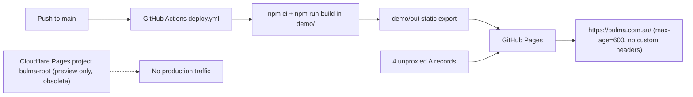

# Astro on Cloudflare Workers Migration Plan 🔄 **IN PROGRESS**

<critical_warning>
> **CRITICAL WARNING:** Production cutover changes DNS for `bulma.com.au` and `www.bulma.com.au` only. Immediately before that write, record the complete live state of every record in zone `0534ecfcfde9d322566af12ec11c1bef`, every Workers custom domain, every zone ruleset, and the GitHub Pages site state in `documents/guides/_hosting.md`, then commit it. Only the three apex `A` records and the one `www` `A` record may change. The `app.bulma.com.au` CNAME to Vercel, every MX, TXT, DKIM, DMARC, autodiscover, and `send.auth` record must remain byte-identical. GitHub Pages stays live and undisabled until the Worker passes every production check so the four recorded `A` records can restore the previous host within minutes.
</critical_warning>

<important_note>
> **IMPORTANT NOTE:** This plan supersedes `documents/todo/cloudflare_pages_migration_plan.md`. That plan kept Next.js and targeted Cloudflare Pages; it stalled at its Step 5G performance gate and is archived by Step 10 of this plan. Its Pages project `bulma-root`, preview deployments, `Pages Write` token, and GitHub secret are obsolete and are removed after cutover. Every Cloudflare and GitHub action in this plan is agent-run through the macOS Keychain credential, the Cloudflare API, Wrangler, and `gh`. The GitHub App grant is already done: `Culpable/bulma-root` was granted to the Cloudflare Workers and Pages GitHub App on 2026-09-04 and the repository is visible in the Cloudflare dashboard's **Import a repository** list. Cloudflare published the Workers Builds repository-connection API on 2026-08-13, so the executor can now create the connection and triggers without a dashboard step. Exactly one action needs the user: the explicit approval to cut over after reviewing `https://staging.bulma.com.au/`.
</important_note>

<autonomy>
> **AUTONOMY (Steps 1-8):** Execute Steps 1 through 8 end to end without asking for permission. This is standing authorisation for every action those steps describe, including: creating, editing, moving, and deleting files under `site/`; installing dependencies with pnpm; writing `documents/guides/_hosting.md`; creating the Cloudflare API token and storing it in Keychain; deploying `bulma-root` and `bulma-root-preview` with Wrangler; uploading preview versions; attaching the `staging.bulma.com.au` custom domain; running Playwright, axe, and Lighthouse; and committing **and pushing** the `site/` work to `main` under `<git_rules>`. Do not pause for confirmation, do not present intermediate options, and do not stop to report progress at step boundaries.
>
> Stop and ask the user in exactly three cases:
> 1. **Step 7 Builds connection** - only if the repository connection and triggers cannot be created through the Cloudflare API. Attempt the API first (see Step 7). If it is genuinely dashboard-only, ask the user with the native question tool, supply the exact field values to enter, wait, then continue autonomously.
> 2. **Step 8 cutover approval** - the mandatory gate. Present both URLs, the parity numbers, the Lighthouse medians, the header result, and the rollback packet, then stop. Never begin Step 9 without a recorded explicit approval.
> 3. **A documented fallback chain is exhausted** - the font, CSP, islands, Worker-name, or custom-domain fallbacks in Section 3.2 all fail. Report the exact failure and the residual risk; do not improvise a substitute architecture.
>
> Nothing in Steps 1-8 changes production. `bulma.com.au` stays on GitHub Pages, `.github/workflows/deploy.yml` keeps building only `demo/`, and the only DNS write before Step 9 is the record Cloudflare creates for `staging`.
</autonomy>

## 1. Goal

Rebuild the Bulma marketing site as a static-first, agent-ready Astro site per the `build-astro-websites` skill, host it on Cloudflare Workers Static Assets in account `213ab3604485056376263d22fa242742`, prove it on `https://staging.bulma.com.au/` with full visual and functional parity against the live Next.js site, and only then move `bulma.com.au` and `www.bulma.com.au` to the Worker and decommission GitHub Pages, the Next.js app, and the obsolete Cloudflare Pages project.

Why: GitHub Pages fixes `Cache-Control: max-age=600`, cannot set response headers, cannot negotiate `Accept: text/markdown`, and the Next.js runtime ships roughly 70 KiB gzip of framework code on every route. The previous Pages migration could not justify a host-only move on performance evidence. Astro removes the framework runtime from static pages, keeps React only inside hydrated islands, and Cloudflare Workers Static Assets supplies immutable asset caching, custom headers, a Content Security Policy, and the negotiated Markdown selector that the sibling `taxgenie-root` site already runs in this account.

The migration is complete when:

- `site/` contains an Astro `7.x` static site (pnpm, strict TypeScript, `output: 'static'`, `trailingSlash: 'always'`, `site: 'https://bulma.com.au'`) that renders the five public routes, the 404 page, `robots.txt`, `sitemap.xml`, and `llms.txt`.
- Every visible surface, animation, interaction, colour, font, copy string, link target, and structured-data node matches the current production site at `https://bulma.com.au/` within the parity gates in Section 6, at `1440x900` and `390x900`, dark-only, with `prefers-color-scheme: light` emulated.
- The React components that own interaction and animation are ported one-to-one as Astro React islands; no animation is removed, simplified, or gated by reduced-motion or colour-scheme conditionals.
- The Worker serves prerendered HTML, negotiated Markdown at the same URL, the skill's security-header baseline with a tested CSP, immutable `/_astro/*` caching, and a real `404.html`.
- Cloudflare Workers Builds deploys `bulma-root` from `main` and uploads non-promoted versions of every other branch to `bulma-root-preview`.
- The user reviewed `https://staging.bulma.com.au/` with the parity and Lighthouse report and explicitly approved cutover.
- `https://bulma.com.au/` is served by the Worker, `https://www.bulma.com.au/<path>?<query>` returns one `308` to the matching apex URL, and every discovery file still names only `https://bulma.com.au`.
- GitHub Pages is disabled, `demo/`, the Pages workflow, CNAME files, the Cloudflare Pages project, its token, and its GitHub secret are removed, and `AGENTS.md`, `DESIGN.md`, `README.md`, `documents/guides/_animations.md`, and `documents/guides/_hosting.md` describe the Astro site as the only runnable app.

---

## 2. Current State Analysis

### 2.1 Current Implementation Overview

- Repository `Culpable/bulma-root`, default branch `main`, `HEAD` at `f31143c`, production revision deployed to GitHub Pages `4a005a64b8b44b91d168602049cbef38867f79be`. Commits go directly to `main`.
- Runnable app: `demo/` only. Next.js `16.1.5`, React `19.2.4`, Tailwind CSS `4.1.18` through `@tailwindcss/postcss`, `three@^0.170.0`, `mixpanel-browser@^2.73.0`, `clsx`, npm lockfile v3, Node `22.23.1` pinned in `.nvmrc` and `demo/package.json` (`>=22.23.1 <23`).
- Build: `node src/scripts/generate-sitemap.js && node src/scripts/generate-llms-txt.js && next build` with `output: 'export'`, `trailingSlash: true`, `basePath: ''`, unoptimised images; emits `demo/out` (179 served files, 8 HTML documents, largest file the 488 KiB Three.js chunk).
- Routes: `/`, `/about/`, `/pricing/`, `/contact/`, `/privacy-policy/`, `/404/` plus `not-found.tsx`; static `404.html` at the export root.
- Shell: `demo/src/app/layout.tsx` sets `<html lang="en" class="dark">`, `viewport.colorScheme = 'dark'`, `themeColor #0a0d0e`, self-hosts Mona Sans (variable, `wdth` axis, latin, `display: swap`, no preload) and Inter (latin, swap, no preload) through `next/font/google`, renders the skip link, `referral-tracking.js` with `strategy="lazyOnload"`, `MixpanelProvider`, the server-rendered navbar shell with hydrated `NavbarController` and route-aware `NavbarLink`s, `Main`, and the newsletter footer.
- Metadata: `demo/src/lib/metadata.ts` (`siteMetadata`, `pageMetadata`), `template: '%s | Bulma'`, absolute homepage title, canonical `./`, Open Graph image `/img/og/bulma-og-image.png`, `og:locale en-AU`, `<link rel="describedby" href="https://bulma.com.au/llms.txt">`, dns-prefetch for `app.bulma.com.au` and `api-js.mixpanel.com`.
- Structured data: `demo/src/schemas/organization-schema.ts` emits `Organization` (`#organization`, PO Box 155 Northlands WA 6905, `solutions@bulma.com.au` sales contact, `sameAs` app URL), `WebSite`, `SoftwareApplication`, per-route `WebPage`, and homepage `FAQPage`; `structured-data.tsx` serialises with `<`, `>`, `&`, U+2028, U+2029 escaping.
- Discovery: `demo/public/robots.txt` (allow all, sitemap URL), `demo/public/sitemap.xml` (five canonical URLs, no `lastmod`), `demo/public/llms.txt` rendered from `demo/src/lib/llms.js` by `generate-llms-txt.js`, which enforces the Bulma-not-website subject rule, promotional-term ban, and minimum operating-line lengths.
- Analytics: `demo/src/lib/mixpanelClient.js` imports `mixpanel-browser/src/loaders/loader-module-with-async-recorder`, token `d6d41f4f948512ee3e388559f7b1686e`, `track_pageview: false`, cookie persistence, cross-subdomain cookie, `record_sessions_percent: 20`, heatmaps, `.sensitive-data` masking, font collection, `record_idle_timeout_ms 600000`, `record_min_ms 3000`; dispatches `bulma:mixpanel-ready` and `bulma:mixpanel-disabled`. `MixpanelProvider.jsx` initialises after `load` plus `requestIdleCallback` (`timeout: 3000`, 1200 ms fallback) and tracks one `Page View {url, page}` per pathname. `demo/public/scripts/referral-tracking.js` waits for readiness and tracks `Referral Source Identified` with first-touch `set_once`/`register_once`. Development mode disables analytics.
- Contact form: `demo/src/app/contact/contact-form.tsx` posts `FormData` with `Accept: application/json` to `https://formspree.io/f/xojvwybl`; fields exactly hidden `form_source=contact_page`, `name`, `email`, `message`; `role="alert"` error panel with mailto fallback, `role="status"` success and pending panels, `aria-busy` submit button with animated checkmark; tracks `Form Submitted` with identification and `Form Error`.
- Interactive layer: 57 files carry `'use client'` (listed in Section 4.3). Homepage hero `hero-dot-pool.tsx` hosts the Three.js Dot Pool (`dot-pool-background.tsx`, loaded through `next/dynamic` with `ssr: false` after `load` + idle) and the scroll-pinned "take the stage" screenshot; `hue-shift-provider.tsx` wraps the homepage and writes `--accent-hue-shift`; FAQ disclosures, pricing toggle with morphing prices, plan comparison tabs, scroll reveals, cursor spotlight, magnetic wrappers, luminance sweep, logo marquee, animated counters, border beam, testimonial glass cards, and View Transition navigation through `transition-link.tsx` with `document.startViewTransition` and 300 ms root keyframes in `globals.css` lines 3110-3160.
- Styling: `demo/src/app/globals.css` (3,484 lines) declares `@import 'tailwindcss'`, `@custom-variant dark (&:where(.dark, .dark *))`, the `@theme` block with the mist oklch ramp, `--font-display: var(--font-mona-sans)` with `--font-display--font-variation-settings: 'wdth' 112.5`, `--font-sans: var(--font-inter)`, every keyframe and animation utility, and the view-transition rules.
- Tests: 33 Node tests in `demo/test/*.test.mjs` (`node --test`) covering agent readiness, analytics runtime, UI contracts, CTA targets, feature-card alignment, navbar dialog ownership, performance regressions and budgets, pricing toggle parity and timers, runtime and browser rules. No Playwright suite. `demo/performance-budgets.json` records per-route unused-JavaScript ceilings and gzip baselines (`/` 197,318 B, `/about/` 185,344 B, `/pricing/` 185,927 B, `/contact/` 179,506 B, `/privacy-policy/` 176,182 B).
- Deployment: `.github/workflows/deploy.yml` builds `demo/` on push to `main` with Node `22.23.1` and publishes `demo/out` through `actions/deploy-pages@v4`. GitHub Pages reports `build_type: workflow`, `cname: bulma.com.au`, HTTPS enforced. `demo/public/CNAME` and root `CNAME` contain `bulma.com.au`. `demo/public/_headers` holds one Pages rule (`/_next/static/*` immutable) that GitHub Pages ignores.
- Documentation contracts: `AGENTS.md` (validation commands, dev server on port 3001, dark-only rules, `#lenders` hash rule, contact form field contract, pricing parity, animation standards, `<host_limits>`), `DESIGN.md` (visual contract), `documents/guides/_animations.md` (55 sections, every animation primitive), `documents/guides/_demo-video.md` (Remotion, unaffected), `documents/guides/_hosting.md` (Pages migration evidence, DNS snapshot, rollback payloads), `.cursor/rules/dev-browser.mdc`.

### 2.2 Current Flow

### 2.3 The Core Problem

- The host cannot express the site's delivery contract: no immutable caching for hashed assets, no security headers, no charset control for `llms.txt`, no `Accept` negotiation, no `X-Robots-Tag` for previews. `AGENTS.md` `<host_limits>` documents these as permanent limits.
- Every route ships the Next.js and React runtime (about 70 KiB gzip transfer, 23-29 KiB representative unused code) even for the static privacy policy; the framework cannot render a page without hydrating the whole tree.
- The Pages migration plan required a host-only performance win from a byte-identical artifact; the GitHub side failed its own non-inferiority gate on measurement variance and the Sydney browser gate stayed blocked, so no cutover happened.
- The workspace already has the target architecture running: `/Users/sacino/taxgenie-root` is an Astro `7.2.6` static site on Workers Static Assets in the same Cloudflare account (`taxgenie-root` production Worker with custom domain, `taxgenie-root-preview` on `webpop.workers.dev`, Workers Builds on push, negotiated Markdown selector, `_headers` CSP, Playwright plus axe suite). Its live responses show HTML `cache-control: public, max-age=0, must-revalidate` with `cf-cache-status: HIT`, `/_astro/*` fonts `max-age=31536000, immutable`, `/llms.txt` `text/plain; charset=utf-8`, and `www` `308` to the apex with path and query preserved, all with zone Browser Cache TTL left at `14400`.

### 2.4 Affected User Scenarios

| Scenario | Today | After |
| --- | --- | --- |
| Broker opens any route on a cold cache | HTML from GitHub Pages plus about 176-197 KiB gzip of route JavaScript | Prerendered HTML from the Cloudflare edge; React only for hydrated islands; per-route JavaScript at or below the recorded Next baseline |
| Repeat navigation | Next router prefetch and same-document view transition | Real page load with native cross-document view transition, Astro hover prefetch, edge-cached HTML, immutable assets |
| Agent requests `Accept: text/markdown` at a canonical URL | HTML only | Generated Markdown from the same URL with `Vary: Accept`; HTML byte-identical when HTML is selected |
| Crawler reads `/llms.txt` | `text/plain` without charset | `text/plain; charset=utf-8` |
| Pre-cutover review | `cloudflare-comparison.bulma-root.pages.dev` (noindexed Pages preview, obsolete) | `https://staging.bulma.com.au/` on the production Worker, noindexed by a host-scoped header rule |
| Contact enquiry | Formspree POST from the browser with in-page states | Identical form, endpoint, fields, and states inside a React island |
| Cutover failure | Restore four `A` records | Same restore, plus delete the Worker custom domains and revert the `www` record and redirect rule |

### 2.5 Technical Constraints

- **Binding project contracts (`AGENTS.md`, `DESIGN.md`):** dark-only rendering with a permanent `dark` class and `color-scheme: dark`; no `prefers-color-scheme` or `prefers-reduced-motion` branches anywhere; no animation removed, simplified, or rewritten beyond what the framework port requires, with every documented timing, trigger, state, cleanup, and WebGL fallback preserved; `#lenders` opens the lender FAQ on direct load and same-page click, `#supported-lenders` targets the hero field; contact form fields exactly `form_source`, `name`, `email`, `message`; homepage and pricing modules stay identical with the annual callout `Get 2 months free on a yearly plan.`; equal-height pricing cards through `h-full` wrappers; Glass Press primary for `Try Bulma free` and `Get started`.
- **Skill authority order:** user instructions, then `AGENTS.md`, then `build-astro-websites` and `deploy-cloudflare-workers-sites` references, then `wrangler` and `workers-best-practices`. This plan rewrites `<host_limits>`, `<validation_commands>`, `<dev_server_policy>`, and the folder structure in `AGENTS.md` in Step 11; until then the old text describes `demo/` only.
- **Astro facts (verified during planning; re-verify before version-sensitive work):** `astro@7.3.1` requires Node `>=22.12.0` (22.23.1 is supported); `@astrojs/react@6.0.5` supports React 19; the Fonts API is stable (`fonts` config, `fontProviders.local()` / `fontsource()` / `google()`, `display` defaults to `swap`, `formats` `['woff2']`, `optimizedFallbacks: true`); Tailwind v4 integrates through `@tailwindcss/vite`; `build.format` defaults to `directory`; `src/pages/404.astro` emits `/404.html`; hashed assets go to `/_astro/*`; prerendered endpoints persist only their body, never headers; processed `<script>` tags under `vite.build.assetsInlineLimit` are inlined and Astro's island hydration stubs are always inline; `@astrojs/sitemap` emits `sitemap-index.xml`, so a custom `src/pages/sitemap.xml.ts` is required for a single `/sitemap.xml`; `@astrojs/cloudflare` is needed only for on-demand routes.
- **Cloudflare facts (verified during planning; re-verify before version-sensitive work):** assets-only Workers need no `main`; `_headers` and `_redirects` are supported in the assets directory, `*` spans `/`, host-scoped rules such as `https://staging.bulma.com.au/*` and `https://:version.:subdomain.workers.dev/*` are valid, domain-level `_redirects` are not; default asset `Cache-Control` is `public, max-age=0, must-revalidate` with an `ETag`; Workers add no `X-Robots-Tag` to previews; custom domains attach through `routes: [{ pattern, custom_domain: true }]` or `PUT /accounts/{account_id}/workers/domains`, Cloudflare creates the proxied record and certificate, and an existing conflicting record is overridden only through the changeset path (`override_existing_dns_record: true`); `workers_dev` and `preview_urls` control `*.workers.dev` exposure; Workers Builds requires the Cloudflare GitHub App installed for the repository before `PUT /accounts/{account_id}/builds/repos/connections` and `POST /accounts/{account_id}/builds/triggers` (fields `external_script_id`, `repo_connection_uuid`, `build_token_uuid`, `trigger_name`, `build_command`, `deploy_command`, `root_directory`, `branch_includes`, `branch_excludes`, `path_includes`, `path_excludes`) and `PATCH .../triggers/{uuid}/environment_variables`; `wrangler versions upload` returns a `workers.dev` preview URL and never promotes traffic; Bulk Redirects and zone redirect rules require a proxied record on the source hostname.
- **Cloudflare account state (read during planning; re-query before every write):** account `213ab3604485056376263d22fa242742`, member `jake.sacino@gmail.com` Super Administrator; workers.dev subdomain `webpop`; existing Workers `hfmlegal`, `musclehacking-astro-preview`, `taxgenie-root`, `taxgenie-root-preview`; one Workers custom domain (`taxgenie.com.au`); zone `bulma.com.au` (`0534ecfcfde9d322566af12ec11c1bef`) has no Worker routes, no custom rulesets, `browser_cache_ttl 14400`, Brotli/HTTP/3/TLS 1.3/IPv6 on, Early Hints/Speed Brain/0-RTT/Rocket Loader off, `always_use_https off`; Pages project `bulma-root` (preview only, latest deployment `3712aa0a-8883-4c46-bf42-3dc1e46be404`); one account token `bulma-root-cloudflare-pages-deploy` (`9dd6d8eb748379192f4d2d9b7fb4fc3b`, `Pages Write`); Zero Trust Access is not enabled (`access.api.error.not_enabled`). GitHub repository secret `CLOUDFLARE_PAGES_API_TOKEN` and variable `CLOUDFLARE_ACCOUNT_ID` exist. The `gh` token cannot list GitHub App installations (`403`, and Cloudflare exposes no installation-listing endpoint either), so the grant was verified visually instead: on 2026-09-04 `Culpable/bulma-root` appeared in the Cloudflare dashboard's **Import a repository** list, confirming the Cloudflare Workers and Pages GitHub App is installed for `Culpable` and now covers this repository.
- **Credential rules:** the Global API Key lives only in Keychain service `cloudflare-global-api-key` (account `jake.sacino@gmail.com`) and is loaded per command as `CLOUDFLARE_API_KEY` with `CLOUDFLARE_EMAIL=jake.sacino@gmail.com`; never print, log, or persist it. New tokens follow the sibling convention: Keychain services `bulma-root-cloudflare-build-api-token`, `-id`, and `-uuid`.
- **Git rules:** no push without explicit authorisation, no `git add -A`, no branch changes without consent, `trash` instead of `rm`, absolute paths for every write, and the mixed-file majority rule for dirty files (`documents/guides/_hosting.md` and `documents/todo/cloudflare_pages_migration_plan.md` are already dirty from the previous task).
- **Dev server rules:** `demo/` keeps port `3001`; the Astro site uses port `4331` (ports 4321-4326, 4330, and 4399 belong to other checkouts). Do not run `npm run build` in `demo/` while its dev server runs.
- **Reference-only trees:** root `components/`, `pages/`, and `tailwind.css` are unrouted Tailwind Plus template sources; leave them untouched. `video/bulma-demo/` is the Remotion project; leave it untouched.

### 2.6 Existing Infrastructure That Can Be Reused

- `/Users/sacino/taxgenie-root`: `astro.config.mjs` (Fonts API, `inlineStylesheets`, `assetsInlineLimit: 0`, `trailingSlash`, port pin), `wrangler.jsonc` (`run_worker_first` exclusions, `not_found_handling: '404-page'`), `public/_headers` (CSP baseline, `/llms.txt` charset, `/_astro/*` immutable), `src/worker.ts`, `src/lib/agent-readable-http/`, `scripts/generate-agent-markdown.mjs`, `scripts/validate-build.mjs`, `scripts/preview-server.mjs`, `playwright.config.ts` (desktop and mobile projects, SwiftShader WebGL flags, `reuseExistingServer: false`), `test/agent-accessibility.*`, `test/discovery.test.ts`, `documents/AGENTS/*`, `README.md` Deployment section, and its plan's Step 10 record of the Workers Builds and custom-domain procedure.
- `build-astro-websites` skill assets: `assets/metadata/src/*` (site config, metadata resolver, `PageMetadata.astro`, `StructuredData.astro`, `BaseLayout.astro`), `assets/llms-txt/src/*`, `assets/sitemap/*`, `assets/agent-readable-http/*` (Cloudflare Workers `worker.ts` and `wrangler.jsonc` templates, `generate-agent-markdown.mjs`, `accept.ts`, `document-response.ts`, `headers.ts`, `internal-path.ts`), `assets/agent-accessibility/*`, `assets/agent-readiness/*`, `assets/third-party-scripts/*`, `assets/project-instructions/*`.
- `deploy-cloudflare-workers-sites/scripts/verify-http-contract.mjs` for repeatable local, staging, and production HTTP contract runs.
- Every component, hook, icon, style, image, script, and copy string under `demo/src` and `demo/public` is the port source. Images, fonts' source families, `robots.txt`, `llms.js` content, `sitemap.js` route list, `supported-lenders.ts`, `mist-palette.ts`, and `organization-schema.ts` carry over verbatim.
- `demo/test/*.test.mjs` are the contract source for the ported Node tests; `demo/performance-budgets.json` supplies the per-route JavaScript baselines.
- `documents/guides/_hosting.md` already holds the DNS baseline, rollback payloads, credential map, and Lighthouse method; this plan extends it.
- Lighthouse `13.4.1`, Chrome `151`, curl `8.7.1`, `dev-browser`, `gh`, `jq`, `security`, and `npx wrangler` are available on the execution machine.

---

## 3. Desired State

### 3.1 Desired State Requirements

- **REQ-1 (MUST):** Create the Astro site at `/Users/sacino/bulma-root/site` with pnpm `11.22.0`, Node `22.23.1`, `astro@7.3.x`, `@astrojs/react@6.x`, `react@19.2.x`, `@tailwindcss/vite@4.x` with `tailwindcss@4.x`, `three` pinned to the exact version resolved in `demo/package-lock.json`, `mixpanel-browser@2.73.0` exact, `clsx`, `wrangler@4.129.x` exact, `@astrojs/check`, `typescript`, `@playwright/test`, `@axe-core/playwright`, and no `@tailwindplus/elements`, `next`, `@astrojs/cloudflare`, or `@astrojs/sitemap`.
- **REQ-2 (MUST):** `astro.config.mjs` sets `site: 'https://bulma.com.au'`, `output: 'static'`, `trailingSlash: 'always'`, `integrations: [react()]`, `vite.plugins: [tailwindcss()]`, `vite.build.assetsInlineLimit: 0`, `build.inlineStylesheets: 'never'` (both commented as a coupled pair), `prefetch: { prefetchAll: true, defaultStrategy: 'hover' }`, `server.port: 4331`, and the Fonts API entries for Mona Sans and Inter.
- **REQ-3 (MUST):** Every public route is prerendered. The only request-time code is the negotiated Markdown selector Worker (`site/src/worker.ts` copied from the skill's `providers/cloudflare-workers/worker.ts`) with the `ASSETS` binding and the skill's `run_worker_first` patterns. No adapter, no Astro endpoint runs on demand, no other binding, no `nodejs_compat`.
- **REQ-4 (MUST):** Interactive and animated behaviour is ported as React islands (`@astrojs/react`) from the existing `demo/src` components with their logic, timings, easings, class strings, ARIA, cleanup, and fallbacks unchanged. Next-specific APIs are replaced per the table in Section 4.3. Static content renders from React components without a `client:*` directive or from `.astro` files.
- **REQ-5 (MUST):** Each hydrated island is the smallest coherent section; the Astro page composes sections and passes only serialisable props. JSX-as-props composition (for example `HeroDotPool` headline, subheadline, CTA, demo, footer slots) lives inside per-page React section components under `site/src/components/pages/`, never across the Astro-to-React boundary.
- **REQ-6 (MUST):** Hydration directives: navbar controller and homepage hero `client:load`; homepage and pricing FAQ sections and the hue-shift controller `client:idle`; every other animated section `client:visible` with a `rootMargin` of at least `200px`; the Dot Pool background remains a lazy client-only module mounted after `load` plus `requestIdleCallback` (`timeout: 2000`, 200 ms fallback) exactly as `hero-dot-pool.tsx` does today. No visible control may be inert when a user can reach it.
- **REQ-7 (MUST):** Navigation uses plain anchors. Native cross-document view transitions (`@view-transition { navigation: auto; }`) reuse the current `::view-transition-old(root)` and `::view-transition-new(root)` rules and keyframes (300 ms, `cubic-bezier(0.22, 1, 0.36, 1)`, 8 px out, 12 px settle). `<ClientRouter />` is not used.
- **REQ-8 (MUST):** Dark-only rendering is preserved: `<html lang="en" class="dark">`, `<meta name="color-scheme" content="dark">`, `<meta name="theme-color" content="#0a0d0e">`, `@custom-variant dark (&:where(.dark, .dark *))`, no `prefers-color-scheme` in CSS, `<source>` media, or scripts.
- **REQ-9 (MUST):** Metadata parity per route: identical `<title>` strings, descriptions, self-referencing canonicals, Open Graph and Twitter values, `og:locale en-AU`, absolute `og:image`, `rel="describedby"` llms link, and dns-prefetch links, emitted once by `PageMetadata.astro` from `site/src/config/site.ts`, `site/src/lib/metadata.ts`, and per-page inputs.
- **REQ-10 (MUST):** Structured data parity: the same `Organization`, `WebSite`, `SoftwareApplication`, `WebPage`, and homepage `FAQPage` nodes with identical `@id`s, values, and escaping, rendered once through `StructuredData.astro`; parsed JSON must deep-equal the production graph per route after key ordering normalisation.
- **REQ-11 (MUST):** Discovery parity: `/robots.txt` byte-identical to production; `/sitemap.xml` byte-identical to production (five URLs, no `lastmod`); `/llms.txt` byte-identical to production, generated from a TypeScript port of `demo/src/lib/llms.js` by `site/src/pages/llms.txt.ts` with the generator's validation rules kept as a Node test.
- **REQ-12 (MUST):** Assets parity: every file under `demo/public/img/**`, `demo/public/favicon.ico`, and `demo/public/scripts/referral-tracking.js` is copied byte-identical into `site/public/` at the same public path; `` markup keeps the same `src`, `srcSet`, `sizes`, `width`, `height`, `alt`, `loading`, `fetchPriority`, and `decoding` attributes.
- **REQ-13 (MUST):** Fonts: Mona Sans and Inter are self-hosted through the Astro Fonts API with `display: 'swap'`, the latin subset, no preload, and Mona Sans exposing the `wdth` axis so `font-variation-settings: 'wdth' 112.5` renders the same widened display face; text-block widths of the homepage H1 and a pricing H2 must match production within 2 px at `1440x900`.
- **REQ-14 (MUST):** Analytics parity: Mixpanel `2.73.0` async-recorder entry, the same token and every `init` option, initialisation after `load` plus idle (1200 ms fallback, 3000 ms timeout), exactly one `Page View {url, page}` per page load, `bulma:mixpanel-ready` and `bulma:mixpanel-disabled` events, `window.mixpanel` and `window.mixpanelLoaded` globals, `referral-tracking.js` loaded unchanged after `load`, analytics disabled under `import.meta.env.DEV`, sampled sessions loading the recorder and unsampled sessions not.
- **REQ-15 (MUST):** Contact form parity: React island posting to `https://formspree.io/f/xojvwybl` with the four fields, the same states, roles, copy, button labels, checkmark animation, `Form Submitted`, identification, and `Form Error` events. Tests intercept and abort the request; no real enquiry is sent.
- **REQ-16 (MUST):** `site/public/_headers` provides: `/*` security baseline (`Content-Security-Policy` with build-generated `sha256` hashes for Astro's inline island scripts, `script-src 'self'` plus the Mixpanel recorder origin, `connect-src 'self'` plus Mixpanel and Formspree origins, `form-action 'self' https://formspree.io`, `style-src 'self' 'unsafe-inline'`, `img-src 'self' data:`, `font-src 'self'`, `frame-ancestors 'none'`, `base-uri 'self'`, `object-src 'none'`, `X-Content-Type-Options: nosniff`, `Referrer-Policy: strict-origin-when-cross-origin`, `X-Frame-Options: DENY`, `Permissions-Policy` as in `taxgenie-root`), `/llms.txt` charset, `/_astro/*` `Cache-Control: public, max-age=31536000, immutable`, `https://staging.bulma.com.au/*` and `https://:version.:subdomain.workers.dev/*` `X-Robots-Tag: noindex`. No HSTS. Exact third-party origins come from intercepted network traffic, not memory.
- **REQ-17 (MUST):** The Worker's document responses carry the `_headers` values (CSP, nosniff, frame, referrer, permissions), `Vary: Accept`, the source status, and a byte-identical HTML body when HTML is selected; Markdown responses use `text/markdown; charset=utf-8`; direct `/_agent-markdown/` requests are blocked; unknown paths return the real `404.html` for HTML and the short Markdown recovery document for Markdown; `406` when neither is acceptable.
- **REQ-18 (MUST):** Wrangler configuration `site/wrangler.jsonc`: `name: 'bulma-root'`, `account_id`, `compatibility_date` set to the execution date, `main: 'src/worker.ts'`, `assets: { binding: 'ASSETS', directory: './dist', not_found_handling: '404-page', run_worker_first: the skill template's document patterns and asset-extension exclusions }`, `workers_dev: false`, `preview_urls: false`, `routes` holding the staging custom domain before cutover and the apex after; environment `preview` with `name: 'bulma-root-preview'`, `workers_dev: true`, `preview_urls: true`, `routes: []`. If a Worker named `bulma-root` cannot be created because the Pages project `bulma-root` reserves the name, delete the preview-only Pages project first and record it; if the name is still unavailable, use `bulma-site` and `bulma-site-preview` everywhere.
- **REQ-19 (MUST):** Cloudflare Workers Builds is the sole release controller: repository `Culpable/bulma-root`, root directory `site`, build `pnpm build`, production trigger `main` with deploy `pnpm deploy`, preview trigger every other branch with deploy `pnpm deploy:preview` (`wrangler versions upload --env preview`), `path_includes: ['site/*']`, build variables `NODE_VERSION=22.23.1` and `PNPM_VERSION=11.22.0`, and a dedicated account API token stored only in Keychain and the Builds token registry. No GitHub Actions deployment for the Astro site. The connection is created by API if a route exists; otherwise by the single user-performed dashboard step in Step 7 (see D-3).
- **REQ-20 (MUST):** Before any custom domain, both Workers are bootstrapped from the local machine with `wrangler deploy` (production, with `routes` temporarily empty and `workers_dev: false`) and `wrangler deploy --env preview`, then verified through a `wrangler versions upload --env preview` preview URL. No custom domain is attached during bootstrap.
- **REQ-21 (MUST):** `staging.bulma.com.au` is attached as a Workers custom domain on `bulma-root` only after the local verification gate passes. Cloudflare creates its DNS record; no manual record is created. The hostname returns `X-Robots-Tag: noindex` on every response and does not appear in any canonical, sitemap, llms, JSON-LD, or Open Graph value.
- **REQ-22 (MUST):** Parity gates against production before requesting approval: identical visible text per route, identical link targets and CTA hrefs, identical structured data, identical discovery files, byte-identical images, both-viewport screenshot comparison with the Dot Pool canvas masked at or below `1.0%` differing pixels (pixelmatch threshold `0.1`) per route and state after animations settle, zero console errors, zero page errors, zero CSP violations, zero failed first-party requests, zero horizontal overflow, the dark class present under light-scheme emulation, and every interaction scenario in Section 6.3 passing on `https://staging.bulma.com.au/`.
- **REQ-23 (MUST):** Performance is reported, not gated: 10 alternating mobile and 5 alternating desktop Lighthouse `13.4.1` runs per route for `https://bulma.com.au/` and `https://staging.bulma.com.au/`, medians, ranges, and deltas recorded in `documents/guides/_hosting.md`; per-route gzip JavaScript at or below the `baselineInitialJavaScriptGzipBytes` values in `demo/performance-budgets.json`; the Three.js chunk requested only after `loadEventEnd`.
- **REQ-24 (MUST):** Cutover happens only after the user views `https://staging.bulma.com.au/` and the report and explicitly approves. The apex attaches as a Workers custom domain (Cloudflare replaces the three GitHub `A` records with its proxied record), `www` becomes a proxied placeholder `A 192.0.2.0` with a zone redirect rule `308` to `concat("https://bulma.com.au", http.request.uri.path)` preserving the query string, GitHub Pages stays live, and the rollback restores the four recorded `A` records, deletes the custom domains, and disables the redirect rule.
- **REQ-25 (MUST):** After production checks pass: the staging custom domain and its certificate pack are removed, the staging `_headers` rule is removed, GitHub Pages is disabled through `gh api`, `demo/`, `.github/workflows/deploy.yml`, root `CNAME`, `demo/public/CNAME`, and `github-pages-setup.md` are moved to Trash, the Pages project `bulma-root` is deleted, token `9dd6d8eb748379192f4d2d9b7fb4fc3b` is revoked, GitHub secret `CLOUDFLARE_PAGES_API_TOKEN` and variable `CLOUDFLARE_ACCOUNT_ID` are deleted, and `documents/todo/cloudflare_pages_migration_plan.md` is archived under `documents/learnings/todo_archive/` with a superseded note.
- **REQ-26 (MUST):** Documentation is synchronised in the same work: `AGENTS.md`, `DESIGN.md`, `README.md`, `documents/guides/_animations.md`, `documents/guides/_hosting.md`, `.cursor/rules/dev-browser.mdc`, `.vscode/launch.json`, `.gitignore`, `.nvmrc`, and new `documents/AGENTS/*` guides describe the Astro site, Workers hosting, pnpm commands, port `4331`, the Playwright gate, the negotiated profile, and the header policy; no active file claims Next.js, `demo/`, GitHub Pages, or Cloudflare Pages is current.
- **REQ-27 (MUST NOT):** Do not add `prefers-reduced-motion` or `prefers-color-scheme` conditionals, remove or retime any animation, change any copy, change the contact form fields, change pricing copy, change the `#lenders` behaviour, add a light theme, add HSTS, add Cloudflare Access, change zone settings (`browser_cache_ttl` stays `14400` unless Step 8 measures a header override), add Cache Rules, push, create branches, or change DNS before the approval in REQ-24.
- **REQ-28 (SHOULD):** Keep every ported component's file name and export name so `documents/guides/_animations.md` needs path changes only; keep the `demo/test` assertions as ported Node tests where the source structure still exists, and replace source-structure assertions that no longer apply with output assertions.

### 3.2 Defaults and Fallbacks

- **Defaults:** Astro site directory `site/`; Worker `bulma-root`, preview Worker `bulma-root-preview`; staging hostname `staging.bulma.com.au`; production custom domain `bulma.com.au`; `www` redirect via zone Single Redirect rule named `Redirect www to the Bulma apex`; canonical origin `https://bulma.com.au`; dev and preview-server port `4331`; pnpm; Node `22.23.1`; Workers Builds; negotiated Markdown profile; header-only CSP with build-generated script hashes; Formspree contact form; native cross-document view transitions; Playwright plus axe; React islands.
- **Worker name fallback:** `bulma-root` -> delete obsolete Pages project `bulma-root` if it blocks the name -> `bulma-site` / `bulma-site-preview`.
- **Font fallback order:** Astro `fontProviders.google()` with `subsets: ['latin']`, Mona Sans weights `200 900`, stretch `75 125`, and the experimental `wdth` variable axis -> `fontProviders.local()` with a verified production-equivalent woff2 if the provider fetch fails -> stop and report if the exact production font hashes and `'wdth' 112.5` rendering cannot both be reproduced. Inter uses the same Google provider with its latin variable file.
- **CSP fallback order:** header CSP with hashes generated from `dist/**/*.html` inline scripts by `site/scripts/generate-headers.mjs` -> Astro `security.csp` for `script-src` and `style-src` with the header carrying only non-script directives -> stop and report if island hydration still produces a CSP violation. Never `'unsafe-inline'` in `script-src`.
- **Islands fallback:** if a section cannot hydrate as one island because two React roots must share state, lift the state to the nearest shared parent island; if that parent becomes page-sized, split the section by DOM-owned coordination (data attributes and CSS variables) instead. Never use React context across islands.
- **Workers Builds fallback:** the GitHub App grant is already complete, so the only remaining gap is the connection itself. If the connection cannot be created by API, ask the user for the one dashboard step described in Step 7 and continue. If the user is unavailable, finish every local and bootstrap step, deploy `bulma-root` and attach `staging.bulma.com.au` with Wrangler from the agent's machine, run the full Step 8 proof against staging, and report that the Git-connected release path is the only outstanding item. Never substitute GitHub Actions for Workers Builds without the user's decision; D-3 option (b) stays rejected.
- **Custom-domain conflict fallback:** if the apex attach reports a conflicting record and offers no override, delete only the three snapshotted apex `A` records by ID, re-attach, and verify within the same minute; if attach still fails, restore the records from the recorded payloads and stop.
- **Compatibility:** `demo/` keeps working unchanged until Step 10; its port `3001` dev server and its GitHub Pages workflow are untouched; `.github/workflows/deploy.yml` builds only `demo/`, so adding `site/` cannot break production.

### 3.3 Verification Checklist

**Functional:**
- [x] All five routes, `/404.html`, `/robots.txt`, `/sitemap.xml`, `/llms.txt` exist in `site/dist` and match the parity gates.
- [x] Every Section 6.3 interaction passes locally and on staging at `1440x900` and `390x900` with light-scheme emulation.
- [x] `#lenders` direct load and same-page click open the FAQ; `#supported-lenders` scrolls to the field.
- [x] Contact form intercepted POST targets Formspree with exactly four fields; error, pending, and success states render.
- [x] Mixpanel init, one Page View per load, referral event, sampled and unsampled recorder behaviour observed with traffic intercepted.

**Defaults/Fallbacks:**
- [x] Worker names, staging hostname, ports, and package manager match Section 3.2 or the recorded fallback.
- [x] Font `wdth` gate and CSP gate pass with the primary option or the recorded fallback.

**Compatibility:**
- [x] `demo/` lint, build, and tests still pass until Step 10 removes it.
- [x] `https://bulma.com.au/` stays on GitHub Pages until the approved cutover.
- [ ] MX, TXT, DKIM, DMARC, autodiscover, `send.auth`, and `app` records are unchanged after cutover (byte comparison with the snapshot).

**Ops/Docs:**
- [x] `documents/guides/_hosting.md` holds the Workers inventory, token map, DNS before-state, cutover packet, rollback payloads, Lighthouse tables, and release evidence.
- [ ] `AGENTS.md`, `DESIGN.md`, `README.md`, `_animations.md`, `dev-browser.mdc`, `launch.json`, and `documents/AGENTS/*` describe the Astro site only.

---

## 4. Additional Context

### 4.1 User-Provided Context

- "We want to migrate this site to an Astro site as per /build-astro-websites. And use Cloudflare workers for it." The `build-astro-websites` and `deploy-cloudflare-workers-sites` skills are the implementation authorities beneath `AGENTS.md`.
- "Note we already have `documents/todo/cloudflare_pages_migration_plan.md` which is related." That plan's evidence, DNS snapshot, credential map, and Lighthouse method are reused; its Next.js-on-Pages goal is superseded.
- "Noting that we want visual parity." Parity is the release gate: the Astro site must look and behave like the current production site, not a redesign.
- "Outline the best way to go about this, checking a workers live site on a valid subdomain before the final switchover on a cloudflare previous." The pre-cutover review happens on a real zone hostname, `staging.bulma.com.au`, served by the production Worker.
- "Everything pre cutover should be handled by the agent, who has access." All Cloudflare and GitHub work is agent-run through existing credentials. The GitHub App repository grant is already done. Steps 1-8 run under the standing authorisation in the `<autonomy>` block at the top of this plan; the user is involved only for the cutover approval, plus the Workers Builds dashboard step in Step 7 if Cloudflare still exposes no API for it.
- "Do a BSP and create a plan." A blindspot pass ran before this plan; every decision below was answered by the user.
- On D9 the user asked: "Make it clear which is faster loading time in your response + benefits to AEO/SEO; we care about speed + robots/agents readability." The answer and the resulting decision are recorded in D-9.

### 4.2 Decision record

#### D-1: Location of the Astro site
- **Context:** The repository has `demo/` (runnable Next.js), root template trees `components/` and `pages/`, and `tailwind.css`; sibling Astro repos run Astro at their root.
- **Options:** (a) new `site/` directory beside `demo/`; (b) Astro at the repository root; (c) a separate repository.
- **Decision:** (a). User accepted the recommendation.
- **Why:** `demo/` and the GitHub Pages workflow keep serving production untouched until cutover, rollback is trivial, and root template trees stay untouched. Workers Builds supports `root_directory: site`.
- **Why not (b), (c):** (b) collides with root template trees and touches the live root while `demo/` still deploys; (c) splits history, `DESIGN.md`, and `AGENTS.md` contracts across repositories.
- **Assumptions:** `site/` remains the permanent location after `demo/` is removed; no hoist to root.
- **Reconsider when:** the user asks to align with sibling root layouts after decommissioning.

#### D-2: Interactive layer
- **Context:** 57 `'use client'` files implement documented animations and interactions that `AGENTS.md` forbids rewriting.
- **Options:** (a) React islands via `@astrojs/react`; (b) hybrid React plus vanilla rewrites; (c) no React.
- **Decision:** (a). User accepted the recommendation.
- **Why:** One-to-one port keeps every animation contract; React ships once (about 45 KiB gzip for `react-dom`) and only hydrated sections load their code.
- **Why not (b), (c):** both rewrite documented animations and double verification; (c) conflicts with the animation standard.
- **Assumptions:** the React runtime plus islands stays at or below the Next per-route baseline; later vanilla conversions are separate work.
- **Reconsider when:** a measured route exceeds its gzip baseline after the port.

#### D-3: Release controller
- **Context:** `taxgenie-root` uses Workers Builds; the previous Pages plan used GitHub Actions with a scoped token.
- **Options:** (a) Cloudflare Workers Builds from GitHub; (b) GitHub Actions plus `wrangler` with a new token.
- **Decision:** (a). User accepted the recommendation.
- **Why:** Proven in this account, gives automatic branch previews to an isolated Worker, and is the skill's default stack.
- **Why not (b):** second deploy path to maintain and no automatic previews.
- **Status (2026-09-04):** The grant is complete. `Culpable/bulma-root` was granted to the Cloudflare Workers and Pages GitHub App and confirmed visible in the dashboard's **Import a repository** list. No further GitHub-side action is required.
- **API status:** Cloudflare published `PUT /accounts/{account_id}/builds/repos/connections` on 2026-08-13. It accepts the GitHub provider account and repository IDs directly. The Builds token, trigger, environment-variable, manual-build, and build-status endpoints are also public. The dashboard fallback is retained only for an unexpected API failure after the documented request is attempted.
- **Consequence:** Step 7 is fully autonomous through the Cloudflare API.
- **Reconsider when:** Cloudflare changes or removes the public Workers Builds API.

#### D-4: Staging hostname
- **Options:** (a) `staging.bulma.com.au`; (b) `preview.bulma.com.au`; (c) `new.bulma.com.au`.
- **Decision:** (a). User accepted the recommendation.
- **Why:** Conventional, obviously non-production, attached to the production Worker so the reviewed deployment is the one that later receives the apex.
- **Assumptions:** the hostname is removed after cutover.

#### D-5: Staging index guard
- **Options:** (a) host-scoped `_headers` `X-Robots-Tag: noindex` rules for `https://staging.bulma.com.au/*` and `https://:version.:subdomain.workers.dev/*`; (b) Cloudflare Access one-time PIN; (c) none.
- **Decision:** (a). User accepted the recommendation.
- **Why:** Repository-owned, cannot affect the apex, needs no account feature; Access is not enabled on the account and would add a login to every automated run.
- **Reconsider when:** staging must hold content that must not be publicly reachable.

#### D-6: Agent-readable HTTP profile
- **Context:** `AGENTS.md` `<host_limits>` mandates the file-only profile because the old hosts could not negotiate; `taxgenie-root` runs the negotiated selector.
- **Options:** (a) negotiated Markdown selector (Worker entry plus `ASSETS`); (b) file-only assets-only Worker.
- **Decision:** (a). User accepted the recommendation.
- **Why:** Skill default for a Workers site, matches the sibling AI-native site, keeps pages prerendered, one Worker invocation per document request.
- **Why not (b):** agents cannot request Markdown at the canonical URL.
- **Assumptions:** `<host_limits>` is rewritten in Step 11; `_headers` values must be carried onto Worker document responses (Section 4.3 records that the live `taxgenie-root` HTML response lacks the CSP its `_headers` declares, so this is a verified gate here, not an assumption).

#### D-7: Security headers
- **Options:** (a) full skill baseline via `_headers` including CSP, no HSTS; (b) cache and charset headers only.
- **Decision:** (a). User accepted the recommendation.
- **Why:** The host now supports headers; the skill requires a tested baseline; `taxgenie-root` ships one.
- **Assumptions:** HSTS stays out until the user approves it separately; CSP origins are discovered from intercepted traffic.
- **Reconsider when:** a third-party script change needs a new origin.

#### D-8: Contact form backend
- **Options:** (a) keep the Formspree browser POST; (b) Worker endpoint with Resend and Turnstile.
- **Decision:** (a). User accepted the recommendation.
- **Why:** Exact behavioural parity, no adapter, no secrets, no new provider; `<contact_form_rules>` unchanged.
- **Why not (b):** changes the visible flow and needs a sending domain.

#### D-9: Navigation transitions
- **Context:** User asked which option loads faster and which serves SEO, AEO, and agent readability.
- **Options:** (a) native cross-document view transitions plus Astro hover prefetch; (b) Astro `<ClientRouter />`.
- **Decision:** (a). User accepted the recommendation after the comparison.
- **Why:** Fastest first load (no router bundle), every navigation counts as a page load in Core Web Vitals, cleanest surface for crawlers and agents (no client head swapping, real status codes, `Vary: Accept` on every request), CSP-compatible, no `astro:page-load` re-initialisation. Astro `prefetch` recovers most repeat-navigation latency.
- **Why not (b):** repeat-navigation gain is in-browser only and invisible to CrUX; adds a runtime on every page, re-init and persistence rules, CSP hashing incompatibility, and the largest class of after-navigation bugs.
- **Assumptions:** Firefox shows an instant navigation, as it does today with the same-document API.

#### D-10: Cutover gate
- **Options:** (a) parity evidence plus user review and explicit approval, performance reported; (b) hard performance non-inferiority gate.
- **Decision:** (a). User accepted the recommendation.
- **Why:** The previous fixed gate blocked on measurement noise; the user's review of staging is the decision.
- **Assumptions:** Lighthouse medians are still recorded (REQ-23) so the user decides with numbers.

#### D-11: Decommissioning timing
- **Options:** (a) in this plan right after production checks pass; (b) defer.
- **Decision:** (a). User accepted the recommendation.
- **Why:** Avoids two build systems and stale contracts; GitHub Pages and the `A` records stay recorded for rollback until the final step.

#### D-12: Test stack
- **Options:** (a) Playwright plus axe plus Node tests; (b) Node tests and dev-browser only.
- **Decision:** (a). User accepted the recommendation.
- **Why:** The skill's 33-rule agent-accessibility scan and CLS checks become repeatable; matches `taxgenie-root`.
- **Assumptions:** `AGENTS.md` `<testing_rules>` and `<dev_server_policy>` are rewritten to include Playwright.

#### D-13: Package manager
- **Options:** (a) pnpm; (b) npm.
- **Decision:** (a). User accepted the recommendation.
- **Why:** Matches sibling Astro repos and proven Workers Builds triggers (`pnpm build`, `pnpm deploy`).
- **Assumptions:** `demo/` keeps npm until removed.

#### D-14: Worker naming and preview Worker
- **Context:** Sibling convention is `<repo>` and `<repo>-preview`; a Pages project named `bulma-root` exists.
- **Decision:** Plan writer. `bulma-root` and `bulma-root-preview`, with the fallback chain in Section 3.2.
- **Why:** Consistency with `taxgenie-root`; the Pages project is obsolete and scheduled for deletion anyway.
- **Reconsider when:** the name conflict fallback triggers.

#### D-15: `www` redirect mechanism
- **Options:** (a) proxied placeholder `A 192.0.2.0` plus zone Single Redirect rule `308`; (b) account Bulk Redirect list as the Pages plan designed; (c) `www` as a second custom domain served by the Worker.
- **Decision:** Plan writer, (a).
- **Why:** Exactly what `taxgenie.com.au` runs today (`www` `308` with path and query preserved), zone-scoped, no account-level list.
- **Why not (b), (c):** (b) is account-level shared state; (c) serves duplicate content.

#### D-16: CSP implementation
- **Context:** Astro always inlines island hydration stubs, so a header `script-src 'self'` would block hydration.
- **Options:** (a) header-only CSP with `sha256` hashes generated from `dist` inline scripts at build time; (b) Astro `security.csp` meta for script and style hashes with the header carrying the rest.
- **Decision:** Plan writer, (a) with (b) as fallback.
- **Why:** One owner for every directive, verifiable from `dist`, matches the skill's option 3; `assetsInlineLimit: 0` keeps project scripts external so only Astro's fixed stubs need hashes.
- **Why not (b):** splits ownership and is documented as incompatible with `'unsafe-inline'`, which SSR `style` attributes need.
- **Reconsider when:** hash generation changes on every build (non-deterministic stubs).

#### D-17: Fonts
- **Decision:** Implemented with the Astro Fonts API and `fontProviders.google()` for both faces. Mona Sans uses weights `200 900`, stretch `75 125`, the `wdth` variable axis, `display: 'swap'`, the latin subset, and no preload; Inter uses its latin variable file with `display: 'swap'` and no preload.
- **Evidence:** The emitted Mona Sans and Inter woff2 files are byte-identical to the corresponding production Next.js font files. This preserves both font metrics and the widened Mona Sans display setting.
- **Why:** The Google provider's `wdth` support is unverified; the local provider guarantees the axis file is the one served.
- **Reconsider when:** the H1 width gate fails.

#### D-18: Branch strategy
- **Decision:** Plan writer. Develop `site/` on `main` as the repository does today; the production trigger deploys every `main` push to `bulma-root` (serving only staging until cutover) while GitHub Pages keeps deploying `demo/`; non-`main` branches upload to `bulma-root-preview`.
- **Why:** Staging is the real production Worker, so cutover adds domains without a new build.

#### D-19: Zone Browser Cache TTL
- **Decision:** Plan writer. Leave `browser_cache_ttl` at `14400` unless Step 8 shows HTML on `staging.bulma.com.au` returning a `max-age` above `0`; only then change it to `0` with the recorded rollback payload.
- **Why:** `taxgenie.com.au` serves `max-age=0, must-revalidate` HTML with the same zone value, so Workers Static Assets responses are not overridden in practice.

### 4.3 Background

**Next-specific API replacement table (every file with a `next/*` import is listed in Section 2.1 or below):**

| Next API | Files | Replacement |
| --- | --- | --- |
| `next/link` (13 files: `button.tsx`, `glass-press-button-link.tsx`, `link.tsx`, `announcement-badge.tsx`, `precision-porcelain-button-link.tsx`, `transition-link.tsx`, three footer sections, `navbar-links.tsx`, two navbar variants, `stats-animated-graph.tsx`, `pricing/page.tsx`, `privacy-policy/page.tsx`) | Plain `<a>` with identical class strings; `TransitionLink` becomes a plain anchor wrapper that keeps `disableTransition`, `onBeforeNavigate`, and external-URL handling but performs no client navigation |
| `next/navigation` `usePathname` (`MixpanelProvider.jsx`, `navbar-links.tsx`, `hero-dot-pool.tsx`, `use-view-transition.ts`) | Build-time `currentPath` prop from `Astro.url.pathname` passed into the navbar island; Page View uses `window.location.pathname`; `use-view-transition.ts` is deleted |
| `next/dynamic` with `ssr: false` (`hero-dot-pool.tsx`, `page.tsx`, one more) | `React.lazy(() => import('../elements/dot-pool-background'))` rendered inside `<Suspense fallback={null}>` only when the existing `poolReady` gate is true; Vite code-splits the Three.js chunk |
| `next/image` (`page.tsx`, `about/page.tsx`) | Plain `` with the same attributes (`unoptimized` today, so no behaviour changes) |
| `next/script` `lazyOnload` (`layout.tsx`) | Processed script in `BaseLayout.astro` that appends ``, U+2028, U+2029 |
| `site/test/analytics-runtime.test.ts` (Node, fake `window`) | `mixpanel-client.ts`, `analytics-boot.ts`, `referral-tracking.js` | Init options unchanged, load-then-idle schedule, one Page View, readiness events, first-touch operations, no real request |
| `site/test/ui-contracts.test.ts` (Node) | Ported components | No `prefers-reduced-motion` or `prefers-color-scheme`, target sizes, press feedback, FAQ enter/leave contracts, mobile dialog exit, longhand transitions |
| `site/test/build-output.test.ts` (Node, after build) | `dist` | Route files, `404.html`, island counts and directives per route, Three.js chunk not initially referenced, `_headers` rules and hashes, `/_astro/*` only immutable, no `staging`/`workers.dev` strings in discovery output, gzip per route at or below baseline, Mixpanel core at most 40 KiB gzip |
| `site/test/images.test.ts` (Node) | `public/img` and About markup | Byte-identical files, About 640-px candidates and attributes unchanged |
| `site/test/pricing-toggle.test.ts` (Node) | Pricing toggle shared tokens and timers | Homepage and pricing toggles share every token; latest animation owns the timer |
| `site/test/http-contract.json` via `verify-http-contract.mjs` | Worker under `wrangler dev`, staging, apex | Every case in Step 5 passes at each environment |
| `site/test/agent-accessibility.spec.ts` (Playwright + axe) | Every built route and declared state, desktop and mobile | Zero violations across the 33 canonical rules |
| `site/test/agent-readiness.spec.ts` (Playwright) | Every indexable route | Direct 200 HTML without JavaScript, one H1, one `main`, self-canonical, no redirect stubs, agent user-agent parity, hidden-content scan reviewed |
| `site/test/parity.spec.ts` (Playwright) | Every route and state at both viewports | Text and href equality, screenshot diff at most 1.0% with canvas masked, CLS at most 0.005, dark class under light emulation |

### 6.3 Integration Tests

1. **Local Worker contract**
   - Action: `pnpm build`, `wrangler dev`, run `verify-http-contract.mjs` with `site/test/http-contract.json`.
   - Expected: All cases in Step 5 pass, including Markdown negotiation, `406`, `HEAD`, both 404 forms, internal-prefix block, `Vary: Accept`, CSP on documents.
   - Verify: Runner output stored in `_hosting.md`.

2. **Dark-only responsive rendering**
   - Action: Open every route at `1440x900` and `390x900` with `prefers-color-scheme: light` emulated, locally, on the `workers.dev` preview, on staging, and on the apex.
   - Expected: Dark class present, no overflow, no console or page errors, no CSP violations, no failed first-party requests.
   - Verify: `dev-browser` DOM checks and Playwright assertions; screenshots with absolute paths.

3. **Navigation and hash contracts**
   - Action: Click navbar links, footer links, CTAs; load `/#lenders` directly; click a same-page `#lenders` link; click `#supported-lenders`; use the mobile menu open, link, close, and Escape paths.
   - Expected: Native view transition runs on supporting browsers; `#lenders` expands `#lenders-question` and unhides `#lenders-answer` in both paths; mobile dialog transitions through its exit state before closing; `aria-current="page"` on the active link.
   - Verify: URL, ARIA state, `hidden` attribute, and transition timing checks.

4. **Homepage animations**
   - Action: Load `/`, wait for `load`, observe the Dot Pool mount, pointer ripples, the pinned screenshot growing from 72% to full width, still water under the frame, fade at the lenders field, blur-transition headline cycling without layout shift, hue-shift variable changes between sections, counters, luminance sweep, spotlight, magnetic wrappers, testimonial glass hover, FAQ glow trail, rapid FAQ reversal.
   - Expected: Behaviour matches `documents/guides/_animations.md` sections 4 through 55; Three.js chunk requested after `loadEventEnd`; WebGL-blocked run keeps the hero usable; canvas disposed on navigation away.
   - Verify: Performance entries, `data-dot-pool-ready`, computed styles, and screenshots after settle.

5. **Pricing states**
   - Action: Toggle Monthly and Yearly on `/` and `/pricing/`; use ArrowLeft, ArrowRight, Home, End on the mobile plan tabs; open pricing FAQs.
   - Expected: `aria-selected` toggles, Solo shows `$490 /year` and `Save $98 compared with monthly`, exact annual callout copy, equal-height desktop cards after animation settles, one active mobile panel.
   - Verify: Text, ARIA, bounding-box heights.

6. **Contact form**
   - Action: Intercept `https://formspree.io/f/xojvwybl`; submit valid data with a mocked `500` then a mocked `200`.
   - Expected: POST with exactly `form_source`, `name`, `email`, `message`; error panel with mailto fallback (`role="alert"`), pending status, success status with animated checkmark and `aria-label` `Message sent`; `Form Error` and `Form Submitted` events observed; no request completes.
   - Verify: Intercepted request metadata and DOM state.

7. **Analytics**
   - Action: Intercept Mixpanel, recorder, and Formspree hosts; load each route; force sampled and unsampled sessions; load with a Google Ads referral query.
   - Expected: One Page View per load with pathname, `Referral Source Identified` with campaign fields, `set_once`/`register_once` calls, recorder loaded only when sampled, development mode disables everything.
   - Verify: Intercepted payloads and globals.

8. **Hosted preview and staging**
   - Action: Repeat items 1 through 7 on the `workers.dev` preview URL and on `https://staging.bulma.com.au/`; run the Lighthouse matrix; run hosted agent-readiness parity.
   - Expected: `X-Robots-Tag: noindex` on every staging and preview response; no preview host in discovery output; parity gates pass; Lighthouse tables complete.
   - Verify: `curl`, Playwright with the hosted base URL, Lighthouse JSON.

9. **Cutover packet and rollback rehearsal**
   - Action: Before DNS changes, validate the recorded `A` record payloads against the live snapshot, dry-run the custom-domain attach, and confirm the redirect-rule and domain-delete calls resolve to existing IDs.
   - Expected: Payloads match field for field; every rollback call has a concrete target.
   - Verify: JSON comparison; command help output recorded.

10. **Production verification**
    - Action: After cutover, request apex, `www` with path and query, unknown path, discovery files, an `/_astro/*` asset, Markdown negotiation, IPv4 and IPv6, Brotli, HTTP/3; run the browser matrix and three mobile Lighthouse runs per route.
    - Expected: Every Step 9 criterion holds; GitHub Pages still enabled until Step 10.
    - Verify: `curl`, Cloudflare APIs, Playwright, Lighthouse.

11. **Decommission verification**
    - Action: After Step 10, query GitHub Pages, Pages projects, tokens, secrets, and the repository tree; run the full `site/` gate.
    - Expected: All removals confirmed; apex unaffected; final Builds deployment equals `origin/main`.
    - Verify: `gh api`, Cloudflare API, `ls`, `rg`, and the Builds API.
