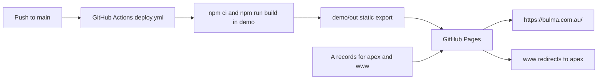

# Cloudflare Pages Migration Plan 🔄 **IN PROGRESS**

<critical_warning>
> **CRITICAL WARNING:** Connecting `bulma.com.au` to Cloudflare Pages changes production DNS. Immediately before that change, the executor must record the complete live state of every `bulma.com.au` and `www.bulma.com.au` DNS record in `documents/guides/_hosting.md`. Only the recorded web-serving A records may be replaced. MX, TXT, mail, verification, nameserver, and unrelated Cloudflare resources must not change. GitHub Pages must remain live until the Cloudflare custom domain passes every hosted check so the recorded A records can restore service immediately.
</critical_warning>

<important_note>
> **IMPORTANT NOTE:** Use Cloudflare Pages Direct Upload with GitHub Actions. This is the only path supported by the currently verified machine connections without a Cloudflare dashboard or GitHub App authorisation step. Cloudflare does not allow a Direct Upload Pages project to be converted to native Git integration later; changing that deployment model would require a new Pages project. All technical work remains agent-run, but the agent must pause after publishing the comparison URL and obtain the user's approval before connecting the production domain.
</important_note>

## 1. Goal

Move the existing Bulma marketing site from GitHub Pages to Cloudflare Pages without changing the framework, rendered site, URL policy, canonical origin, or client behaviour.

The migration must first publish the same committed static export to a noindexed Cloudflare preview hostname. The user must be able to open the GitHub Pages production URL and Cloudflare preview URL side by side and receive a repeatable speed comparison before any production DNS change. After approval, the agent must connect `bulma.com.au`, preserve `www.bulma.com.au` as a one-hop redirect to the apex, make Cloudflare Pages the only continuous deployment target, and retire GitHub Pages.

The user subsequently authorised a second noindexed comparison deployment containing the complete local implementation from `documents/todo/agent_readiness_and_page_speed_plan.md`. This refreshed preview is an application-and-host comparison against the unchanged GitHub Pages baseline, not the host-only parity comparison completed in Steps 3 through 5. It must carry explicit dirty-source provenance, pass the readiness plan's 23-test and browser contracts, and remain ineligible for production cutover until the readiness changes are committed and a matching deployable revision is verified.

The migration is complete when:

- The app remains Next.js `16.1.5` with `output: 'export'`; no Astro conversion occurs.
- The exact same commit and static output are verified on GitHub Pages and a Cloudflare preview before cutover.
- A comparison report names both URLs and records reproducible median Lighthouse and network timings.
- No custom domain, DNS record, or production Pages deployment changes before the user approves cutover.
- `https://bulma.com.au/` is served by Cloudflare Pages with the existing route, trailing-slash, canonical, sitemap, robots, 404, form, analytics, and dark-only contracts intact.
- `https://www.bulma.com.au/<path>?<query>` returns one permanent redirect to the matching apex path and query.
- The Cloudflare `pages.dev` production and preview hostnames redirect to the canonical apex after cutover.
- GitHub Actions deploys `demo/out` to Cloudflare Pages from `main`, and GitHub Pages is disabled only after the live Cloudflare deployment passes all checks.
- Every Cloudflare and GitHub action is performed through the existing Keychain credential, Cloudflare API, Wrangler, and `gh`; no dashboard or manual DNS work is required.

---

## 2. Current State Analysis

### 2.1 Current Application and Build

- Repository: `Culpable/bulma-root`, GitHub repository ID `R_kgDOQyhlxg`.
- Default branch: `main`.
- Runnable app: `/Users/sacino/bulma-root/demo`.
- Framework: Next.js `16.1.5`, React `19.2.4`, npm lockfile version `3`.
- Runtime: Node.js `22.23.1`, pinned in `.nvmrc`, `demo/package.json`, and `.github/workflows/deploy.yml`.
- Static configuration: `demo/next.config.ts` sets `output: 'export'`, empty `basePath`, unoptimised images, and `trailingSlash: true`.
- Build command: `npm run build`, which creates `demo/out` and then regenerates `demo/public/sitemap.xml`.
- `demo/src/scripts/generate-sitemap.js` stamps build time into sitemap entries. Two independent builds of the same commit are therefore not guaranteed to produce byte-identical output. The comparison must reuse the exact `github-pages` artifact from one successful workflow run rather than rebuilding once per host.
- Current inspected export: 178 files, 6.7 MB total, largest file 488,789 bytes. This is below Wrangler Direct Upload's 20,000-file and 25 MiB-per-file limits.
- Runtime services remain browser-side: the contact form posts to Formspree form `xojvwybl`, and Mixpanel uses the existing public project token. There is no application server, database, API route, middleware, Pages Function, or Worker.
- Canonical and discovery output use `https://bulma.com.au`; `demo/public/robots.txt` points to `https://bulma.com.au/sitemap.xml`.
- `NEXT_PUBLIC_SITE_URL` is not set in the current local environment; production code falls back to `https://bulma.com.au`.

### 2.2 Current GitHub Pages Flow

- `.github/workflows/deploy.yml` builds on pushes to `main` and uploads `demo/out` with `actions/upload-pages-artifact@v3` and `actions/deploy-pages@v4`.
- The GitHub Pages API reports `build_type: workflow`, `status: built`, `cname: bulma.com.au`, and enforced HTTPS.
- `demo/public/CNAME` and the root `CNAME` both contain `bulma.com.au`.
- Live HTML responses report `server: GitHub.com` and `Cache-Control: max-age=600`.
- `https://www.bulma.com.au/` currently redirects once to `https://bulma.com.au/`.
- Unknown paths return the built custom `404.html` with HTTP 404.

### 2.3 Verified Cloudflare Control Plane

Use these identifiers as validation targets, but query them again before every write:

| Resource | Verified value |
| --- | --- |
| Cloudflare account | `Jake.sacino@gmail.com's Account` |
| Account ID | `213ab3604485056376263d22fa242742` |
| Zone | `bulma.com.au` |
| Zone ID | `0534ecfcfde9d322566af12ec11c1bef` |
| Zone status | Active, full setup, not paused |
| Nameservers | `vita.ns.cloudflare.com`, `will.ns.cloudflare.com` |
| Cloudflare credential | macOS Keychain service `cloudflare-global-api-key`, account `jake.sacino@gmail.com` |
| Cloudflare member role | Super Administrator - All Privileges |
| Existing Pages projects in target account | None |
| Existing account redirect lists | None |
| Existing account `http_request_redirect` ruleset | None |
| Existing zone Page Rules | None |
| Existing zone `http_request_dynamic_redirect` ruleset | None |

The preferred Pages project name is `bulma-root`. Neither `bulma-root.pages.dev` nor the deterministic fallback `bulma-com-au.pages.dev` currently returns a DNS answer. The Pages API response remains the authority because project names can be claimed between planning and execution.

The target account exposes the `Pages Write` permission group with ID `8d28297797f24fb8a0c332fe0866ec89` and the `Account API Tokens Write` permission group with ID `5bc3f8b21c554832afc660159ab75fa4`. It currently has no account-owned API tokens. The executor must query permission groups again by name instead of assuming those IDs remain unchanged.

### 2.4 Current DNS Baseline

This is the inspected baseline, not a substitute for the mandatory pre-cutover refresh:

| Record ID | Type | Name | Content | Proxied | TTL | Comment |
| --- | --- | --- | --- | --- | --- | --- |
| `f4126d8a14cbaef48bdb01475469868a` | A | `bulma.com.au` | `185.199.111.153` | No | Auto | None |
| `5c2d843829044e88737e52479e6059f4` | A | `bulma.com.au` | `185.199.110.153` | No | Auto | None |
| `31b4ad370c84b9fd0c443af8af34f096` | A | `bulma.com.au` | `185.199.108.153` | No | Auto | None |
| `00832e9d4a08edb5072892b6cba436a1` | MX | `bulma.com.au` | `bulma-com-au.mail.protection.outlook.com` | No | 3600 | None |
| `b6ff3371f8fefbd584bf8c6a30afe7d7` | TXT | `bulma.com.au` | `v=spf1 include:spf.protection.outlook.com ~all` | No | 3600 | None |
| `c27e9cb54e6e6a0a93132dbf71c34da3` | TXT | `bulma.com.au` | `MS=ms59823863` | No | 3600 | None |
| `0b3b817b0b6f152c44ba7a5018dd5e7c` | TXT | `bulma.com.au` | `google-site-verification=0tckke5_vKtAzc4213cMKkKfJCBOwhYwTdA3Pe9hE0o` | No | Auto | Existing Google Search Console comment; capture exact live text during the pre-cutover refresh |
| `c8e82fc2b97b87587bca888d574a8869` | A | `www.bulma.com.au` | `185.199.109.153` | No | Auto | None |

Only the four A records are web-host migration targets. The missing fourth GitHub apex address and the single `www` address are current facts, not errors to correct during this migration.

### 2.5 Files and Documentation Tied to GitHub Pages

- `.github/workflows/deploy.yml` owns the current deployment.
- `demo/public/CNAME` and root `CNAME` are GitHub Pages host files.
- `demo/next.config.ts` contains GitHub Pages-specific comments, while its static-export settings remain valid for Cloudflare Pages.
- `README.md`, `github-pages-setup.md`, and the environment/folder descriptions in `AGENTS.md` identify GitHub Pages as production.
- `demo/test/runtime-and-browser-rules.test.mjs` reads `github-pages-setup.md` and asserts the Node pin in the current workflow.
- `documents/todo/agent_readiness_and_page_speed_plan.md` and its completed local implementation are now explicitly included in the refreshed Cloudflare preview requested after the original host-only comparison. The migration must not stage, commit, push, or deploy these changes to the production branch without separate authorisation.

### 2.6 Core Migration Risks

- Direct Upload is a durable project-type decision; native Git integration would require a replacement project later.
- The production `pages.dev` alias is not the comparison host. The initial deployment must use the non-production branch alias `cloudflare-comparison.<project>.pages.dev`, which Cloudflare marks with `X-Robots-Tag: noindex`.
- A speed comparison is invalid if the hosts serve different commits or bodies. The comparison must use one verified commit and matching response-body hashes.
- A later user-authorised readiness comparison may intentionally serve different bodies. Label every such result as a combined application-and-host delta, keep the original matched-artifact benchmark as the host-only baseline, and never use the combined delta alone to justify production cutover.
- A separately rebuilt export is not an equivalent comparison artifact because the current sitemap includes build-time values. Download the exact unexpired `github-pages` Actions artifact that GitHub deployed and upload its extracted contents to Cloudflare.
- Pages domain association and conflicting GitHub A records can change DNS. The association must be created first, then only the snapshotted A records may be replaced if Cloudflare has not created the required proxied CNAME records.
- Bulk Redirects are account-level resources. Any existing lists or account rules that appear before execution must be preserved byte-for-byte when adding Bulma's canonical-host redirects.
- Formspree submissions communicate externally. Hosted verification must intercept the request and inspect it without sending a real enquiry.

---

## 3. Desired State

### 3.1 Desired State Requirements

- **REQ-1 (MUST):** Keep Next.js static export with Node.js `22.23.1`, npm, `demo/out`, empty `basePath`, and `trailingSlash: true`.
- **REQ-2 (MUST NOT):** Do not convert to Astro or add `@astrojs/cloudflare`, `@opennextjs/cloudflare`, a Worker, Pages Functions, `functions/`, `_worker.js`, `_routes.json`, runtime bindings, compatibility flags, or server-rendered routes.
- **REQ-3 (MUST):** Create a Cloudflare Pages Direct Upload project in account `213ab3604485056376263d22fa242742` with production branch `main`.
- **REQ-4 (MUST):** Build and deploy one committed revision to the preview branch alias `cloudflare-comparison.<project>.pages.dev` before creating a production Pages deployment or custom domain.
- **REQ-5 (MUST):** Keep canonicals, Open Graph URLs, sitemap URLs, JSON-LD URLs, and `robots.txt` fixed to `https://bulma.com.au`; no `pages.dev`, branch, local, or deployment-specific hostname may enter built discovery output.
- **REQ-6 (MUST):** Verify `X-Robots-Tag: noindex` on the comparison alias and deployment-specific preview URL before sharing either URL.
- **REQ-7 (MUST):** Produce a repeatable comparison of GitHub Pages and Cloudflare Pages from the same machine, commit, routes, viewports, Lighthouse version, and run count.
- **REQ-8 (MUST):** Present the user with both direct URLs and the comparison result, then wait for explicit approval before the first custom-domain, production DNS, or GitHub Pages decommissioning action.
- **REQ-9 (MUST):** Perform all Cloudflare work through the Keychain credential, Cloudflare API, and Wrangler; perform all GitHub work through Git and `gh`. Do not require dashboard clicks, manual DNS changes, copied secrets, or a manually installed GitHub App.
- **REQ-10 (MUST):** Create an account-owned token scoped only to `Pages Write` for GitHub Actions. Never print its value, write it to disk, commit it, or store the Global API Key in GitHub.
- **REQ-11 (MUST):** Preserve all current routes, assets, trailing slashes, HTTP statuses, content types, custom 404 behaviour, contact form field contract, client analytics, and dark-only rendering.
- **REQ-12 (MUST):** Keep GitHub Pages active during custom-domain verification and automatically restore the recorded four A records if a cutover gate fails.
- **REQ-13 (MUST):** After successful cutover, redirect `www.bulma.com.au` and all project `pages.dev` aliases to `https://bulma.com.au` while preserving path and query string.
- **REQ-14 (MUST):** Make `.github/workflows/deploy.yml` deploy only to Cloudflare Pages from `main`, then disable the GitHub Pages site and remove GitHub-only CNAME files and instructions.
- **REQ-15 (MUST):** Update project documentation and regression assertions so no active file identifies GitHub Pages as the production host.
- **REQ-16 (SHOULD):** Use Cloudflare Pages defaults for edge caching, ETags, compression, Tiered Cache, `nosniff`, and referrer policy during the matched-artifact host comparison. After that comparison is complete, an explicitly authorised performance-remediation preview may use `demo/public/_headers` only for a one-year immutable browser TTL on content-hashed `/_next/static/*` assets. Do not add custom Cache Rules, CSP, HSTS, or unrelated headers before production cutover.
- **REQ-17 (MUST):** For the user-authorised readiness refresh, build the complete current `demo/` source in an isolated directory, identify it as `HEAD` plus dirty working-tree changes, deploy it only to the existing `cloudflare-comparison` preview branch, and preserve the original host-only benchmark separately.
- **REQ-18 (MUST):** Re-run lint, production build, all 23 readiness tests, static-output assertions, five-route browser checks at `1440x900` and `390x900`, interaction checks, deployed response checks, Lighthouse, curl timings, and deployed-file parity against the refreshed local export.

### 3.2 Defaults and Fallbacks

- **Deployment model:** Direct Upload via Wrangler and GitHub Actions.
- **Preferred project name:** `bulma-root`.
- **Project-name fallback:** If and only if the Pages API returns a name-conflict response, use `bulma-com-au`. Record and use the API-returned `name` and `subdomain` everywhere thereafter.
- **Preview branch:** `cloudflare-comparison`. This is a Wrangler deployment label, not a Git branch; do not create or switch repository branches.
- **Production branch:** `main`.
- **Canonical origin:** `https://bulma.com.au`.
- **Canonical host policy:** apex serves content; `www` permanently redirects to apex.
- **Post-cutover Pages policy:** the root and subdomain aliases under the returned project `pages.dev` hostname permanently redirect to the apex through a dedicated account Bulk Redirect list and rule.
- **Comparison gate:** user approval after evidence, not an automatic winner threshold.
- **Custom-domain safety fallback:** Associate the hostname with the Pages project first. If the API returns `pending` and the old A records remain, replace only those snapshotted A records with proxied CNAME records targeting the API-returned Pages subdomain. If the API returns any other error, make no DNS change.
- **Cutover rollback:** Before GitHub Pages is disabled, restore the exact recorded A records, disable the Bulma redirect rule, verify GitHub Pages serves the apex again, and only then detach the Pages custom domains.
- **Credential fallback:** There is no manual-dashboard fallback. If the existing Global API Key cannot create and verify the least-privilege account token, stop before repository, Pages-project, or DNS writes and report the missing machine-usable permission.
- **Compatibility:** Keep `demo/public/CNAME` and root `CNAME` through the parallel-host phase; Cloudflare ignores them. Remove them only after Cloudflare custom-domain and continuous-deployment checks pass.

### 3.3 Verification Checklist

**Parallel-host proof:**

- [ ] GitHub Pages and Cloudflare preview identify the same commit SHA.
- [ ] Comparison alias and deployment-specific preview URL return `X-Robots-Tag: noindex`.
- [ ] Five public routes and representative assets have matching response-body hashes.
- [ ] Both direct URLs and the measured comparison are delivered before approval is requested.

**Production host:**

- [ ] Apex returns HTTP 200 from Cloudflare with no redirect.
- [ ] `www` returns one HTTP 301 to the same apex path and query.
- [ ] Unknown paths return the built custom page with HTTP 404.
- [ ] Canonicals, sitemap, robots, metadata, and structured data still name `https://bulma.com.au`.

**Safety and operations:**

- [ ] The refreshed DNS snapshot is committed to `documents/guides/_hosting.md` before DNS changes.
- [ ] MX and TXT records are unchanged by ID, type, name, content, TTL, comments, and tags.
- [ ] The GitHub secret contains only the account-owned Pages token; the Global API Key remains only in Keychain.
- [ ] The final workflow deploys only to Cloudflare Pages and its hosted deployment SHA equals `origin/main`.
- [ ] The GitHub Pages API no longer reports an active Pages site after final decommissioning.

---

## 4. Additional Context

### 4.1 User-Provided Context

- The user wants an end-to-end plan to move the existing site from GitHub Pages to Cloudflare Pages.
- The site must remain Next.js; the Build Astro Websites skill is used only for its Cloudflare Pages-specific static-host guidance.
- The user wants GitHub Pages and a Cloudflare subdomain available side by side before connecting the production domain so speed can be compared.
- All technical work must be agentic and use existing Cloudflare connections.
- The native question tool returned no selections. This plan applies the recommended defaults: Direct Upload CI, a user approval gate after the comparison, and a canonical redirect for `pages.dev` after cutover.

### 4.2 Architecture Decisions

- Direct Upload was selected because the existing Global API Key, exact account, zone, and Super Administrator membership are verified. The Cloudflare account has no Pages projects, and native Cloudflare GitHub App access to `Culpable/bulma-root` cannot be verified through the available APIs without attempting an external setup.
- Direct Upload keeps the existing deterministic GitHub Actions build model. GitHub builds `demo/out`; Wrangler uploads only those prebuilt assets. Cloudflare performs no framework build and needs no project root, build command, build image, environment variables, adapter, or runtime configuration.
- The preview uses a Wrangler non-production branch alias so Cloudflare supplies its default noindex header without changing the static files. No temporary `_headers` file is needed.
- The comparison uses the unmodified host defaults. Adding cache or security policies before comparison would mix a hosting migration with an application-policy change and prevent an isolated result.
- The canonical origin does not change, so no metadata, sitemap, robots, JSON-LD, analytics URL, or application-link rewrite is required.
- GitHub Pages remains active until the custom domain passes live checks. This makes DNS rollback a restoration of four recorded A records rather than a reconstruction of a deleted host.

### 4.3 Current Authoritative Provider Guidance

- [Cloudflare Pages static Next.js export](https://developers.cloudflare.com/pages/framework-guides/nextjs/deploy-a-static-nextjs-site/) confirms that Pages supports a Next.js static `out` directory.
- [Cloudflare Pages Direct Upload](https://developers.cloudflare.com/pages/get-started/direct-upload/) defines project creation, preview branch aliases, the 20,000-file limit, the 25 MiB file limit, and the non-convertible project type.
- [Direct Upload with continuous integration](https://developers.cloudflare.com/pages/how-to/use-direct-upload-with-continuous-integration/) defines the least-privilege `Pages Write` token and GitHub Actions deployment model.
- [Cloudflare Pages preview deployments](https://developers.cloudflare.com/pages/configuration/preview-deployments/) defines the default `X-Robots-Tag: noindex` response.
- [Cloudflare Pages custom domains](https://developers.cloudflare.com/pages/configuration/custom-domains/) requires Pages domain association before relying on a CNAME and requires the apex zone to be in the same account.
- [Cloudflare Pages serving behaviour](https://developers.cloudflare.com/pages/configuration/serving-pages/) defines route matching, custom 404 behaviour, caching defaults, ETags, compression, default headers, and Tiered Cache.
- [Cloudflare Pages API](https://developers.cloudflare.com/api/resources/pages/) provides agentic project, deployment, custom-domain, and rollback operations.
- [Cloudflare Bulk Redirects API](https://developers.cloudflare.com/rules/url-forwarding/bulk-redirects/create-api/) provides the account-level canonical redirects for `www` and `pages.dev`.

---

## 5. Implementation Plan

### ~~Step 1: Revalidate Authority, Repository State, and the Comparison Revision~~ ✅ **COMPLETED**

**Objective:** Establish exact, current inputs before any local or external write.

#### 1.1 High-Level Approach

- Read `/Users/sacino/bulma-root/AGENTS.md`, this plan, `.cursor/rules/dev-browser.mdc`, and the current official Cloudflare Pages Direct Upload, preview, custom-domain, serving, API, and Bulk Redirect documentation.
- Run read-only Git checks with `git -C /Users/sacino/bulma-root`. Record the full worktree and index state. Preserve unrelated and pre-existing changes, including `documents/todo/agent_readiness_and_page_speed_plan.md`.
- Fetch `origin` and verify `HEAD`, `origin/main`, and the latest successful GitHub Pages workflow/deployment SHA. If the live deployment differs from `origin/main`, trigger the existing GitHub Pages workflow for `origin/main`, wait for success, and select that run's unexpired `github-pages` artifact. Never use a separately built directory as the host-comparison payload.
- Re-query the Cloudflare account, zone, member role, Pages project inventory, token permission groups, account redirect lists/rulesets, zone redirect rulesets, Page Rules, and DNS records.
- Create `documents/guides/_hosting.md` as the hosting source of truth. Record the selected revision, provider identifiers, current GitHub Pages configuration, current Cloudflare inventory, initial DNS snapshot, rollback commands, and a redacted credential map that names Keychain service and GitHub secret names but contains no secret values.
- Stop before writes if `bulma.com.au` is not active in account `213ab3604485056376263d22fa242742`, the authenticated member is not a Super Administrator, or any unexpected existing Pages project or redirect resource overlaps the intended names.

**Success Criteria:**

- `git rev-parse HEAD` and `git rev-parse origin/main` return the same SHA, or `documents/guides/_hosting.md` records the exact `origin/main` SHA selected instead of the dirty checkout.
- The latest successful GitHub Pages workflow and deployment report that same SHA before benchmarking, and its `github-pages` artifact reports `expired: false`; verify through the GitHub Actions, artifacts, and deployments APIs.
- Cloudflare API responses identify account `213ab3604485056376263d22fa242742`, zone `0534ecfcfde9d322566af12ec11c1bef`, and an accepted Super Administrator membership.
- `documents/guides/_hosting.md` contains every live apex and `www` DNS record field required for exact recreation: ID, type, name, content, proxied, TTL, settings, comment, and tags.
- The hosting guide contains no Global API Key, account-token value, GitHub token, environment-file contents, or other secret; verify with `git diff` and the repository's secret scanner if one exists.
- No repository file, Cloudflare resource, GitHub setting, branch, DNS record, or deployment changes during this step.

### ~~Step 2: Provision a Least-Privilege Deploy Token and Direct Upload Project~~ ✅ **COMPLETED**

**Objective:** Create the minimum Cloudflare resources required for a preview without dashboard work or a broad CI credential.

#### 2.1 High-Level Approach

- Load the Global API Key per command from macOS Keychain as `CLOUDFLARE_API_KEY` with `CLOUDFLARE_EMAIL=jake.sacino@gmail.com`. Do not echo the key or place it in a command argument that can be logged.
- Query the account token permission groups by name and create one account-owned token with only `Pages Write`, scoped to account `213ab3604485056376263d22fa242742`. Name it `bulma-root-cloudflare-pages-deploy`.
- Pipe the one-time token value directly into GitHub Actions secret `CLOUDFLARE_PAGES_API_TOKEN` for `Culpable/bulma-root`; do not write it to a file or chat output. Set repository Actions variable `CLOUDFLARE_ACCOUNT_ID` to `213ab3604485056376263d22fa242742`.
- Verify the new token through Cloudflare's token verification endpoint. Record only its token ID, name, scope, status, and GitHub secret name in `documents/guides/_hosting.md`.
- Create a Direct Upload Pages project with production branch `main` and preferred name `bulma-root`. Use `bulma-com-au` only after a verified name-conflict response. Do not include a `source` object, build configuration, deployment bindings, Functions configuration, or custom domains.
- Query the created project and use its returned `name` and `subdomain` for every later command.

**Success Criteria:**

- Cloudflare token verification returns `success: true` and `status: active` for the new account-owned token.
- The token policy contains exactly one allow policy, exactly one permission group named `Pages Write`, and only account `213ab3604485056376263d22fa242742` in `resources`; verify with the account token API without retrieving or printing its value.
- `gh secret list --repo Culpable/bulma-root` contains `CLOUDFLARE_PAGES_API_TOKEN`, and `gh variable get CLOUDFLARE_ACCOUNT_ID --repo Culpable/bulma-root` returns `213ab3604485056376263d22fa242742`.
- The Pages project API returns the selected name, `production_branch: main`, no custom domains, `source: null`, and `uses_functions: false`.
- The project has no production or preview deployment at the end of project creation; verify through the Pages deployments API.
- The Global API Key remains only in Keychain and is not stored in GitHub Actions.

### ~~Step 3: Build the Committed Export and Publish the Noindexed Preview~~ ✅ **COMPLETED**

**Objective:** Publish the exact GitHub Pages artifact to Cloudflare without a custom domain, production deployment, repository branch, or source change.

#### 3.1 High-Level Approach

- Create one disposable parent directory with `mktemp -d` and two explicit child paths: `published-out` for the downloaded deployment artifact and `validation-source` for independent source validation. Do not create a Git worktree.
- Download the selected successful Actions run's artifact named `github-pages` with `gh run download`. Verify the download is the artifact ID recorded in Step 1, extract its `artifact.tar` into `published-out`, and retain the archive digest and extracted manifest.
- Export the selected commit with `git archive` into `validation-source`. In its `demo` directory, run npm with Node.js `22.23.1`: `npm ci`, `npm run lint`, `npm run build`, then `npm test`. Set `NEXT_PUBLIC_SITE_URL=https://bulma.com.au` explicitly for this validation build, but do not deploy its newly generated `out` directory.
- Inspect `published-out`. Confirm expected HTML routes, top-level `404.html`, assets, `robots.txt`, `sitemap.xml`, and current CNAME output. Confirm no `functions/`, `_worker.js`, `_routes.json`, or Wrangler runtime file is present.
- Load the Global API Key from Keychain only for the Wrangler process. Run Wrangler `4.127.1` without modifying project dependency files and upload `published-out` with `--branch=cloudflare-comparison`, the selected commit SHA, `--commit-dirty=false`, and the API-returned project name.
- Capture both the branch alias and immutable deployment-specific URL from the API. Verify `X-Robots-Tag: noindex` on both before opening or sharing them.
- Open `https://bulma.com.au/` and the branch alias in the macOS default browser so the user can view both. Do not create or connect a custom domain.
- Move the disposable parent directory to Trash only after all manifest, parity, benchmark, and deployment checks that need the exact artifact finish.

**Success Criteria:**

- The selected Actions artifact ID, run ID, artifact SHA-256, unexpired status, and workflow head SHA are recorded before extraction.
- All four independent source-validation commands exit 0 under Node.js `22.23.1`: `npm ci`, `npm run lint`, `npm run build`, and `npm test`.
- `published-out` contains fewer than 20,000 files, and every file is smaller than 25 MiB; verify with `find`, `wc`, and `stat` before upload.
- The Pages deployment API reports `success`, branch `cloudflare-comparison`, the selected commit SHA, and `uses_functions: false`.
- The Pages project still has no custom domains and no production deployment.
- Both Cloudflare preview URLs return HTTPS, HTTP 200 for `/`, and `X-Robots-Tag: noindex`.
- HTML from the preview contains `https://bulma.com.au` canonicals and contains no returned project subdomain; verify with `curl` and `rg`.
- No Git branch, Git commit, GitHub Pages setting, DNS record, source file, or index entry changes in this step.

### ~~Step 4: Prove Hosted Functional and Content Parity~~ ✅ **COMPLETED**

**Objective:** Establish that Cloudflare serves the same site before interpreting any speed difference.

#### 4.1 High-Level Approach

- Generate a SHA-256 manifest for the extracted `published-out` artifact before it is trashed. Map each HTML `index.html` to its clean trailing-slash route, map top-level `404.html` to a random unknown route, and request all other representative files by emitted path.
- Compare decoded response-body hashes between local output, GitHub Pages, and Cloudflare Pages for `/`, `/about/`, `/pricing/`, `/contact/`, `/privacy-policy/`, one unknown path, `robots.txt`, `sitemap.xml`, every emitted CSS and JavaScript file under `_next/static`, and at least one image and font from each emitted asset directory.
- Compare status, redirect, content type, content encoding, ETag, cache, and robots headers. Header values may differ by host, but route semantics and content types must match. Record the intentional Cloudflare defaults separately from regressions.
- Use `dev-browser` for hosted verification after reading `.cursor/rules/dev-browser.mdc`. Emulate `prefers-color-scheme: light`, which proves the permanent dark lock-in. Test `1440x900` and `390x900` on every public route.
- Verify navigation, `/#lenders`, pricing Monthly and Yearly states, mobile navigation, key CTAs, asset loading, no horizontal overflow, and no console or page errors.
- On `/contact/`, verify the form fields remain exactly hidden `form_source`, `name`, `email`, and `message`. Intercept the Formspree POST, inspect its destination and field names, then abort it so no real message is sent.

**Success Criteria:**

- The named HTML, discovery, JavaScript, CSS, image, and font responses have matching decoded SHA-256 hashes on both hosts; differences are limited to headers and provider transport encoding.
- `/`, `/about/`, `/pricing/`, `/contact/`, and `/privacy-policy/` return HTTP 200 with their existing trailing-slash policy on Cloudflare.
- A random unknown path returns HTTP 404 and the decoded body hash of the built top-level `404.html`.
- `robots.txt` returns plain text, `sitemap.xml` returns XML, and all canonical/discovery URLs remain on `https://bulma.com.au`.
- Desktop and mobile browser checks show zero console errors, zero page errors, zero failed first-party requests, and `document.documentElement.scrollWidth <= document.documentElement.clientWidth` on every route.
- Direct and same-page `#lenders` navigation both open the intended FAQ disclosure.
- The intercepted contact submission targets `https://formspree.io/f/xojvwybl` with only the existing four field names, and no network request reaches Formspree.
- Any failed parity assertion blocks benchmarking and custom-domain work.

### ~~Step 5: Run the Side-by-Side Speed Comparison and Obtain Approval~~ ✅ **COMPLETED**

**Objective:** Give the user repeatable evidence and both URLs before any production change.

#### 5.1 High-Level Approach

- Use Lighthouse `13.4.1` with Google Chrome from the same machine and network for both hosts. Test `/` and `/pricing/` at mobile and desktop settings.
- Run five fresh-profile Lighthouse measurements for each route, viewport, and host. Alternate host order on every run. Record median and range for performance score, server response time, FCP, LCP, Speed Index, TBT, and CLS.
- Run one warm-up followed by twenty alternating `curl` requests per host for `/`, `/pricing/`, and the largest emitted JavaScript asset. Record DNS, TCP, TLS, TTFB, total time, HTTP version, remote IP, status, and transfer size. Report medians and ranges; do not use a single request as the result.
- Keep the Cloudflare noindex response and host defaults in place. Do not add Cache Rules, `_headers`, Early Hints configuration, security headers, image changes, JavaScript changes, or any other tuning during the comparison.
- Add a comparison table to `documents/guides/_hosting.md` containing the exact commit SHA, host URLs, tool versions, commands, run counts, medians, ranges, absolute deltas, and percentage deltas. State which host was faster for each metric without claiming that one synthetic score proves all real-user performance.
- Give the user clickable links for `https://bulma.com.au/` and the API-returned Cloudflare branch alias, plus the compact comparison result. Request one explicit approval to connect `bulma.com.au`.
- If approval is withheld, leave GitHub Pages, DNS, custom domains, and production Pages deployments unchanged. Keep the noindexed preview available.

**Success Criteria:**

- The report contains 40 successful Lighthouse JSON results: 2 hosts x 2 routes x 2 viewport modes x 5 runs.
- The report contains 120 timed `curl` results: 2 hosts x 3 resources x 20 measured requests, excluding warm-ups.
- Every result names the same commit SHA, and the Step 4 body-hash checks remain passing.
- Every metric table includes run count, median, minimum, maximum, absolute delta, and percentage delta.
- The user receives both direct URLs before the approval request.
- No Pages production deployment, custom domain, DNS record, GitHub Pages setting, or canonical redirect changes until explicit approval is recorded.

### ~~Step 5A: Refresh the Preview with the Agent-Readiness Build~~ ✅ **COMPLETED**

**Objective:** Publish and test the complete current readiness implementation on the existing noindexed Cloudflare comparison branch without changing production.

#### 5A.1 High-Level Approach

- Treat the existing GitHub Pages deployment at commit `2a475b50527f3d81593b0a9d3036cde94b974adc` as the unchanged before state and the current dirty `demo/` working tree as the after state.
- Copy the current `demo/` source into a disposable isolated directory because the shared checkout has a pre-existing dev server on port 3001. Run `npm ci`, lint, the production build, and all tests there under Node.js `22.23.1` so the live Turbopack cache remains untouched.
- Record the source-file inventory, generated-output manifest, file count, total bytes, largest file, and SHA-256 digest. Confirm the static-only, canonical-origin, discovery, 404, accessibility, image, font-preload, and no-runtime contracts before upload.
- Deploy the isolated `out` directory to the existing `bulma-root` Pages project and `cloudflare-comparison` branch with Wrangler. Attach the current `HEAD` SHA, set the deployment dirty flag, and use a message that identifies the agent-readiness refresh. Do not create a production deployment, custom domain, DNS change, redirect, branch, commit, or push.
- Verify the branch alias points to the new immutable deployment, both URLs carry `X-Robots-Tag: noindex`, `uses_functions` remains false, and every deployed file matches the isolated export after transport decoding.
- Re-run the full five-route browser matrix at `1440x900` and `390x900` with `prefers-color-scheme: light`. Include skip navigation, direct and same-page `#lenders`, Monthly and Yearly pricing parity, mobile navigation, responsive image selection, Dot Pool and FAQ animation, WebGL fallback, contact form interception, overflow, console errors, page errors, and first-party request failures.
- Repeat the original benchmark shape: five Lighthouse runs per host, route, and viewport plus twenty measured curl runs per host for `/`, `/pricing/`, and the largest refreshed JavaScript asset. Compare the refreshed Cloudflare result with both the unchanged GitHub baseline and the prior Cloudflare artifact, and label causation limits clearly.
- Update `documents/guides/_hosting.md`, this plan's implemented solution, and the existing readiness implementation report with deployment identity, complete results, differences, validation outcomes, and remaining production gates.

**Success Criteria:**

- Isolated `npm ci`, lint, production build, and all 23 tests pass under Node.js `22.23.1`.
- The generated export includes the readiness features: deferred Three.js and Mixpanel loading, zero font preloads, five correct canonicals, static JSON-LD, `/llms.txt`, corrected sitemap, skip navigation, decorative icon semantics, AA contrast, responsive image candidates, WebGL fallback, and one noindex-only 404 robots directive.
- The refreshed Cloudflare deployment reports environment `preview`, branch `cloudflare-comparison`, attached commit `2a475b50527f3d81593b0a9d3036cde94b974adc`, dirty source `true`, `uses_functions: false`, no custom domains, and no production deployment.
- Both Cloudflare URLs return `X-Robots-Tag: noindex`, every generated file matches the deployed response body, and no canonical or discovery artefact contains a `pages.dev` origin.
- All required browser scenarios pass at both viewports with the permanent dark theme, no horizontal overflow, no page errors, no unexpected console errors, and no failed first-party requests.
- The refreshed benchmark contains 40 successful Lighthouse JSON results and 120 successful measured curl rows, with median, range, delta, and causal-boundary notes.
- The user receives a concise before-and-after overview that separates application changes, hosting differences, measured performance changes, and unverified production effects.

### ~~Step 5B: Remediate the Current Preview Speed Gaps~~ ✅ **COMPLETED**

**Objective:** Fix the measured About and Contact LCP delays, reduce the shared navbar client boundary, and enable immutable caching for hashed Cloudflare assets without changing production.

#### 5B.1 High-Level Approach

- Keep the About photo and Contact hero copy visible at first paint while retaining their documented 700ms transform entrances. Keep the About photo's 150ms delay and the Contact card scroll animations.
- Recompress the About mobile photo candidate without changing its dimensions or responsive source contract.
- Server-render the active navbar shell. Hydrate only route-aware links and `NavbarController`; keep the native mobile dialog transition, native mobile navigation, active-state styling, scroll glass, and cleanup contracts.
- Add `demo/public/_headers` with one rule for `/_next/static/*`: `Cache-Control: public, max-age=31556952, immutable`. Keep HTML on Pages defaults.
- Build, test, verify both viewports locally, publish only to `cloudflare-comparison`, verify every emitted response body, repeat the hosted browser matrix, rerun 240 fixed-probe Melbourne/Sydney requests, and rerun three mobile Lighthouse reports per host and route.

**Success Criteria:**

- Lint, production build, and all 26 tests pass.
- About and Contact above-fold LCP candidates have opacity `1` throughout their entrance and complete at zero transform on desktop and mobile.
- Mobile dialog open, close, and link navigation work after the server/client split; no route has horizontal overflow, console errors, or page errors.
- Hashed Cloudflare assets return the one-year immutable header, HTML retains revalidation, and both preview URLs remain noindexed.
- All 182 served export files match the local build, all 240 Globalping samples return HTTP 200, and all 30 Lighthouse reports complete.
- The Pages project remains preview-only. DNS, custom domains, GitHub Pages, Git branches, commits, pushes, and production settings remain unchanged.

### Step 6: Add a Parallel Cloudflare Deployment to GitHub Actions

**Objective:** Prove the permanent CI path while GitHub Pages remains available for rollback.

#### 6.1 High-Level Approach

- Begin only after the user approves cutover.
- Add exact dev dependency `wrangler@4.127.1` to `demo/package.json` and `demo/package-lock.json`; do not add a Wrangler configuration file.
- Update `.github/workflows/deploy.yml` so one build on `main` uses Node.js `22.23.1`, runs `npm ci`, `npm run lint`, `npm run build`, and `npm test`, uploads the existing GitHub Pages artifact, deploys it to GitHub Pages, and uploads the same `demo/out` directory to the Cloudflare Pages production branch `main` with Wrangler.
- Use GitHub secret `CLOUDFLARE_PAGES_API_TOKEN` and repository variable `CLOUDFLARE_ACCOUNT_ID`. Pass the project name, branch `main`, and `GITHUB_SHA` explicitly. Do not interpolate commit-message text directly into a shell command.
- Keep existing GitHub Pages permissions only while its deploy job remains. Add no Pages Function, Worker, adapter, build environment, runtime secret, or custom header.
- Add or update assertions in `demo/test/runtime-and-browser-rules.test.mjs` for the Node pin, static output path, Wrangler version, project name, production branch, secret/variable names, and required validation commands.
- Review the complete scoped diff. Commit only migration-owned files and push only when the execution request explicitly authorises commit and push. Wait for the workflow and both deployment providers to finish.

**Success Criteria:**

- `demo/package.json` and lockfile resolve Wrangler exactly to `4.127.1`, whose Node engine accepts Node.js `22.23.1`.
- The workflow contains one build of `demo/out`; GitHub Pages and Cloudflare consume that output without separate framework builds.
- The workflow runs lint, build, and the existing Node test suite before either deploy can complete.
- A pushed `main` revision produces successful GitHub Pages and Cloudflare Pages deployments with the same `GITHUB_SHA`.
- `https://bulma.com.au/` still reports GitHub Pages before DNS cutover, while the Pages project production deployment reports the same SHA at its root `pages.dev` subdomain.
- `npm --prefix /Users/sacino/bulma-root/demo run lint`, `npm --prefix /Users/sacino/bulma-root/demo run build`, and `npm --prefix /Users/sacino/bulma-root/demo test` all exit 0.
- No unrelated file or pre-existing staged change enters the migration commit.

### Step 7: Refresh Rollback Evidence and Connect the Custom Domains

**Objective:** Move production traffic to the verified Cloudflare deployment with an exact, tested rollback path.

#### 7.1 High-Level Approach

- Immediately before DNS mutation, re-query all records named `bulma.com.au` and `www.bulma.com.au`, all account redirect lists/rulesets, all zone redirect rulesets/Page Rules, the Pages production deployment, and the GitHub Pages state. Replace the provisional DNS section in `documents/guides/_hosting.md` with this final pre-cutover snapshot and commit it before changing DNS.
- Compare the four web A records to the current-state baseline. If an unexpected web record, redirect, custom domain, Pages deployment, or third-party change exists, stop and request direction. Do not delete or overwrite it.
- Through the Pages custom-domain API, associate `bulma.com.au` and `www.bulma.com.au` with the verified project before manually creating any CNAME.
- Inspect the DNS response after each association. If Cloudflare created the required proxied CNAME, do not add another. If the domain is `pending` and the old A records remain, delete only the exact snapshotted A records for that hostname, re-query DNS, and create one proxied CNAME to the API-returned Pages subdomain only when none exists.
- Poll the Pages domain API in bounded intervals until both custom domains report `active` and certificate validation is active. Do not use a blocking wait longer than 60 seconds without a user update.
- Verify apex HTTPS before adding redirects. Keep the GitHub Pages site and its last deployment intact throughout this step.

**Success Criteria:**

- The final pre-cutover snapshot is committed and contains sufficient JSON-equivalent fields to recreate every apex and `www` record exactly.
- Pages domain API returns `active` for both `bulma.com.au` and `www.bulma.com.au` with no validation error.
- DNS API returns exactly one proxied Cloudflare-managed web record for the apex and one for `www`, each targeting the API-returned project subdomain directly or through Cloudflare's Pages association.
- The three apex A records and one `www` A record are absent only after the Pages association exists.
- The existing MX record and all three TXT records match the final pre-cutover snapshot in every recorded field.
- `curl -I https://bulma.com.au/` returns HTTP 200, a valid Cloudflare-served certificate, `server: cloudflare`, and no redirect.
- GitHub Pages remains enabled and its last successful artifact remains available for rollback.

### Step 8: Enforce One Canonical Host and Verify Production

**Objective:** Preserve the existing `www` redirect and prevent duplicate `pages.dev` content after cutover.

#### 8.1 High-Level Approach

- Re-query account redirect lists and the account `http_request_redirect` entry-point ruleset. Preserve every existing item and rule if concurrent changes appeared.
- Create a dedicated redirect list named `bulma_root_canonical_redirects` with two path-preserving, query-preserving permanent redirects:
  - `www.bulma.com.au` to `https://bulma.com.au`, covering all paths.
  - The API-returned project `pages.dev` hostname to `https://bulma.com.au`, covering all paths and subdomains so the production, branch, and deployment-specific aliases redirect.
- Create or append one enabled account Bulk Redirect rule that references only this list. Record list, operation, ruleset, and rule IDs in `documents/guides/_hosting.md`. Poll list-item operations until `completed` before enabling the rule.
- Run direct header checks for apex, `www`, root `pages.dev`, the comparison alias, and the immutable deployment URL. Verify path and query preservation with a value such as `/pricing/?source=host-check`.
- Repeat hosted browser checks for all five public routes at `1440x900` and `390x900`, emulating `prefers-color-scheme: light`. Check route rendering, navigation, pricing states, FAQ hash behaviour, overflow, console errors, page errors, and first-party network failures.
- Run three Lighthouse measurements for the custom apex on `/` and `/pricing/` in both viewport modes. Compare medians with the Cloudflare preview medians. If apex FCP, LCP, or server response time is more than 10% slower than the corresponding Cloudflare preview median, treat it as a failed cutover gate and investigate or roll back before decommissioning GitHub Pages.
- If any critical route, TLS, redirect, body, browser, or performance gate fails, disable the new Bulk Redirect rule, restore the exact four A records from the snapshot, verify GitHub Pages serves the apex and `www` again, then detach the Pages custom domains. Do not disable GitHub Pages.

**Success Criteria:**

- `https://www.bulma.com.au/pricing/?source=host-check` returns exactly one HTTP 301 whose `Location` is `https://bulma.com.au/pricing/?source=host-check`.
- Root, comparison, and deployment-specific `pages.dev` URLs return HTTP 301 to the matching apex path and query.
- `https://bulma.com.au/` and all five public routes return HTTP 200 without a host redirect, and a random unknown path returns HTTP 404 with the built custom page.
- Apex responses contain no `X-Robots-Tag: noindex`; `robots.txt`, sitemap, canonicals, Open Graph data, and JSON-LD all retain the apex origin.
- Browser checks pass at both required viewports with zero console errors, page errors, horizontal overflow, and failed first-party requests.
- Custom-domain median FCP, LCP, and server response time are each no more than 10% slower than the corresponding Cloudflare preview median.
- The redirect list and rule IDs, exact item configuration, live DNS state, and tested rollback result are recorded in `documents/guides/_hosting.md`.

### Step 9: Make Cloudflare the Sole Deployment Target and Retire GitHub Pages

**Objective:** Complete the migration only after production has passed with GitHub Pages still recoverable.

#### 9.1 High-Level Approach

- Update `.github/workflows/deploy.yml` to remove `actions/upload-pages-artifact`, `actions/deploy-pages`, the GitHub Pages deploy job, and the `pages: write` and `id-token: write` permissions. Keep checkout, Node `22.23.1`, `npm ci`, lint, build, tests, and the Wrangler Direct Upload to project production branch `main`.
- Update `demo/test/runtime-and-browser-rules.test.mjs` so it asserts the Cloudflare-only workflow and reads the new hosting guide rather than `github-pages-setup.md`.
- Update `demo/next.config.ts` comments to describe portable static export rather than GitHub Pages. Preserve `output`, `basePath`, image, and trailing-slash values exactly.
- Update `README.md` and `AGENTS.md` to identify Cloudflare Pages Direct Upload as production, name `demo/out`, the account and project selection rules, the GitHub Actions workflow, the `pages.dev` preview model, and the no-dashboard requirement. Add `documents/guides/_hosting.md` to the architecture documentation table.
- Use `trash` to remove root `CNAME`, `demo/public/CNAME`, and `github-pages-setup.md`. Do not use `rm` or Git restore operations.
- Run the full local validation, inspect the complete diff, commit only migration-owned files, push the Cloudflare-only workflow, and wait for its deployment. Verify the deployed SHA before disabling GitHub Pages.
- Disable the GitHub Pages site through `gh api` only after the Cloudflare-only workflow succeeds and all Step 8 production checks still pass.
- Retain the least-privilege Pages token because GitHub Actions uses it. Record its rotation and revocation commands in the hosting guide without including the token value.

**Success Criteria:**

- `.github/workflows/deploy.yml` contains no `actions/upload-pages-artifact`, `actions/deploy-pages`, GitHub Pages environment, `pages: write`, or `id-token: write` entry.
- The workflow contains Node `22.23.1`, `npm ci`, lint, build, tests, and Wrangler upload of `demo/out` to the returned project name with branch `main`.
- A new successful Cloudflare deployment reports the final `origin/main` SHA before GitHub Pages is disabled.
- `gh api repos/Culpable/bulma-root/pages` returns the expected not-found response after decommissioning, while `https://bulma.com.au/` continues to return HTTP 200 from Cloudflare.
- Root `CNAME`, `demo/public/CNAME`, and `github-pages-setup.md` no longer exist in the final commit.
- `README.md`, `AGENTS.md`, `documents/guides/_hosting.md`, `demo/next.config.ts`, and `demo/test/runtime-and-browser-rules.test.mjs` contain no active claim that GitHub Pages hosts production.
- `rg -n "GitHub Pages|github-pages|actions/deploy-pages|upload-pages-artifact"` returns only explicit historical or rollback context in `documents/guides/_hosting.md` and this completed plan.
- No animation, design, page, component, metadata, sitemap, robots, contact-field, or analytics implementation changes as part of the migration.

### Step 10: Complete Final Hosted and Repository Verification

**Objective:** Prove the final repository, CI pipeline, Cloudflare control plane, DNS, and public site agree.

#### 10.1 High-Level Approach

- Run local lint, build, and tests with absolute project targeting. Inspect `demo/out` for all expected routes and the absence of GitHub/Cloudflare runtime-only files.
- Query the Pages project, deployments, and domains. Confirm Direct Upload, `source: null`, `uses_functions: false`, production branch `main`, both custom domains active, and the latest deployment SHA equal to `origin/main`.
- Query DNS and redirect resources. Confirm only intended Bulma web records and canonical redirects changed; compare MX and TXT records to the final pre-cutover snapshot.
- Re-run apex, `www`, `pages.dev`, discovery, asset, unknown-path, browser, and performance checks from Steps 4 and 8.
- Review the complete committed diff and the final commit contents. Confirm the unrelated plan and all unrelated worktree/index changes remain intact.
- Add final commands, results, deployment IDs, redirect IDs, DNS state, benchmark summary, and rollback verification to `documents/guides/_hosting.md`. Do not include secret values or raw headers that expose authentication data.

**Success Criteria:**

- `npm --prefix /Users/sacino/bulma-root/demo run lint` exits 0 with zero errors.
- `npm --prefix /Users/sacino/bulma-root/demo run build` exits 0 and produces the static export and sitemap without errors.
- `npm --prefix /Users/sacino/bulma-root/demo test` exits 0 with all existing and migration assertions passing.
- The final Pages project returns `source: null`, `uses_functions: false`, `production_branch: main`, active apex and `www` domains, and a latest production deployment SHA equal to `git -C /Users/sacino/bulma-root rev-parse origin/main`.
- Apex, `www`, `pages.dev`, route, 404, discovery, content-type, body, browser, and performance checks meet every Step 8 assertion.
- DNS comparison proves MX and TXT records are byte-for-byte unchanged from the committed pre-cutover snapshot.
- The final GitHub Actions run succeeds, GitHub Pages is disabled, and no custom domain points to GitHub's `185.199.108.153` through `185.199.111.153` addresses.
- `git show --stat --oneline HEAD` and `git show --name-status HEAD` contain only the authorised migration files, while unrelated working-tree and index state remains unchanged.

---

## 6. Testing Plan

### 6.1 Source-of-Truth Regression Artifacts

| Artifact | Why it matters | Expected final behaviour | Scope |
| --- | --- | --- | --- |
| `.github/workflows/deploy.yml` | Exact current build and GitHub Pages deployment owner | Builds once with Node `22.23.1`, validates, and uploads `demo/out` only to Cloudflare Pages | Full file |
| `demo/next.config.ts` | Static-export, base-path, image, and trailing-slash contract | Values remain unchanged; only provider-specific comments change | Full file |
| Downloaded `github-pages` artifact from the selected successful Actions run | Exact payload GitHub deployed and Cloudflare must receive | Hosted response bodies match the extracted artifact; no separately rebuilt output is used for comparison | Full extracted tree and artifact digest |
| `https://bulma.com.au/` and its current headers | Live GitHub Pages baseline and canonical URL | Same URL and content are served by Cloudflare after cutover | Full response and headers |
| GitHub Pages API for `Culpable/bulma-root` | Current host state: workflow build, CNAME, HTTPS, active site | Active through rollback verification, then disabled after Cloudflare-only deploy succeeds | Repository Pages resource |
| Cloudflare zone `0534ecfcfde9d322566af12ec11c1bef` DNS records | Exact rollback source and mail/verification safety boundary | Four web A records are replaced; MX and TXT records are unchanged | Every record named apex or `www` |
| Cloudflare account `213ab3604485056376263d22fa242742` Pages and redirect inventories | Proves there is no pre-existing project, list, or redirect rule to overwrite | One Direct Upload project and one Bulma-specific canonical redirect list/rule exist | Exact account resources |
| `demo/public/robots.txt`, `demo/public/sitemap.xml`, and built metadata | Production-origin discovery contract | Continue to name only `https://bulma.com.au` on preview and production | Full files and emitted HTML |
| `demo/src/app/contact/contact-form.tsx` | Exact external form destination and field contract | Same endpoint and four fields; migration tests send no real enquiry | Full form contract |
| `demo/test/runtime-and-browser-rules.test.mjs` | Existing deployment/runtime documentation assertions | Asserts Cloudflare workflow, Node pin, and hosting guide | Full test file |
| `documents/todo/agent_readiness_and_page_speed_plan.md` and the current dirty `demo/` source | User-authorised readiness implementation for the refreshed preview | Included in the isolated preview build and validation; remains uncommitted and outside production | Complete plan plus source/output manifests |

<critical_warning>
> **CRITICAL WARNING:** The live DNS records, GitHub Pages API state, selected commit export, and hosted response bodies are the rollback and parity sources of truth. Re-query and record them immediately before writes. Do not replace them with example records, dashboard screenshots, a newly generated synthetic site, or assumptions copied from this plan. If they differ from the inspected baseline, stop before deleting records or disabling GitHub Pages.
</critical_warning>

### 6.2 Automated Checks

| Check | Tool and location | Expected Result |
| --- | --- | --- |
| Lint | ESLint via `npm --prefix /Users/sacino/bulma-root/demo run lint` | Exit 0, zero errors |
| Static build | Next.js via `npm --prefix /Users/sacino/bulma-root/demo run build` | Exit 0; `demo/out` contains all public routes, assets, top-level `404.html`, robots, and sitemap |
| Regression suite | Node test runner via `npm --prefix /Users/sacino/bulma-root/demo test` | Exit 0; existing and migration assertions pass |
| Direct Upload limits | `find`, `wc`, `stat` against the selected `out` directory | Fewer than 20,000 files; no file exceeds 25 MiB |
| Static-only contract | `find` and `rg` against repository and `out` | No Pages Functions, `_worker.js`, `_routes.json`, adapter, runtime binding, or request-time route |
| Body parity | `curl`, `shasum -a 256`, and generated manifest | Named responses match local output and one another after decoding transport compression |
| Canonical/discovery policy | `curl`, `rg`, and XML parsing | No `pages.dev` URL in canonical, sitemap, robots, JSON-LD, Open Graph, or HTML discovery output |
| Preview indexing | `curl -I` against branch and deployment URLs | `X-Robots-Tag: noindex` present before cutover |
| Deployment identity | GitHub and Cloudflare APIs | Each compared and final deployment reports the selected commit SHA |
| Credential scope | Cloudflare account-token API and `gh secret list` | One Pages Write account token; secret exists by name; no value is printed |
| DNS preservation | Cloudflare DNS API and committed snapshot | MX/TXT fields unchanged; only recorded web records differ |
| CI ownership | Source assertions and GitHub Actions API | Final workflow deploys only to Cloudflare and latest run succeeds |

### 6.3 Hosted Integration Tests

1. **Noindexed Cloudflare comparison deployment**
   - Action: Request the branch alias and immutable deployment URL before custom-domain work.
   - Expected: HTTP 200 for `/`, `X-Robots-Tag: noindex`, production canonical, no custom domains.
   - Verify: Cloudflare Pages deployment/project APIs and `curl -I`.

2. **Route and body parity**
   - Action: Request all five public routes, one unknown path, discovery files, emitted JavaScript/CSS, and representative media on both hosts.
   - Expected: Matching decoded body hashes, matching route statuses, correct content types, and only documented provider-header differences.
   - Verify: SHA-256 manifest plus raw status/header summary.

3. **Side-by-side speed comparison**
   - Action: Run five alternating Lighthouse measurements per host, route, and viewport plus twenty alternating network timings per host and resource.
   - Expected: Complete median/range/delta tables for the same commit; no missing or failed run silently excluded.
   - Verify: 40 Lighthouse JSON files and 120 measured network rows before aggregation.

4. **Dark-only responsive rendering**
   - Action: Open every public route on both hosts at `1440x900` and `390x900` while emulating `prefers-color-scheme: light`.
   - Expected: Dark rendering, identical text and interactions, no overflow, no console/page errors, and no failed first-party requests.
   - Verify: `dev-browser` DOM checks and targeted screenshots with absolute paths when evidence is needed.

5. **Navigation and interaction preservation**
   - Action: Exercise mobile navigation, direct and same-page `#lenders`, pricing Monthly/Yearly states, and key CTA links.
   - Expected: Current routes and states behave identically on GitHub Pages and Cloudflare preview, then on the custom apex.
   - Verify: URL, disclosure state, visible text, and browser error checks.

6. **Contact form safety**
   - Action: Fill the four existing fields, intercept submit, inspect the request, and abort it.
   - Expected: POST target `https://formspree.io/f/xojvwybl`; field names exactly `form_source`, `name`, `email`, `message`; no external request completes.
   - Verify: Intercepted request metadata and absence of a successful Formspree response.

7. **Custom-domain routing**
   - Action: Request apex, `www`, Pages aliases, discovery files, assets, and an unknown path after cutover.
   - Expected: Apex serves Cloudflare content; `www` and Pages aliases redirect once with path/query preserved; unknown path returns 404; discovery remains apex-only.
   - Verify: `curl --location --max-redirs`, Pages API, DNS API, and redirect API.

8. **Rollback before GitHub decommissioning**
   - Action: Validate the stored recreation payloads against the final pre-cutover snapshot without mutating production; if any cutover gate fails, execute them.
   - Expected: The payload recreates the three apex A records and one `www` A record exactly, disables the Bulma redirect rule, and returns traffic to the still-active GitHub Pages deployment.
   - Verify: JSON schema/field comparison before cutover; live `server: GitHub.com` and current `www` redirect only if rollback is triggered.

9. **Cloudflare-only continuous deployment**
   - Action: Push the final authorised migration commit and wait for `.github/workflows/deploy.yml`.
   - Expected: Local validation passes; one Wrangler deployment reaches Pages production branch `main`; no GitHub Pages job runs; deployed SHA equals `origin/main`.
   - Verify: GitHub Actions logs/status and Cloudflare deployment API.

10. **Final decommissioning**
    - Action: Disable GitHub Pages after all prior checks pass.
   - Expected: GitHub Pages API reports no active site; apex remains HTTP 200 from Cloudflare; `www` and Pages aliases retain canonical redirects.
   - Verify: GitHub API, Cloudflare API, DNS API, and live HTTP requests.

---

## 7. Implemented Solution

### Completed Scope

- Completed Steps 1 through 5 only. Steps 6 through 10 remain unstarted and require a later execution request after the production cutover approval gate.
- Completed Step 5A after the user explicitly requested a refreshed Cloudflare comparison containing all agent-readiness changes.
- Kept the aggregate plan status `IN PROGRESS` because the full migration is not complete.

### Repository Files

- Created `documents/guides/_hosting.md` as the migration source of truth. It records provider identifiers, credential boundaries, the complete initial DNS snapshot, rollback payloads, selected GitHub artifact and commit, Cloudflare project and deployment identifiers, parity evidence, browser checks, full Lighthouse and curl comparison tables, and the current approval state.
- Updated `documents/todo/cloudflare_pages_migration_plan.md` with live status markers and this implemented-solution record.
- Made no migration changes to application source, package files, workflows, generated public output, Git branches, the Git index, or commits.
- Preserved all unrelated collaborative worktree changes. Removed only the migration-generated `.wrangler/` cache by moving it to Trash.

### External Resources

- Created active account-owned Cloudflare token `bulma-root-cloudflare-pages-deploy` with exactly one allow policy, one `Pages Write` permission group, and account `213ab3604485056376263d22fa242742` as its only resource.
- Stored the one-time token value only as GitHub Actions secret `CLOUDFLARE_PAGES_API_TOKEN`; stored the account ID as repository variable `CLOUDFLARE_ACCOUNT_ID`.
- Created Direct Upload Pages project `bulma-root` with production branch `main`, `source: null`, and no custom domains.
- Deployed the exact GitHub Pages artifact for commit `2a475b50527f3d81593b0a9d3036cde94b974adc` only to preview branch `cloudflare-comparison`.
- Published no Cloudflare production deployment and changed no DNS, custom domain, redirect, or GitHub Pages setting.

### Hosted Behaviour and Performance

- Verified zero decoded-body mismatches across all 178 emitted files before and after benchmarking.
- Verified every public route, custom 404, discovery file, navigation state, pricing state, mobile menu, FAQ hash path, CTA, contact-field contract, dark-only rendering, and responsive viewport requirement.
- Kept both Cloudflare preview URLs noindexed. The branch alias is `https://cloudflare-comparison.bulma-root.pages.dev/`; the immutable deployment is `https://80ac3a14.bulma-root.pages.dev/`.
- Recorded all 40 Lighthouse results and 120 measured curl results. From the Perth execution machine, GitHub Pages had lower median TTFB and total time for every tested resource; Cloudflare transferred fewer bytes and led selected metrics.
- Requested explicit cutover approval after presenting both URLs and the comparison. The approval prompt returned no selection, so approval is withheld and production remains on GitHub Pages.

### Validation

- Passed independent selected-revision `npm ci`, lint, production build, and 17-test suite under Node.js `22.23.1`.
- Passed live-checkout lint and all 23 current live-checkout tests after unrelated collaborative changes appeared.
- Passed Direct Upload file limits, static-only inspection, preview noindex, canonical-origin inspection, project/deployment identity, credential-scope, DNS-preservation, full body parity, hosted browser, benchmark-count, and post-benchmark parity checks.
- Did not repeat a live-checkout production build while the pre-existing port 3001 Bulma dev server was active. The selected revision's disposable archive build is the production-build evidence for Steps 1 through 5.

### Step 5A Readiness Refresh

- Added Step 5A to distinguish the original byte-identical host comparison from the later user-authorised readiness comparison. The refreshed result is a combined application-and-host delta and cannot support cutover until the readiness source is committed.
- Copied the current `demo/` source into disposable path `/tmp/bulma-cloudflare-readiness.4B7IDb` because the shared checkout's pre-existing port 3001 dev server remained active.
- Isolated Node.js `22.23.1` validation passed: `npm ci`, ESLint, production static build, and all 23 tests. The first test attempt lacked repository-level fixtures; after copying the exact referenced workflow, README, browser rule, runtime pin, GitHub Pages guide, and animation guide, all 23 tests passed.
- The refreshed export contains 182 files and 6,667,165 uncompressed bytes. Its largest file is 488,911-byte Three.js chunk `_next/static/chunks/5995cb1810ff71d4.js`; its combined manifest SHA-256 is `9c9c5f2dee159ba968c0c38d65a32792b89d25e130f1ea227497bf7dea7cac35`.
- Verified zero font preloads, zero `role="image"` source matches, zero Pages Function or Worker runtime files, one canonical per indexable route, static JSON-LD, `/llms.txt`, corrected sitemap, no `pages.dev` discovery origin, responsive image candidates, WebGL fallback, and noindex-only static 404 robots output.
- Wrangler `4.127.1` published deployment `0e21f32b-05ae-4d52-9557-18a7433fd08b` to the existing `cloudflare-comparison` preview branch. It reports commit `2a475b50527f3d81593b0a9d3036cde94b974adc`, `commit_dirty: true`, `uses_functions: false`, status `success`, immutable URL `https://0e21f32b.bulma-root.pages.dev/`, and branch alias `https://cloudflare-comparison.bulma-root.pages.dev/`.
- Both preview URLs return HTTP 200 and `X-Robots-Tag: noindex`. The project still has no production deployment or custom domain, and the complete DNS baseline remains unchanged.
- Compared all 182 generated files against decoded branch-alias responses before and after benchmarking. Every status and SHA-256 body matched, including the custom 404 through an unknown route.
- Re-ran the hosted browser matrix on all five routes at `1440x900` and `390x900` with light colour-scheme emulation. Verified dark lock-in, zero overflow, skip navigation, both `#lenders` paths, FAQ transitions, Monthly and Yearly pricing, equal-height desktop cards, mobile navigation, CTAs, Dot Pool post-load timing, pointer response, WebGL fallback, DPR 1.75 responsive images, and mocked contact error/success states without sending Formspree traffic.
- Lighthouse homepage results reached Accessibility `1.00`, Best Practices `1.00`, and Agentic Browsing `1.00`. The noindexed preview's SEO result is intentionally not representative. Separate route audits exposed pre-existing `/about/` list semantics and `/pricing/` heading/table semantics outside this deployment refresh.
- Recorded 40 successful Lighthouse performance files and 120 successful curl rows. Against unchanged GitHub production, refreshed Cloudflare mobile LCP improved by 351.7 ms on `/` and 712.9 ms on `/pricing/`; Cloudflare median TTFB remained 25-46 ms slower from Perth.
- Compared with the previous Cloudflare artifact, mobile homepage LCP improved 13.3% and mobile pricing LCP improved 28.6%. Mobile homepage FCP regressed to 1,979.9 ms and does not meet the 1,500 ms readiness target. `documents/guides/_hosting.md` records every median, range, delta, method, deployment identity, caveat, and remaining gate.
- Updated the existing HTML implementation report at `/Users/sacino/.agents/skills/post-work-response/tmp/bulma-root/20260830-1457-agent-readiness-page-speed/index.html` with the deployed result, screenshots, benchmark summary, production boundary, and next action.
- Passed the report contract and presentation validators, responsive browser checks at 390 px, 1440 px, and 1920 px, and an independent cold read. The report now names the preview URLs, deployment identity, dirty-source provenance, remaining semantics findings, and exact pre-cutover and post-cutover gates.

### Step 5A Melbourne and Sydney Recheck

- Re-ran the current Cloudflare readiness preview against GitHub production from four fixed Melbourne probes and four fixed Sydney probes through Globalping.
- Covered all five public routes for three rounds per host. Reused the same probes, alternated host order, and recorded 240 successful HTTP 200 samples.
- GitHub returned the fastest fully warm HTML: route-level median totals were about 14-17 ms versus Cloudflare's 39-50 ms in round 2.
- Cloudflare retained the warm result in round 3 at 36-41 ms across the route medians. GitHub returned to 215-229 ms on most routes. Cloudflare's initial fill was slower and included a 2,261 ms Sydney pricing-route median.
- Ran three mobile Lighthouse reports for each host and all five routes. All 30 completed without runtime errors.
- Current Cloudflare mobile LCP led by 1,401 ms on `/`, 657 ms on `/pricing/`, and 884 ms on `/privacy-policy/`. `/about/` and `/contact/` were effective ties.
- Current Cloudflare homepage FCP measured 1,232 ms, compared with 1,980 ms in the earlier five-run set. Treated the 1,500 ms target as unresolved measurement variance and added a ten-run commit-matched post-cutover gate.
- Selected Cloudflare as the stronger current visitor experience because the three large LCP wins outweigh its 20-37 ms higher Lighthouse server-response medians. Kept the conclusion explicitly separate from a host-only result because the two hosts serve different application artifacts.
- Recorded remaining work in `documents/guides/_hosting.md`: about-page and contact-page above-fold opacity delays, 120-184 KiB unused JavaScript across all routes, immutable browser caching for hashed Cloudflare assets, and lower-priority homepage, pricing, and privacy follow-up.
- Kept the production cutover approval gate unchanged. No DNS, custom-domain, production deployment, GitHub Pages, branch, index, commit, or push change was made.

### Step 5B Performance Remediation

- Changed the About and Contact above-fold entrances from opacity-plus-transform reveals to server-rendered, transform-only entrances. The About photo retains its 150ms stagger, and the Contact card animations remain scroll-triggered.
- Recompressed `demo/public/img/photos/1-720.webp` from 30,366 to 23,032 bytes without changing its 720x378 dimensions.
- Split the active navbar into server markup, `navbar-controller.tsx::NavbarController`, and route-aware link clients. The non-home routes now ship about 2.3-3.9 KB less raw initial JavaScript; Lighthouse's representative unused-JavaScript estimate fell by about 20-21 KB on About, Contact, and Privacy.
- Added `demo/public/_headers` for a one-year immutable browser TTL on content-hashed `/_next/static/*` assets. Deployed assets return the configured header, HTML remains `max-age=0, must-revalidate`, and Lighthouse `cache-insight` now reports zero wasted bytes.
- Added three focused performance regression tests and updated the mobile-menu transition contract test. Final lint, static build, and all 26 tests passed.
- Published deployment `ad546a08-869e-43b8-920f-0734c3e656f0` to the existing `cloudflare-comparison` preview branch. The immutable URL is `https://ad546a08.bulma-root.pages.dev/`; both preview URLs remain noindexed, the project has no production deployment or custom domain, and DNS is unchanged.
- Verified all 182 served export files against the local build with zero body or status mismatches. The hosted five-route matrix passed at `1440x900` and `390x900` with light colour-scheme emulation, zero overflow, working About and Contact entrances, and working mobile-menu open, close, active state, and navigation.
- Re-ran 240 Globalping requests from four fixed Melbourne and four fixed Sydney probes. All returned HTTP 200. When both hosts were warm, GitHub route medians were 12-14 ms versus Cloudflare's 36-51 ms; both hosts retained their warm state in round 3.
- Re-ran 30 mobile Lighthouse reports. Cloudflare About LCP improved from 4,385 to 1,908 ms and Contact from 2,582 to 1,831 ms. The new cross-host medians favour Cloudflare for About and Contact, show an effective tie on Pricing and Privacy, and give Cloudflare a 347ms homepage LCP lead; homepage, pricing, and privacy results still show substantial run-to-run variance.
- Kept the aggregate migration status `IN PROGRESS`. No production, DNS, custom-domain, GitHub Pages, Git branch, commit, or push action was performed.
