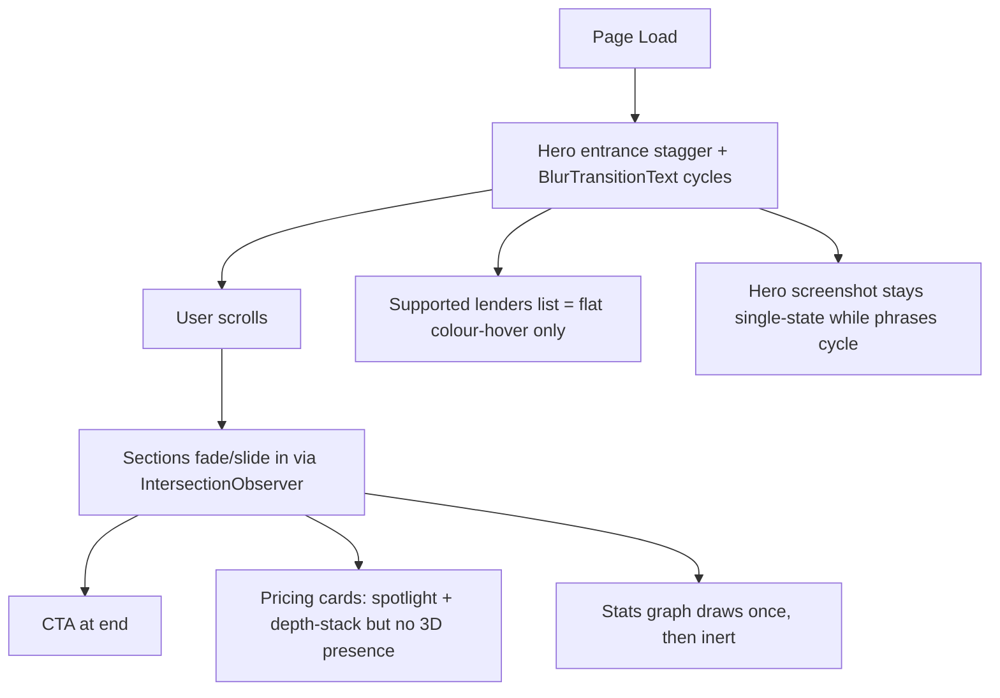

# Premium Polish Recommendations Plan

<critical_warning>
> **CRITICAL WARNING:** Per `AGENTS.md` and `documents/guides/_animations.md`, NEVER add `prefers-reduced-motion` checks (or `requestAnimationFrame` wrappers gated on accessibility/timing media queries) to the new animation code introduced by this plan. Animations must run consistently for all users; existing IntersectionObserver/rAF patterns in the repo (see `use-scroll-animation.ts`) are the reference.
</critical_warning>

<important_note>
> **IMPORTANT NOTE:** The font family and brand theme colours are explicitly out of scope. All work MUST stay within the existing `mist-*` palette tokens defined in `demo/src/app/globals.css` and the brand gradient `#243a42 → #232f40`. Do not introduce new font imports, new colour ramps, or `prefers-color-scheme` overrides.
</important_note>

## 1. Goal

Lift the perceived quality of `bulma.com.au` from "polished SaaS" to "premium, sleek, on-brand product showcase" without changing the brand system (font, colour, voice). The homepage already carries strong foundations (hero stagger, BlurTransitionText, CardSpotlight, prismatic testimonial entrance, animated SVG graph, hue-shift section background, gradient border CTA, magnetic wrappers). This plan adds a curated, novel layer of interactive polish that:

- Reinforces Bulma's core promise — *instant, source-cited policy answers* — through visuals, not copy.
- Adds memorable "wow" moments that resist tackiness (no typewriter effects, no over-saturated parallax, no decorative particles for their own sake).
- Stays performant on mid-range hardware: GPU-only properties (`transform`, `opacity`, `filter`), single rAF-throttled `pointermove`/`scroll` listeners, `IntersectionObserver` with `disconnect()` after first hit, `next/dynamic` for client-only chunks, and respects existing `content-visibility` deferral.

**Success criteria:**
- Lighthouse Performance score on the homepage stays at or above current baseline (mobile + desktop).
- Total blocking time on the homepage does not regress by more than 50ms.
- Zero new layout shifts introduced by any of the new animations (CLS unaffected).
- Each new effect ships behind a feature flag or component boundary so any individual item can be reverted without touching the rest.

---

## 2. Current State Analysis

### 2.1 Current Implementation Overview

The marketing site is the Next.js 16 app under `demo/`, statically exported to GitHub Pages. The homepage renders a hero, two feature blocks, an animated stats graph, a six-card testimonials grid, FAQs, three pricing tiers, and a closing CTA, all composed in `demo/src/app/page.tsx`.

Existing premium-feel ingredients already shipped:

- Hero entrance stagger (`hero-animate hero-delay-N` keyframes in `demo/src/app/globals.css:148-193`).
- Phrase cycling in the hero headline via `<BlurTransitionText>` (used at `page.tsx:269`).
- Luminance sweep on the hero headline via `<LuminanceSweep>` (`page.tsx:267`).
- Magnetic CTA wrappers + rotating gradient border (`page.tsx:283-289`).
- Aurora background and cursor spotlight inside the hero (`hero-left-aligned-with-demo.tsx:41-55`).
- Parallax tilt on the hero screenshot (`screenshot.tsx`, see `globals.css:294-343`).
- Section hue-shift background tint that smoothly cross-fades between section IDs (`hue-shift-provider.tsx`).
- Sticky eyebrow per section (`sticky-eyebrow.tsx`).
- Animated SVG graph with stroke-dash draw + travelling data pulses (`stats-animated-graph.tsx`).
- Testimonial cards with prismatic-direction entrance + presence-pulse avatar ring (`testimonials-glassmorphism.tsx`, `globals.css:1033-1142`).
- Pricing cards with `CardSpotlight`, `card-depth-stack` ghost shadow, and `pricing-focus-group` sibling-dim (`pricing-multi-tier.tsx`, `globals.css:1143-1182`).
- FAQ accordion with spring icon rotation, content reveal, and glow trail tracking expansion (`faqs-two-column-accordion.tsx`, `globals.css:1616-1679`).
- Navbar glassmorphism + gradient glow line on scroll (`navbar-with-logo-actions-and-left-aligned-links.tsx`, `globals.css:1479-1537`).
- Code-splitting for animation components via `next/dynamic` (`page.tsx:39-67`) and `content-visibility` for below-the-fold sections (`globals.css:97-146`).

### 2.2 Current Flow



### 2.3 The Core Problem

Individual moments are polished, but several are missing the connection between Bulma's brand promise and what the user actually sees on the page:

- The cycling hero phrase implies four product capabilities, yet the screenshot beside it is a single static Q&A view. The narrative is incomplete.
- The "Supported Lenders" wrap is a high-information element compressed into a flat text block; visitors skim past it without engaging.
- The hero CTA reads as generic SaaS ("Try Bulma free / See it in action") and does nothing to suggest *what the product feels like*.
- The pricing cards — the highest-leverage decision point on the page — feel flat after the cursor lands on them, despite the surrounding polish.
- The animated stats graph is decorative only after its draw animation completes; there is no reward for hovering it.

### 2.4 Affected User Scenarios

| Scenario | Current Impact |
| --- | --- |
| Prospect lands on hero | Sees impressive but disconnected motion (phrase cycles, screenshot static) — value prop must be inferred from copy |
| Prospect scans lender list | Reads it as a static credit, not as proof of breadth; low engagement |
| Prospect reads CTAs | Generic SaaS pattern; conversion driven by copy alone |
| Prospect compares pricing | Cards feel flat at the moment of decision; spotlight + depth shadow are subtle and easy to miss |
| Prospect reaches stats section | Watches graph draw once, scrolls past — no interactive reward |
| Long-page navigation | No persistent wayfinding beyond the navbar — section context is lost mid-scroll |

### 2.5 Technical Constraints

- **Static export only**: GitHub Pages (workflow build) — no SSR runtime, no API routes, no edge functions. All state must be client-side.
- **Tailwind v4 + custom CSS**: New animations live in `demo/src/app/globals.css` alongside existing keyframes; new components in `demo/src/components/elements/` or `demo/src/components/sections/`.
- **`next/dynamic` discipline**: Any new client-only component must follow the existing `dynamic(() => import(...).then(m => m.X))` pattern from `page.tsx:40-53` so it does not bloat the initial JS bundle.
- **No new fonts or colour tokens**: Constrained to current `mist-*` ramp and brand gradient.
- **No `prefers-reduced-motion` gating** on any animation introduced here (per `AGENTS.md` animation_standards).
- **LCP discipline**: Hero `<ThemePicture>` images are `loading="eager" fetchPriority="high"`. New variants must not displace the LCP image; only the *currently visible* phrase variant should be eager.
- **GitHub Pages CNAME + sitemap**: Don't touch `demo/public/CNAME` or the generated `sitemap.xml`.

### 2.6 Existing Infrastructure That Can Be Reused

| Asset | File | Reuse For |
| --- | --- | --- |
| `useScrollAnimation` hook | `demo/src/hooks/use-scroll-animation.ts` | Word cascade, crosshair gating, rail dot active state |
| `useHeroParallax` hook | `demo/src/hooks/use-hero-parallax.ts` | Pattern for rAF-throttled scroll listeners |
| `CardSpotlight` | `demo/src/components/elements/card-spotlight.tsx` | Layer gyroscopic tilt over existing spotlight cleanly |
| `MagneticWrapper` + `GradientBorderWrapper` | `demo/src/components/elements/` | Wrap chat-input illusion if treated as primary CTA |
| `ThemePicture` | `demo/src/components/elements/theme-picture.tsx` | Stack screenshot variants for phrase-sync cross-fade |
| `Screenshot` (with `enableReflection`) | `demo/src/components/elements/screenshot.tsx` | Anchor citation pins + floating answer chips inside screenshot wrapper |
| Existing keyframe library | `demo/src/app/globals.css:148-1750` | Pattern for new keyframes; reuse easing tokens |
| `BlurTransitionText` | `demo/src/components/elements/blur-transition-text.tsx` | Source of truth for phrase timing — refactor to expose active index |
| `IconPathMotion` | `demo/src/components/elements/icon-path-motion.tsx` | Pattern for path-bound motion on stats crosshair |
| Section hue tokens | `hue-shift-provider.tsx` | Already supports per-section tinting; new effects inherit automatically |

---

## 3. Desired State

### 3.1 Desired State Requirements

**First 5 (Priority A–E) — ship together:**

- **REQ-A (MUST)**: The hero phrase cycle and the hero screenshot share a single timeline so the screenshot cross-fades through four state variants (Q&A, scenarios, credit prep, lender comparison) in lockstep with `<BlurTransitionText>`.
- **REQ-B (MUST)**: Three glassmorphism "answer chips" anchor around the hero screenshot on `lg+` viewports, fading in after the screenshot entrance and bobbing on independent loops.
- **REQ-C (MUST)**: A faux chat-input element ("Ask Bulma a policy question…") sits in the hero CTA cluster with rotating placeholder copy and routes to `https://app.bulma.com.au/register` on click.
- **REQ-D (MUST)**: The hero "Supported Lenders" wrap responds to cursor proximity with graded weight + lift + tone shift on `pointer: fine` devices.
- **REQ-E (MUST)**: Each pricing card tilts gyroscopically (≤ 2.5°) under the cursor while preserving the existing spotlight, depth-stack, and focus-isolation effects.
- **REQ-F (MUST NOT)**: No new effect introduces CLS, blocks the main thread for >16ms in steady state, or requires `prefers-reduced-motion` gating.
- **REQ-G (MUST NOT)**: No new effect changes the LCP element or evicts the existing eager hero image from the priority queue.
- **REQ-H (SHOULD)**: Each new effect is opt-in at the component prop level (e.g., `enableTilt`, `enableProximity`) so it can be toggled without removing markup.

**Deferred 5 (recommendations 6–10) — captured for follow-up phases:**

- **REQ-I (SHOULD)**: Subheadlines reveal word-by-word on intersection (28-35ms stagger) layered over existing `ScrollHighlight`.
- **REQ-J (SHOULD)**: The stats SVG graph exposes a hover crosshair with an interpolated data tooltip on `lg+` viewports.
- **REQ-K (SHOULD)**: A right-edge sticky scroll-progress rail with one dot per section provides wayfinding and click-to-jump.
- **REQ-L (SHOULD)**: A fixed-position SVG noise grain (~0.035 opacity) plus a scroll-driven radial vignette layer add cinematic atmosphere across the viewport.
- **REQ-M (SHOULD)**: 2-3 source-citation pins overlay the hero screenshot at fixed percentage anchors with pulse + tooltip on hover.

### 3.2 Defaults and Fallbacks

- **Defaults**: All new effects default `on` for desktop (`lg+`, `pointer: fine`). On mobile/touch (`max-lg` or `pointer: coarse`), proximity/tilt/crosshair effects are skipped via media query, not stripped from the DOM (so no SSR mismatch).
- **Fallback order**: If `IntersectionObserver` isn't available, the element renders in its final state immediately. If `pointermove` doesn't fire (no pointer), the resting state is the visual default. Phrase-sync screenshot defaults to the first variant if the controller hasn't hydrated.
- **Compatibility**: The existing `BlurTransitionText`, `Screenshot`, `Plan`, and `Hero…` APIs MUST remain backwards-compatible — phrase-sync and tilt are added as opt-in props with safe defaults.

### 3.3 Verification Checklist

**Functional:**
- [ ] Hero screenshot cross-fades match phrase index transitions (visually verified at four positions).
- [ ] Three answer chips appear in correct positions on `lg+`, hidden on `max-lg`.
- [ ] Chat-input illusion routes to `https://app.bulma.com.au/register` on click and rotates placeholder copy.
- [ ] Cursor proximity over the lender list lifts/weights names within ~80px.
- [ ] Pricing cards tilt under cursor (≤ 2.5°) and reset on `pointerleave`.

**Defaults/Fallbacks:**
- [ ] All new effects degrade gracefully on touch / no-pointer devices.
- [ ] First paint on hero matches current baseline (no LCP regression).
- [ ] Phrase-sync default state shows variant 0 if JS hasn't hydrated.

**Compatibility:**
- [ ] Existing parallax-tilt, CursorSpotlight, AuroraBackground, gradient-border, and magnetic effects continue to work unchanged.
- [ ] `BlurTransitionText`, `Screenshot`, `Plan`, `HeroLeftAlignedWithDemo` callers in other pages (e.g., `pricing/page.tsx`) are unaffected.
- [ ] Dark mode renders correctly for every new element (chips, chat input, lender list, tilt highlights).

**Ops/Docs:**
- [ ] `documents/guides/_animations.md` updated with new keyframes, hooks, and components.
- [ ] No new external dependencies added to `demo/package.json` (use vanilla React + existing utilities).

---

## 4. Implementation Plan

### Step 1: Hero Phrase ↔ Screenshot Sync (A)

**Objective:** Bind the hero headline phrase cycle and the hero demo screenshot to a shared timeline so the cycling phrase becomes a guided product tour above the fold.

#### 1.1 High-Level Approach
- Refactor `<BlurTransitionText>` (`demo/src/components/elements/blur-transition-text.tsx`) to optionally accept an `onIndexChange?: (index: number) => void` callback; preserve current standalone behaviour when the callback is omitted.
- Introduce a thin client wrapper, e.g. `demo/src/components/elements/hero-phrase-controller.tsx`, that owns the active phrase index in `useState`, renders `<BlurTransitionText onIndexChange={setIndex} />`, and exposes the index via React context (`HeroPhraseContext`).
- Wrap the existing hero `<Screenshot>` block (`demo/src/app/page.tsx:298-337`) in a new `<PhraseScreenshotStack>` element that reads the context and stacks four absolutely-positioned `<ThemePicture>` variants at the same coordinates, toggling `opacity` 0/1 with a 400ms `cubic-bezier(0.4, 0, 0.2, 1)` transition.
- Asset strategy: only the phrase-0 variant remains `loading="eager" fetchPriority="high"`; phrases 1-3 use `loading="lazy"` + `fetchPriority="low"`. This preserves the LCP image. Existing image filenames at `demo/public/img/screenshots/` can be reused for phrase 0; three additional WebP assets (Q&A, scenarios, credit prep, comparison) are required for phases 1-3. If those assets do not yet exist, fall back to repeating phrase-0 until art is ready (REQ-A degrades gracefully).
- Trade-off: introduces three additional WebP fetches (~50-150KB each) but they are deferred until after LCP. Acceptable for the visual payoff.

### Step 2: Floating Answer Chips Around Hero Screenshot (B)

**Objective:** Visually narrate "instant source-cited answers" before the visitor scrolls.

#### 2.1 High-Level Approach
- Add a new client component `demo/src/components/elements/floating-answer-chips.tsx` that renders three absolutely-positioned glass pills inside a `position: relative` parent.
- Reuse the testimonial card glass tokens (`bg-gradient-to-br from-white/70 via-white/50 to-white/30 backdrop-blur-xl backdrop-saturate-150 ring-1 ring-white/50` etc.) so chips visually relate to the existing system.
- Position three chips at deterministic offsets relative to the screenshot wrapper (top-left `-translate-x-6 -translate-y-3 rotate-[-3deg]`, mid-right `translate-x-4 rotate-[2deg]`, bottom-left `-translate-x-3 translate-y-4 rotate-[-2deg]`).
- Chip content placeholders: `✓ 95% LVR · CBA`, `Source: NAB Policy v8.4`, `2.1s avg response` — copy to be finalised by marketing.
- Animation: `opacity 0 → 1` + `translateY 8px → 0` keyframe with `animation-delay` matching `hero-delay-4 + 200ms`; each chip then bobs on a unique 5-7s `translateY(±4px)` keyframe so they desync.
- Visibility: hidden below `lg` (`max-lg:hidden`) to preserve mobile breathing room and avoid overlap with the screenshot.
- Mount inside `HeroLeftAlignedWithDemo` where the screenshot already lives, gated by a new optional prop `floatingChips?: ReactNode` so the section component stays generic.

### Step 3: CTA "Ask Bulma…" Chat-Input Illusion (C)

**Objective:** Replace generic SaaS CTA pattern with a moment that visually IS the product.

#### 3.1 High-Level Approach
- Add `demo/src/components/elements/chat-input-cta.tsx` rendering a `<Link href="...">` styled as a chat input pill (`rounded-full ring-1 ring-mist-950/10 bg-white/70 backdrop-blur-md`) with a leading sparkle icon and a trailing enter-arrow.
- Placeholder copy rotates through 3-4 sample questions via a state machine driven by an `IntersectionObserver` (only animates while in viewport; disconnects after first hit if hero leaves the viewport for >2s to save CPU).
- Placeholder swaps use `opacity` + `translateY(4px)` only — no `width` animations to avoid layout thrash.
- Insert above the existing CTA row at `page.tsx:282-296`, wrapped on `lg+` so it shares the row with the primary button stack; on `max-lg` it sits above the buttons full-width.
- Click target uses Next `<Link>` to `https://app.bulma.com.au/register` and inherits existing analytics tracking.
- Trade-off: adds one new client component and a small JS chunk (~1.5KB gzipped). Acceptable.

### Step 4: Cursor-Proximity Lender Magnification (D)

**Objective:** Convert the static "Supported Lenders" wrap into a tactile interaction that rewards exploration.

#### 4.1 High-Level Approach
- Wrap the existing `<ul>` at `page.tsx:348-360` in a new client component `demo/src/components/elements/proximity-list.tsx` that attaches a single `pointermove` listener to the parent.
- Compute distance from cursor centre to each child's bounding box centre on each frame (rAF throttled, single `requestAnimationFrame` queue, cancelled on `pointerleave`); write a per-child CSS variable `--proximity` clamped to 0-1 with a smooth falloff (e.g., quadratic).
- Drive the visual via CSS only:
  - `font-weight`: 600 → 700 (graded via `font-variation-settings` if a variable axis is present, otherwise a discrete 600/700 swap at threshold 0.5).
  - `transform: translateY(calc(var(--proximity) * -2px))`.
  - `color`: `color-mix(in oklch, var(--current), var(--mist-950) calc(var(--proximity) * 100%))` (light) and the inverse for dark mode.
- Gate on `@media (pointer: fine) and (min-width: 1024px)` so touch and mobile keep the current flat-hover behaviour.
- Use `IntersectionObserver` to attach/detach the `pointermove` listener only while the list is in the viewport.
- Trade-off: 35 list items × per-frame distance maths is cheap (well under 1ms per frame on mid-range hardware) but worth profiling.

### Step 5: Pricing Card Gyroscopic Tilt (E)

**Objective:** Add physical depth to the highest-leverage decision point on the page.

#### 5.1 High-Level Approach
- Extend `demo/src/components/elements/card-spotlight.tsx` (or wrap it) to also write `--rx` and `--ry` CSS variables based on cursor position relative to the card centre, clamped to ±2.5°.
- Apply `transform: perspective(1000px) rotateX(var(--ry, 0deg)) rotateY(var(--rx, 0deg)) translateZ(0)` to the inner `<Plan>` surface (`pricing-multi-tier.tsx:80-122`).
- Listener: a single `pointermove` on `.pricing-focus-group` (already in the markup) determines the active card via `event.target.closest('.pricing-focus-card')` — avoids one listener per card. rAF throttled. Reset to 0/0 on `pointerleave` with a 600ms `cubic-bezier(0.16, 1, 0.3, 1)` ease.
- Order matters: the tilt transform wraps the existing spotlight + depth-stack so all three effects share the same transform context (no double-compositing).
- Gate on `@media (pointer: fine) and (min-width: 1024px)`.
- Add an opt-out prop `enableTilt?: boolean` defaulting to `true` so other pages calling `<Plan>` (e.g., `pricing/page.tsx`) can disable if needed.

### Step 6: Documentation Sync

**Objective:** Keep system architecture docs in lockstep with the new animation surface.

#### 6.1 High-Level Approach
- Update `documents/guides/_animations.md` with: new keyframes added to `globals.css`, new hooks/components, gating rules (pointer/viewport), and the phrase-sync controller pattern.
- Add a brief note in `documents/guides/_animations.md` referencing the new opt-in props (`floatingChips`, `enableTilt`, etc.) and their defaults.
- Do NOT add a new top-level guide — this is an extension, not a new system.

### Step 7: Deferred Phase (Recommendations 6–10)

**Objective:** Capture the remaining five recommendations as ready-to-pick-up follow-ups without bloating the first delivery.

#### 7.1 High-Level Approach
- Each item below ships as a separate PR after the first 5 land and stabilise. They are intentionally independent and can be picked up in any order.
- **Word Cascade (REQ-I)**: Split subheading text into spans in a new `<WordCascade>` element wrapping `<Text>` blocks; layer over existing `<ScrollHighlight>`.
- **Stats Crosshair (REQ-J)**: Extend `stats-animated-graph.tsx` with a `pointermove` handler over the SVG, snapping a vertical guide and tooltip to interpolated points via `getPointAtLength()`.
- **Scroll Progress Rail (REQ-K)**: New `<ScrollRail>` client component fixed to `right-4`, uses `IntersectionObserver` for active-dot state and a single rAF scroll listener for the fill ratio.
- **Grain + Vignette (REQ-L)**: Two `pointer-events: none` fixed-position layers; grain is a single inline SVG `<feTurbulence>` data URI; vignette is a `radial-gradient` whose opacity is driven by a CSS variable updated via rAF scroll listener.
- **Citation Pins (REQ-M)**: Anchored 18px circles inside `<Screenshot>`, positioned by percentage props, with a 2-step `box-shadow` pulse keyframe and `<Tooltip>` on hover.

---

## 5. Testing Plan

### 5.1 Unit Tests

| Test Case | Component | Expected Result |
| --- | --- | --- |
| `BlurTransitionText` calls `onIndexChange` on each cycle | `blur-transition-text.tsx` | Callback fires with monotonically increasing index modulo `phrases.length` |
| `BlurTransitionText` works without `onIndexChange` | `blur-transition-text.tsx` | No errors; existing visual behaviour preserved |
| `PhraseScreenshotStack` renders all variants stacked | `hero-phrase-controller.tsx` | All four `<picture>` elements present; only phrase 0 has `fetchPriority="high"` |
| `ChatInputCta` rotates placeholders only while in viewport | `chat-input-cta.tsx` | `IntersectionObserver` mock toggles state machine on/off |
| `ProximityList` no-ops on touch devices | `proximity-list.tsx` | `pointermove` listener never attached when `pointer: coarse` |
| `Plan` tilt transform clamps to ±2.5° | `pricing-multi-tier.tsx` | Cursor at extreme corners produces `rotateX/Y` values inside the bound |

### 5.2 Integration Tests

1. **Phrase sync end-to-end (A)**
   - Action: Load homepage, wait through one full phrase cycle (~12s).
   - Expected: Screenshot cross-fades between four variants synced with each phrase change; no flash of unstyled content.
   - Verify: Visual regression snapshot at each phrase index using Playwright + page screenshot, and a network-tab check that only phrase 0 image is in the LCP candidate set.
2. **Answer chips placement and bob (B)**
   - Action: Load homepage on a `lg+` viewport, hover hero region for 10s.
   - Expected: Three chips visible at the documented offsets, each bobbing independently (no synchronised motion).
   - Verify: DOM presence of three `[data-chip]` elements, computed `transform` differs per chip across frames.
3. **Chat input click routes correctly (C)**
   - Action: Click the chat-input pill in the hero.
   - Expected: Browser navigates to `https://app.bulma.com.au/register`.
   - Verify: Playwright navigation assertion + analytics event fires (existing tracking).
4. **Lender proximity on `lg+` desktop (D)**
   - Action: Move pointer along the lender list at varying speeds.
   - Expected: Names within ~80px lift/weight; movement is smooth (>50fps median).
   - Verify: Performance trace shows single rAF callback per frame; CSS variable `--proximity` updates correlate with cursor position.
5. **Pricing tilt resets on leave (E)**
   - Action: Hover a `<Plan>` card, then `pointerleave`.
   - Expected: Card tilts under cursor and smoothly returns to flat over ~600ms.
   - Verify: `transform` matrix returns to identity within 700ms of `pointerleave`.
6. **No regression on existing animations**
   - Action: Visit homepage, confirm hero stagger, magnetic CTA, gradient border, parallax tilt, prismatic testimonial entrance, FAQ glow trail, animated graph, navbar glow.
   - Expected: All existing effects continue to render correctly.
   - Verify: Visual diff against current production snapshot under `demo/out/`.
7. **Lighthouse and Web Vitals**
   - Action: Run Lighthouse mobile + desktop on a clean throttled environment (`npm run build && npm run start` then Lighthouse).
   - Expected: Performance score does not drop more than 2 points; LCP, CLS, INP unchanged or improved.
   - Verify: Compare to baseline run captured before this PR.
8. **Dark mode parity**
   - Action: Toggle to dark mode and re-run integration tests 1-5.
   - Expected: Every new element renders correctly with the dark token set.
   - Verify: Visual snapshot per test.

---

## 6. UI/UX Changes

### 6.1 User Interface Flow

```mermaid
sequenceDiagram
    participant U as Visitor
    participant H as Hero (page.tsx)
    participant C as PhraseController
    participant S as ScreenshotStack
    participant P as PricingSection

    U->>H: Loads homepage
    H->>C: Mount BlurTransitionText with onIndexChange
    C->>S: Broadcast phrase index 0
    S-->>U: Show screenshot variant 0 (LCP, eager)
    Note over C,S: Every ~3s, index advances 0->1->2->3->0
    C->>S: Broadcast new index
    S-->>U: Cross-fade to next variant (400ms)
    U->>H: Hovers Supported Lenders list
    H-->>U: Names within 80px lift/weight via --proximity
    U->>H: Clicks "Ask Bulma..." faux input
    H-->>U: Navigates to app.bulma.com.au/register
    U->>P: Scrolls to pricing
    P-->>U: Card tilts ≤ 2.5° under cursor; resets on leave
```

### 6.2 Visual Components

| Component | Location | Purpose | Interaction |
| --- | --- | --- | --- |
| `HeroPhraseController` | `demo/src/components/elements/hero-phrase-controller.tsx` (new) | Owns active phrase index; broadcasts via context | Auto-cycles every ~3s; no direct interaction |
| `PhraseScreenshotStack` | Inline within `HeroLeftAlignedWithDemo` consumer | Stacks 4 screenshot variants; toggles opacity per phrase | Cross-fades on phrase change (400ms) |
| `FloatingAnswerChip` | `demo/src/components/elements/floating-answer-chips.tsx` (new) | 3 glass pill chips around hero screenshot | Bob on independent 5-7s loop; no click target |
| `ChatInputCta` | `demo/src/components/elements/chat-input-cta.tsx` (new) | Faux chat input as primary CTA | Click → `app.bulma.com.au/register`; placeholder rotates while in viewport |
| `ProximityList` | `demo/src/components/elements/proximity-list.tsx` (new) | Wraps any list; writes `--proximity` per child | `pointermove` lifts/weights nearby items on `lg+` |
| `Plan` (extended) | `demo/src/components/sections/pricing-multi-tier.tsx` (extend) | Existing pricing card + new gyroscopic tilt | Tilt ≤ 2.5° on `pointermove`; resets on leave |
| Updated `BlurTransitionText` | `demo/src/components/elements/blur-transition-text.tsx` (extend) | Accepts `onIndexChange` callback | Same visual; new pub/sub hook for screenshot sync |
